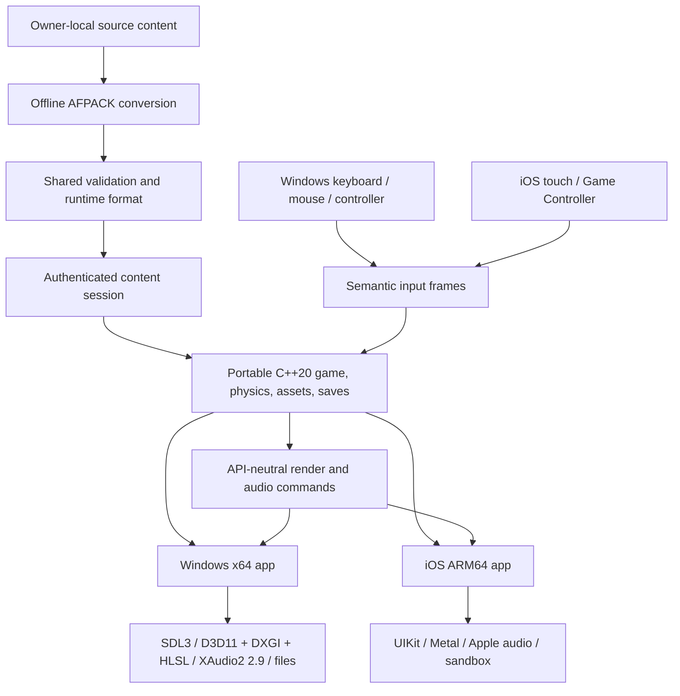

# Airfix Dogfighter — native reconstruction for Windows and iOS

[](https://github.com/tryk016/airfix-dogfighter/actions/workflows/portable-ci.yml) [](https://github.com/tryk016/airfix-dogfighter/actions/workflows/ios-unsigned.yml)

An evidence-driven, native reimplementation of **Airfix Dogfighter v1.01
(2000)** with two parallel product targets: a playable Windows x64 application
and a private iOS ARM64 port. The project reconstructs observable formats and
behaviour as maintainable C++20 with narrow platform adapters; it does not run,
translate, or redistribute the original x86 executable.

Windows is the primary environment for rapid debugging and controlled
side-by-side comparison with the original. iOS remains a native private
sideload for the owner's devices. Both products share one game, physics,
resource, save, input-action, and platform-neutral presentation core. Faithful
behaviour comes first, but the target renderer is not a low-resolution upscale:
both products will render 3D at the selected physical resolution at 100% render
scale, use Hor+ widescreen by default, and keep a separately selectable
high-resolution `Classic` profile alongside `Enhanced`.

> **Project status:** active research and development. The repository builds
> and tests its portable core, a native data-less SDL3/D3D11 Windows shell,
> and an unsigned data-less UIKit/Metal iOS shell. The Windows product now
> keeps its public synthetic smoke path while an explicit private launch can
> authenticate one AFPACK revision, load a selected mission room, upload its
> geometry and complete texture chains, optionally join the authenticated
> player's textured slot-zero aircraft at its start pose, and render the
> combined scene through the recovered gameplay camera contract in D3D11.
> Both native backends now consume the first shared native-resolution layout:
> the 3D target exactly equals the output at 100% scale and the standard
> gameplay viewport is full-target Hor+ rather than a stretched or enlarged
> legacy framebuffer. Windows has verified direct D3D11 readbacks at 1080p,
> 1440p, 4K, and 32:9; the captures and owner data remain private. It
> also exercises bounded synthetic PCM
> through the reconstructed AirCraft audio coordinator and XAudio2 2.9.
> The iOS shell now consumes the same audio contract through AVAudioEngine and
> enforces explicit-resume interruption and route-loss handling. Both products
> can now bind the six recovered aircraft roles to PCM decoded from one
> authenticated, owner-local AFPACK transaction. Both native products also load
> the same private AFIP controller profile before input starts and expose one
> shared controller-settings draft: four-axis calibration with exact
> raw/adjusted preview plus a bounded seven-action text picker. Conflicts cancel
> by default, swaps require a separate confirmation, and durable changes remain
> save-for-next-launch only.
> Neither target is **yet a complete playable release**.

**Lawfully owned original game data is required for private use and is not
included in this repository.**

[Status](#current-state) · [Build](#quick-start) · [Architecture](#architecture) · [Controls](#controls) · [Legal](#legal-and-clean-room-boundary)

## Scope

| Area | Target |
|---|---|
| Products | Native playable Windows x64 desktop application and private native ARM64 iOS application |
| Product role | Windows is the primary rapid-debug/parity environment; iOS is the private mobile port |
| Distribution | Original and converted data remain owner-private; no App Store release or public content-bearing package |
| Platform layers | SDL3 window/input, D3D11/DXGI/HLSL rendering, and XAudio2 2.9 on Windows; UIKit, Metal, touch, Game Controller, and Apple audio adapters on iOS |
| OS targets | Windows 10/11 API family with exact release floor pending; iOS 16.4 minimum |
| iOS validation devices | iPhone 17 Pro Max (iOS 26.6) and iPhone SE, 3rd generation (iOS 26.3) |
| Gameplay | Single-player campaign and required menus |
| Controls | Windows keyboard/mouse and controllers; iOS touch and Bluetooth/USB extended controllers |
| Rendering | Native-resolution 3D at 100% scale, Hor+ widescreen, optional Original 4:3, explicit safe vertical-FOV adjustment, sharp independent UI, and `Classic`/`Enhanced` profiles |
| Not in version 1 | Multiplayer, House Editor, Paint Room, and unavailable CD audio |

The device list is the intended validation matrix, not a compatibility claim
for the unfinished application. See the [version 1 scope](docs/design/V1-SCOPE.md)
for acceptance criteria and
[ADR-0013](docs/adr/0013-native-resolution-modern-rendering.md) for the binding
modern-rendering contract. The versioned, cross-platform presentation-settings
model and its safe application rules are defined by
[ADR-0014](docs/adr/0014-render-presentation-settings.md).
The independent, presentation-only FOV policy and schema migration are defined
by [ADR-0016](docs/adr/0016-safe-fov-settings.md).
The optional owner-local HD texture package remains disabled in both products.
Its public, synthetic-only foundation now includes an accepted-manifest index,
a root-confined file capability, and a resolver that proves exact Classic GTI
fallback. A disconnected portable preparer now also validates memory-only
RGBA8 PNG decoding, the complete declared mip chain, straight-alpha metadata,
and bounded encoded/decoded memory before returning backend-neutral levels.
Settings, native uploads, caches, and private content remain later stages; no
product can select Enhanced textures yet. The staged contract is documented in
[ADR-0019](docs/adr/0019-private-hd-texture-replacements.md).

## Current state

Implemented foundations include:

- a native Windows x64 shell with SDL3 window/lifecycle events, a separate
  D3D11/DXGI renderer, runtime-compiled HLSL, hardware-to-WARP fallback,
  resize/focus handling, and a hidden data-less GPU readback smoke test;
- a portable bounded audio-command/PCM16 contract and native XAudio2 2.9
  backend with secure system loading, copied clip ownership, focus pause,
  game-thread recovery, safe no-output operation, and a muted synthetic smoke
  path; the recovered engine start/running/stop and destroyed-dive state
  machines are now composed in their original order and translated into this
  shared command stream; iOS consumes the same stream through bounded
  AVAudioEngine player/varispeed nodes, standard Float32 conversion, retained
  loop recovery, and lifecycle/interruption-safe session activation;
- one proprietary-data-free render scene and validated draw plan shared by the
  Windows D3D11 and iOS Metal bring-up paths;
- an explicit owner-local Windows mission launch path that builds the manifest,
  room, camera bootstrap, geometry, textures, and aircraft audio from one
  unchanged authenticated content session; D3D11 prepares every replacement
  resource before publication, preserves authored or generated mip chains,
  uses the recovered reverse-depth projection, and now presents the scene
  through the shared native-resolution Hor+ layout;
- a portable, allocation-free native-render layout that keeps output pixels,
  3D render-target pixels, logical camera coordinates, UI design coordinates,
  safe areas, and input transforms separate; it guarantees an exact target
  identity at 100% scale, computes the 50-200% policy, preserves reference
  vertical FOV across 4:3 through 32:9, retains Original 4:3 as a tested
  comparison policy, and applies an optional bounded vertical-FOV increase
  without changing render targets, UI scale, or simulation state;
- one durable cross-platform presentation snapshot now carries scene render
  scale, presentation, safe FOV, visual profile, diagnostics, and an
  independent 75-150% UI-content scale. Windows renders the scaled interface
  natively through DPI-aware D2D/DWrite with bounded row scrolling; iOS
  combines it with Dynamic Type, Auto Layout, safe areas, and native controls;
- the visual-profile selector now has its first pixel-affecting implementation:
  `Classic` preserves the established point-sampled scene-texture path, while
  `Enhanced` selects trilinear sampling with bounded 8x anisotropy on D3D11 and
  Metal. UI overlays and final render-scale presentation retain independent
  samplers; lighting, material, shadow, color-space, and post-processing work
  remains staged separately;
- bounded UDSP, CCF, GTI, and related legacy-format parsing;
- a disconnected, synthetic-only HD replacement foundation that retains
  authenticated GTI logical identity, hashes the actual source bytes, accepts
  only reviewed manifest records, reads the manifest-selected base file through
  a pinned root capability, verifies its checksum, and routes every miss or
  failure through the unchanged Classic GTI preparation path;
- a private AFPACK container, strict validation, atomic installation, recovery,
  rollback, and authenticated content sessions;
- a native pre-game Windows private-content manager with an AFPACK file
  picker, cancellable progress, retry, authenticated replacement, and an
  explicit verified-generation rollback action; the existing one-shot CLI
  import remains available for controlled automation;
- a bounded RIFF/WAVE PCM16 parser plus an atomic owner-local aircraft clip
  loader that resolves exact entries only through an authenticated content
  session, validates the four continuous sampler loops, keeps start/stop as
  one-shots, and publishes no partial bindings;
- aggregate mission-room assembly, texture preparation, draw validation, and
  two-phase Metal publication;
- a deterministic semantic input core with native touch, Apple Game
  Controller, and SDL3 keyboard/mouse/gamepad adapters; Windows and iOS now
  consume eligible 60 Hz frames through one atomic player-state/presentation
  coordinator, retain a canonical diagnostic hash, and reset fail-closed at
  pause, focus, disconnect, or invalid transitions;
- authenticated player selection plus bounded player-model, texture,
  scene-placement, and publication integration in the mission-world loader;
- a preallocated per-scene pose runtime planned and prepared by one portable
  boundary, publishing authenticated actor frames for accepted simulation
  steps and resolved through one coherent lease per Metal or D3D11 frame;
- a retained, pointer-free mission BSP arena with source-aware runtime-room
  bindings, bounded allocation-free static/portal line tracing, and the
  recovered portal mesh/type/visibility transition gate, plus a fail-closed
  runtime/source-world basis adapter with strict per-hop segment validation;
- authenticated immutable dynamic BSP assets for mission-placed objects and
  the player, with exact CPU budgeting and an allocation-free native-order
  frame that traces both disjoint mesh owners without copying geometry;
- a bounded, allocation-free projectile collision coordinator that repeats the
  complete caller-supplied query across projectile-level portals and fails
  closed on malformed results or cycles;
- an authenticated, allocation-free adapter from the published mission
  collision frame to that coordinator, including room-ID, material and
  generation-matched primary-player actor gates, while retaining an explicit
  callback seam for future non-player actors;
- an allocation-free terminal machine-gun projectile reducer that commits
  endpoint/room/water state and produces bounded actor-damage or
  surface/ricochet command data, plus a runtime wrapper joining it to the
  published collision query and a fail-closed creator
  `DisableBsp`/conditional `EnableBsp` transaction around the complete
  portal/terminal path, without dispatching private effects;
- a caller-owned fixed-capacity projectile runtime that preserves the recovered
  state-before-capacity order, activates semantic event `0xE2` into
  generation-tagged slots, rejects stale handles, and allocates no memory in
  the hot path;
- validated, allocation-free reconstructions of the legacy world-to-camera
  point transform and camera-space screen projection, including the recovered
  reverse-depth scalar, four depth presets, gameplay camera preset selection,
  exact quaternion-to-matrix and chase-target/nonlinear smoothing steps,
  backend-neutral collision/factor/line primitives and look-at pose math; the
  recovered 640x480 values remain reference-camera metadata rather than a
  physical raster limit;
- bounded static sphere and vehicle-to-camera line resolution with atomic
  position/room/factor completion, plus a preallocated single-writer owner and
  immutable backend-neutral pose snapshot joining look-at, unit-scale
  world-to-view, and the recovered gameplay projection;
- a private-room Metal camera adapter that preserves the scalar projection as
  homogeneous clip values, uses recovered reverse depth and the shared
  full-target Hor+ layout, and starts from an explicit tested camera0
  bootstrap;
- a producer-side camera-step coordinator that transactionally composes
  recovered AirCraft factor recovery, input mode/rear selection, chase,
  retained-static collision, pose, clip packaging, and state commit while
  preserving the confirmed scheduler-derived refresh delta in seconds;
- a bounded, allocation-free SPSC exchange that publishes only complete
  gameplay-camera packets and lets Metal retain one coherent camera generation
  through command encoding;
- a preallocated mission-lifetime runtime that owns the retained static arena,
  immutable placed/player colliders, exact reusable dynamic-line buffers,
  camera workspaces, coordinator, and packet exchange, plus a weak iOS
  producer endpoint that expires safely when the mission is replaced.

The portable authenticated load now produces one validated room-and-player
draw model plus mission-lifetime static and placed/player dynamic BSP assets
for every runtime room. The actor still remains at its authenticated spawn
transform until the recovered movement law supplies a changing world pose.
Dynamic-object sphere collision for the camera, live event-5 camera production
from complete AirCraft state, full gameplay simulation, campaign flow,
live aircraft audio inputs, audible parity, finished
menus, live Windows simulation/input-to-world integration,
physical-device rendering, and visual acceptance remain future milestones.

For frequently updated details, use
[project status](docs/progress/STATUS.md) and the
[verification matrix](docs/verification/PARITY-MATRIX.md).

## Legal and clean-room boundary

This repository is for compatibility and preservation work by people who own a
lawfully acquired copy of the original game and are permitted by applicable law
to create a private compatibility copy.

The repository contains independently written source code, documentation,
aggregate observations, and synthetic tests. It does **not** contain:

- original executables, archives, artwork, audio, or other proprietary assets;
- converted `.afpack` packages or application bundles containing those assets;
- memory dumps, decompiler databases, traces, or tool-vendor project files;
- signing certificates, provisioning profiles, device identifiers, or private
  build configuration.

Original content must remain private and outside Git. Analysis and conversion
must operate on owner-supplied files without modifying the original
installation. No original or derived payload may be uploaded to cloud analysis
services.

This project is not affiliated with or endorsed by the original developers,
publishers, or trademark owners. It does not grant rights to the original game
and is not legal advice.

## Quick start

The portable code and all public tests use synthetic fixtures; no proprietary
game files are required.

Prerequisites:

- CMake 3.25 or newer;
- Ninja;
- a C++20 compiler.

From the repository root:

```bash
cmake --preset code-intelligence
cmake --build --preset code-intelligence
ctest --preset code-intelligence
```

The preset produces a normal Ninja build and a machine-local
`compile_commands.json`. Build directories and compilation databases are
ignored and must not be committed.

For clangd, VS Code, CLion, other LSP clients, and the limits of a Windows
compilation database for Objective-C++, UIKit, and Metal, see
[Code intelligence with clangd](docs/toolchain/CODE-INTELLIGENCE.md).

### Windows x64 product shell

The official Windows preset requires Visual Studio 2026 Build Tools with the
Desktop C++ workload and a Windows SDK. Its first configure downloads the
hash-pinned SDL 3.4.12 source archive; it never downloads game data.

```powershell
cmake --preset windows-product
cmake --build --preset windows-product-release --parallel
ctest --preset windows-product-release
```

The resulting data-less `AirfixDogfighter.exe` displays only the public
synthetic renderer scene. CTest launches it with `--smoke-test`, creates a
hidden SDL window, compiles the embedded HLSL, submits the shared draw plan,
reads the D3D11 back buffer, and requires visible non-clear pixels. It also
loads inbox XAudio2 2.9, registers muted synthetic PCM, and drives the recovered
five-call AirCraft audio cadence through engine start, running, shutdown,
destroyed dive, and recovery; a runner without an output endpoint remains
supported. This is a platform-shell milestone, not yet a playable build.

Interactive startup loads the owner-private AFIP controller profile before
constructing the SDL input adapter. The pause menu exposes four-axis
calibration and bounded gameplay-button assignments in one draft, with
raw/adjusted live preview and an explicit `Save for next launch` action; it
never mutates the active input pipeline.
A public, synthetic screenshot can be generated without reading game data or
the private settings store:

```powershell
AirfixDogfighter.exe `
  --capture-controller-calibration-panel <public-output.bmp> `
  --capture-size 1920x1080

AirfixDogfighter.exe `
  --capture-controller-bindings-panel <public-output.bmp> `
  --capture-size 640x360
```

### Private content for local Windows validation

The tools can build an owner-private AFPACK without placing original data in
the repository. The Windows product then copies, authenticates, and atomically
activates it in its own SDL preference root:

```powershell
afpack-create --source <owned-installation-copy> --language English --output <private-package.afpack>
AirfixDogfighter.exe --manage-installed-content

# Optional non-interactive import for controlled local automation:
AirfixDogfighter.exe --import-afpack <private-package.afpack>
AirfixDogfighter.exe --validate-installed-content
AirfixDogfighter.exe --installed-content
```

`--manage-installed-content` opens the native pre-game manager. It checks the
private store, accepts only an owner-selected `.afpack`, reports redacted
progress, supports safe cancellation and retry, and offers rollback only when
the portable recovery service has already authenticated a previous
generation. If the current generation is unusable but a previous generation is
verified, restore is required before importing a replacement. An indeterminate
store permits only retry or close. The manager does not reload a running
mission and, outside the owner-controlled OS picker, never echoes a local path, logical archive path,
checksum, generation identifier, or backend diagnostic.

Both UI and CLI imports use the same exclusive transaction. It generates the
transaction UUID, serializes concurrent product imports in the same login
session, retains the previous active generation on an ordinary failure, and
never prints the selected path or a complete digest. A commit-unknown result
terminates the manager and requires restart plus a fresh installed-content
check before another mutation.
Reimporting identical content is safe and does not create a new generation.

An explicit mission adds owner-private logical paths out of band without
requiring the private storage location on the command line:

```powershell
AirfixDogfighter.exe --validate-installed-content `
  --setup <setup-logical-path> `
  --level <level-logical-path> `
  [--player-object <player-object-logical-path>] `
  [--start-index <uint32>]

AirfixDogfighter.exe --installed-content `
  --setup <setup-logical-path> `
  --level <level-logical-path> `
  [--player-object <player-object-logical-path>] `
  [--start-index <uint32>]

AirfixDogfighter.exe --installed-content `
  --setup <setup-logical-path> `
  --level <level-logical-path> `
  [--player-object <player-object-logical-path>] `
  [--start-index <uint32>] `
  --capture-frame <private-output.bmp>

AirfixDogfighter.exe --installed-content `
  --setup <setup-logical-path> `
  --level <level-logical-path> `
  [--player-object <player-object-logical-path>] `
  [--start-index <uint32>] `
  --capture-overview-frame <private-output.bmp> `
  --capture-size 1920x1080 `
  --render-scale 100

AirfixDogfighter.exe --installed-content `
  --setup <setup-logical-path> `
  --level <level-logical-path> `
  [--player-object <player-object-logical-path>] `
  [--start-index <uint32>] `
  --capture-hud-validation-frame <private-output.bmp> `
  --capture-size 1920x1080 `
  --render-scale 100
```

The lower-level `afpack-install`, `--content-root`, and
`--validate-content-root` interfaces remain available to development tooling
that deliberately manages a separate private root. They are not required for
the normal owner-local product flow.

All placeholders must point outside the repository. The validation mode opens a
hidden window, authenticates the AFAC-selected package, decodes and checks the
six aircraft samples, registers them with XAudio2, and exits. With a complete
mission pair it additionally loads the mission from the same pinned session,
prepares all D3D11 resources, renders one gameplay-camera frame, reads the back
buffer, and requires visible output. Normal startup keeps the authenticated
room and registered clips available for the reconstructed runtime. AFPACK v1
contains no launch catalogue, so setup and Level paths are deliberately
explicit and are never inferred. Do not place real values in source files,
presets, scripts, shell history shared with others, or issue reports.
Both one-shot capture modes keep the SDL window hidden, refuse to overwrite an
existing file, and write a top-down BGRA8 BMP after the same visible-output
check. `--capture-frame` retains the current gameplay camera.
`--capture-overview-frame` instead derives an owning one-frame camera from the
complete placed-model bounds, enables the diagnostic overlay, and applies a
room-shell-only cutaway so exterior faces do not hide the interior. It never
publishes that camera to simulation and does not change normal gameplay
culling. `--capture-hud-validation-frame` exercises the complete authenticated
HUD transaction and centred sight with fixed, representative presentation
values. It does not publish those values to simulation or enable HUD drawing
in ordinary frames. Captures contain derived proprietary imagery and must stay
private and outside Git.

Loose WAV files and the original installation directory are not accepted by
the application.

## Architecture

The portable core owns parsing, content identity, game state, physics, semantic
input, and platform-neutral render/audio commands. Operating-system APIs stay
at the outer boundary and cannot redefine simulation behaviour.



The Windows backend reproduces the original's observable render result through
modern D3D11 pipeline state; it does not recreate or expose the DirectX 7 API.

Read the [architecture](docs/ARCHITECTURE.md), the
[port strategy ADR](docs/adr/0001-port-strategy.md), the
[Windows x64 product decision](docs/adr/0007-windows-x64-parallel-target.md),
the [Windows platform stack decision](docs/adr/0008-windows-rendering-and-platform-stack.md),
the [Windows audio decision](docs/adr/0009-windows-xaudio2-audio-backend.md),
the [authenticated aircraft-audio decision](docs/adr/0011-authenticated-owner-local-aircraft-audio.md),
the [staged private HD texture replacement decision](docs/adr/0019-private-hd-texture-replacements.md),
the [root-confined private-content capability](docs/adr/0020-root-confined-private-content-capability.md),
the [audio-system contract](docs/systems/AUDIO.md),
and the [reverse-engineering workflow](docs/RE-WORKFLOW.md) for the detailed
contracts.

## Controls

Every platform adapter maps physical devices into the same deterministic
semantic action model.

SDL3 supplies Windows keyboard, mouse, focus, and standardized gamepad events;
it owns neither rendering nor audio. The implemented Windows adapter converts
physical USB HID scancodes, relative mouse motion, buttons, wheels, sticks,
triggers, D-pad, shoulders, and face buttons into the same fixed-rate
`InputFrame` used by iOS. Ordered taps, controller hot-plug, disconnect
release, per-source neutral gates, and focus-loss neutralization are covered
by data-less tests.
iOS supplies the corresponding landscape touch and Game Controller adapters.
Both native products load persistent AFIP profiles before input starts and
provide four-axis calibration plus bounded seven-action button remapping
without replacing the active router. The Windows picker supports keyboard,
mouse, and controller input; the iOS safe-area picker supports touch and
controller navigation with Dynamic Type and VoiceOver-compatible controls.
Both keep private paths, device identity, and checksums outside the UI.
Controller glyphs, polished menus, live profile replacement, Windows UI
Automation, and end-to-end device usability acceptance remain pending.

See [Input, controls, and haptics](docs/systems/INPUT.md).

## Private content and AFPACK

AFPACK is the bounded private container used to move owner-local converted
content into either product. Packages are authenticated before activation,
installed transactionally, and consumed through the same verified session so a
mission cannot silently mix content revisions or source handles. Windows uses
an owner-local import/storage adapter; iOS imports into its sandbox.

Public source and tests remain data-less. AFPACK v1 deliberately contains no
mission-launch metadata.

See the [AFPACK format and trust boundary](docs/formats/AFPACK.md) and
[GitHub Actions iOS design](docs/ci/GITHUB-ACTIONS-IOS.md).

## Platform builds and CI

Public workflows validate portable C++ and compile the data-less UIKit/Metal
shell for `iphoneos` and `iphonesimulator` with deployment target 16.4 and no
code signing. The Windows CI job builds the native x64 SDL3/D3D11/XAudio2
product with Visual Studio and runs its hidden data-less GPU/audio smoke test.
Pull-request workflows do not read private content configuration or signing
secrets. Documentation-only pull requests take a conservative fast path that
still validates the public boundary, internal links, research ledgers, and
whitespace, while every build-affecting or unclassified path runs the complete
matrix. Supported portable C/C++ jobs use a pinned compiler cache; a weekly
complete run and cold-by-default manual dispatch bypass it. See the
[CI execution policy](docs/ci/CI-EXECUTION-POLICY.md).

Optional private launch inputs, signing, and installation belong to a
protected, manually approved workflow. Signed IPAs, credentials, profiles,
original assets, and AFPACK content must never be public artifacts.

## Documentation

- [Project plan](docs/PROJECT-PLAN.md)
- [Version 1 scope](docs/design/V1-SCOPE.md)
- [Windows x64 product requirements](docs/design/WINDOWS-X64-REQUIREMENTS.md)
- [iOS product requirements](docs/design/IOS-PORT-REQUIREMENTS.md)
- [Private content installation](docs/systems/CONTENT-INSTALL.md)
- [Campaign and legacy-roster core](docs/systems/CAMPAIGN.md)
- [Player reconstruction](docs/re/systems/PLAYER-SPAWN.md)
- [Reverse-engineering workbench](docs/toolchain/RE-WORKBENCH.md)
- [Current status](docs/progress/STATUS.md)

## Contributing safely

- Never commit proprietary game content, converted payloads, analysis
  databases, local paths, credentials, signing material, or device identifiers.
- Use synthetic fixtures in public tests; record private-corpus findings only as
  bounded aggregate facts.
- Keep parsers fail-closed and enforce limits before allocation or I/O.
- Distinguish confirmed evidence from hypotheses and link recovered behaviour
  to a reproducible note or experiment.
- Preserve faithful behaviour before adding optional enhancements.
- Before publishing, run the portable tests and
  `python tools/ci/check_public_boundary.py .`. The scanner rejects private
  content roots, raster/GPU textures, line-oriented manifests, archives,
  proprietary game formats, and local analysis databases.

No source-code license has been selected yet. Third-party tools and references
retain their own licences.
