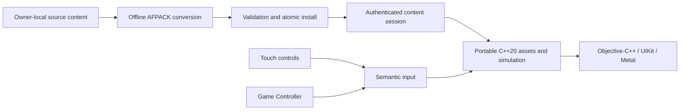

# Airfix Dogfighter — reconstruction and private iOS port

[](https://github.com/tryk016/airfix-dogfighter/actions/workflows/portable-ci.yml) [](https://github.com/tryk016/airfix-dogfighter/actions/workflows/ios-unsigned.yml)

An evidence-driven, native reimplementation of **Airfix Dogfighter v1.01
(2000)**, with a private iOS port as its first target. The project reconstructs
observable formats and behaviour as maintainable C++20 and Objective-C++ code;
it does not attempt to run or translate the original x86 executable on iOS.
The goal is to preserve the single-player experience on modern Apple hardware,
with faithful behaviour first and optional visual enhancements kept separate.

> **Project status:** active research and development. The repository builds
> and tests its portable core and an unsigned, data-less UIKit/Metal shell, but
> it is **not yet a playable or device-validated port**.

**Lawfully owned original game data is required for private use and is not
included in this repository.**

[Status](#current-state) · [Build](#quick-start) · [Architecture](#architecture) · [Controls](#controls) · [Legal](#legal-and-clean-room-boundary)

## Scope

| Area | Target |
|---|---|
| Distribution | Private sideloading on the owner's registered devices; no App Store release |
| Platform | Native ARM64 iOS application using UIKit, Metal, and Game Controller |
| Minimum OS | iOS 16.4 |
| Validation devices | iPhone 17 Pro Max (iOS 26.6) and iPhone SE, 3rd generation (iOS 26.3) |
| Gameplay | Single-player campaign and required menus |
| Controls | Complete touch controls and Bluetooth/USB extended controllers |
| Rendering | Faithful presentation first; optional higher-resolution and lighting enhancements later |
| Not in version 1 | Multiplayer, House Editor, Paint Room, and unavailable CD audio |

The device list is the intended validation matrix, not a compatibility claim
for the unfinished application. See the [version 1 scope](docs/design/V1-SCOPE.md)
for acceptance criteria.

## Current state

Implemented foundations include:

- bounded UDSP, CCF, GTI, and related legacy-format parsing;
- a private AFPACK container, strict validation, atomic installation, recovery,
  rollback, and authenticated content sessions;
- aggregate mission-room assembly, texture preparation, draw validation, and
  two-phase Metal publication;
- a deterministic semantic input core with native touch and Apple Game
  Controller adapters;
- authenticated player selection plus bounded player-model, texture,
  scene-placement, and publication integration in the mission-world loader;
- a per-scene pose exchange whose authenticated step-zero actor frame is
  resolved by the Metal render loop without changing the authored static room.

The portable authenticated load now produces one validated room-and-player
draw model. Full gameplay simulation, campaign flow, audio, finished menus,
physical-device rendering, and visual acceptance remain future milestones.

For frequently updated details, use
[project status](docs/progress/STATUS.md) and the
[verification matrix](docs/verification/PARITY-MATRIX.md).

## Legal and clean-room boundary

This repository is for compatibility and preservation work by people who own a
lawfully acquired copy of the original game and are permitted by applicable law
to create a private compatibility copy.

The repository contains independently written source code, documentation,
aggregate observations, and synthetic tests. It does **not** contain:

- original executables, archives, artwork, audio, or other proprietary assets;
- converted `.afpack` packages or application bundles containing those assets;
- memory dumps, decompiler databases, traces, or tool-vendor project files;
- signing certificates, provisioning profiles, device identifiers, or private
  build configuration.

Original content must remain private and outside Git. Analysis and conversion
must operate on owner-supplied files without modifying the original
installation. No original or derived payload may be uploaded to cloud analysis
services.

This project is not affiliated with or endorsed by the original developers,
publishers, or trademark owners. It does not grant rights to the original game
and is not legal advice.

## Quick start

The portable code and all public tests use synthetic fixtures; no proprietary
game files are required.

Prerequisites:

- CMake 3.25 or newer;
- Ninja;
- a C++20 compiler.

From the repository root:

```bash
cmake --preset code-intelligence
cmake --build --preset code-intelligence
ctest --preset code-intelligence
```

The preset produces a normal Ninja build and a machine-local
`compile_commands.json`. Build directories and compilation databases are
ignored and must not be committed.

For clangd, VS Code, CLion, other LSP clients, and the limits of a Windows
compilation database for Objective-C++, UIKit, and Metal, see
[Code intelligence with clangd](docs/toolchain/CODE-INTELLIGENCE.md).

## Architecture

The portable core owns parsing, content identity, deterministic state, and
platform-neutral render data. Apple-specific code stays at the outer boundary.



Read the [architecture](docs/ARCHITECTURE.md), the
[port strategy ADR](docs/adr/0001-port-strategy.md), and the
[reverse-engineering workflow](docs/RE-WORKFLOW.md) for the detailed contracts.

## Controls

The target is complete playability with either the landscape touch overlay or a
supported extended controller.

The current native slice routes touch and controller input through the same
deterministic action model. It covers flight axes, throttle, weapons, camera,
mission status, and pause semantics, including multitouch and safe
neutralization across disconnects and lifecycle changes. Bluetooth pairing is
managed by iOS. Remapping, calibration, controller glyphs, haptics, polished
controller-only menus, and physical-device usability testing are still pending.

See [Input, controls, and haptics](docs/systems/INPUT.md).

## Private content and AFPACK

AFPACK is the bounded private container used to move owner-local converted
content into the iOS sandbox. Packages are authenticated before activation,
installed transactionally, and consumed through a verified session so a
mission cannot silently mix content revisions or source handles.

Public source and tests remain data-less. AFPACK v1 deliberately contains no
mission-launch metadata.

See the [AFPACK format and trust boundary](docs/formats/AFPACK.md) and
[GitHub Actions iOS design](docs/ci/GITHUB-ACTIONS-IOS.md).

## iOS and CI

Public workflows validate portable C++ and compile the data-less UIKit/Metal
shell for `iphoneos` and `iphonesimulator` with deployment target 16.4 and no
code signing. Pull-request workflows do not read private content configuration
or signing secrets.

Optional private launch inputs, signing, and installation belong to a
protected, manually approved workflow. Signed IPAs, credentials, profiles,
original assets, and AFPACK content must never be public artifacts.

## Documentation

- [Project plan](docs/PROJECT-PLAN.md)
- [Version 1 scope](docs/design/V1-SCOPE.md)
- [Private content installation](docs/systems/CONTENT-INSTALL.md)
- [Player reconstruction](docs/re/systems/PLAYER-SPAWN.md)
- [Reverse-engineering workbench](docs/toolchain/RE-WORKBENCH.md)
- [Current status](docs/progress/STATUS.md)

## Contributing safely

- Never commit proprietary game content, converted payloads, analysis
  databases, local paths, credentials, signing material, or device identifiers.
- Use synthetic fixtures in public tests; record private-corpus findings only as
  bounded aggregate facts.
- Keep parsers fail-closed and enforce limits before allocation or I/O.
- Distinguish confirmed evidence from hypotheses and link recovered behaviour
  to a reproducible note or experiment.
- Preserve faithful behaviour before adding optional enhancements.
- Before publishing, run the portable tests and
  `python tools/ci/check_public_boundary.py .`.

No source-code license has been selected yet. Third-party tools and references
retain their own licences.
