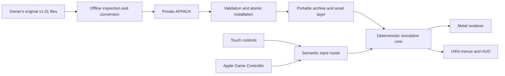

# Airfix Dogfighter reconstruction and private iOS port

This repository contains an evidence-driven, native reimplementation of
**Airfix Dogfighter v1.01 (2000)** and the foundations of a private iOS port.
The goal is to preserve the original single-player experience on modern Apple
hardware, then add optional improvements such as higher rendering resolution
and modern lighting without changing faithful-mode gameplay.

The project is under active development and is **not yet a playable port**.
It currently provides the portable archive/asset pipeline, deterministic input
and player-control state, private content-package infrastructure, fail-closed
render submission and texture-upload preparation, diagnostic rendering, and a
data-less UIKit/Metal application shell with an authenticated aggregate-mission
loading and publication path, plus full native gameplay-action transport into
the frozen simulation boundary.

## Project scope

| Area | Version 1 target |
|---|---|
| Distribution | Private installation on the owner's registered devices |
| Platform | Native ARM64 iOS application; no x86 emulation or JIT |
| Minimum OS | iOS 16.4 deployment target |
| Gameplay | Single-player campaign and required menus |
| Input | Complete touch controls and Bluetooth/USB extended controllers |
| Rendering | Faithful Metal path first; optional enhanced mode later |
| Content | Imported locally from the owner's original v1.01 files |
| Out of scope | App Store release, public asset distribution, multiplayer, House Editor, Paint Room |
| Music | Original CD audio is unavailable and remains optional/absent |

The initial device-validation matrix is:

| Device | Runtime OS | Role |
|---|---:|---|
| iPhone 17 Pro Max | iOS 26.6 | Large-screen, high-performance target |
| iPhone SE (3rd generation) | iOS 26.3 | Compact-screen and performance floor |

These are target test devices, not a claim that the unfinished game has already
passed device acceptance. GitHub Actions currently verifies unsigned
`iphoneos` and `iphonesimulator` builds with deployment target 16.4.

## Legal and content boundary

This is a compatibility and preservation project. It assumes that each user:

- owns a lawfully acquired copy of Airfix Dogfighter v1.01;
- is permitted by the laws applicable to them to make and use a private
  compatibility copy;
- keeps all original and converted game content private; and
- does not redistribute original executables, archives, media, converted
  `.afpack` files, or app packages containing that content.

Original game binaries and assets are deliberately excluded from Git. The
repository contains independently written source code, format documentation,
synthetic test fixtures, and aggregate observations only. Conversion reads an
owner-supplied installation without modifying it and produces a private,
validated runtime package outside the repository.

This is not legal advice, does not grant rights to the original game, and is
not affiliated with or endorsed by the game's developers, publishers, or
trademark owners. Do not obtain missing music or assets from unofficial
sources.

## Current status

| Component | State |
|---|---|
| Reverse engineering | Ongoing, with functions and claims tied to reproducible evidence |
| `UDSP` archives | Bounded single-handle metadata/parser and entry-read APIs, lookup, decompression, verification, and CLI implemented |
| Legacy assets | GTI textures plus bounded CCF scene, room/fog/BSP, mesh, material, blueprint, and placed-node parsing implemented |
| Dependency resolution | Object-to-scene, blueprint/placed graphs, BSP polygons, verified world-to-CCF binding, rooms, meshes, portals, materials, texture edges, and an authenticated mission dependency manifest implemented |
| Private packaging | AFPACK writer, validation, transactional install/recovery, and native iOS import/rollback UI implemented |
| Runtime content loading | Exact authenticated active lease/session, explicit setup + Level + `uint32` start requests, same-session mission manifest and aggregate CCF/GTI loading, and revision/serial-gated one-shot native handoff implemented |
| Rendering | Bounded source-aware multi-CCF runtime-room assembly, globally deduplicated source-local texture binding, numeric provenance, stable texture IDs, atomic RGBA8 upload preparation, CPU diagnostics, two-phase aggregate-mission Metal publication, and neutral scene-bound pose transport implemented |
| Input core | Deterministic semantic router for touch/controller/test sources implemented |
| Native controls | Full V1 gameplay-action transport implemented for the UIKit overlay and one Apple extended controller; profiles, remapping, haptics, finished menus, and device acceptance remain pending |
| Game simulation | Deterministic player-control intent state plus an independently authenticated absolute-world spawn pose are implemented; the player/primary-actor path, campaign start table, ordered multi-CCF room lookup/draw plan, grouped skin hierarchy, and complete static 12 ms aircraft force law are documented, while actor instantiation, portal traversal, dynamic publication, runtime traces, physical units, and numeric tolerance remain pending |
| Continuous integration | Portable C++ tests plus unsigned device/simulator iOS builds |

Detailed, frequently updated progress lives in
[docs/progress/STATUS.md](docs/progress/STATUS.md) and
[docs/progress/LOG.md](docs/progress/LOG.md).

The public synthetic Metal scene remains the data-less bootstrap and regression
fixture. An optional private launch request supplies an explicit setup logical
path, Level logical path, and `uint32_t` start index. The native coordinator
keeps the adopted AFPACK session on its serialized content worker, builds the
authenticated mission manifest, and loads the aggregate room through that same
`VerifiedContentSession`. It then issues a one-shot private Objective-C++
snapshot. The paths exist only as transient native request inputs; the public
snapshot, UI, status text, and logs expose only bounded counts and revision
metadata, never those paths or C++ provenance.

Metal publication is two-phase. Complete buffers, RGBA8 textures, and generated
mips are prepared off the main thread. On main, renderer validation is
read-only; the coordinator then consumes the exact outstanding serial/revision
ticket and immediately performs the candidate's no-fail, constant-time atomic
pointer swap. A failed or discarded candidate conditionally abandons only its
own still-current ticket, so it cannot cancel newer work. Replaced requests,
content changes, lifecycle invalidation, and stale callbacks cannot publish.
The published owner retains setup/start selection and mesh/instance provenance
while releasing CPU texture pixels after Metal has complete ownership.
Buffers and textures are suballocated from retained Metal heaps. A checked heap
descriptor plan is admitted before allocation, then each accepted snapshot is
charged exactly once by its measured `MTLHeap.currentAllocatedSize` in a shared
384 MiB ledger. Prepared, published, retired, and command-buffer-retained
snapshots all remain charged until their resources and heaps are destroyed off
main. Metal may page-round a heap beyond its descriptor plan without exposing a
documented pre-creation upper bound; any measured difference needs supplemental
admission before publication, but that short unpublished allocation window is
not claimed as a hard physical byte ceiling.

The portable UDSP layer now supports a stable, caller-owned binary stream from
metadata parsing through indexed entry reads. `Archive::open(path)` uses one
file handle; `Archive::open(stream, sourceLabel)` and the stream overloads of
`readFilePrefix`/`readFile` never reopen `sourceLabel`, which is diagnostic
text only. Exact current stream size, archive and payload regions, indices,
limits, and `streamoff`/`streamsize` representability are checked before the
corresponding allocation or read.

The portable recovery layer now returns a move-only active-content lease. It
keeps the exact file handle used for the full AFPACK SHA-256 check together
with the already parsed pack, strict manifest, and exact
`source/Resource.up` archive. `airfix_content` consumes that lease without
reopening, rehashing, or reparsing the package. Its diagnostic label is never
opened as a path, and only serialized, bounded nested-file reads are exposed.
An independent stream-opening entry point remains for synthetic tests.

`WorldRoomLoader` composes that session into one immutable, revision-tagged
room result. It resolves an exact World and its exact `CCFF`, selects only an
explicit physical CCF room, derives dense texture IDs, preflights aggregate
source/decoded/upload/resident/CPU budgets, prepares every GTI, assembles the
draw model, and validates the final draw submission before publishing anything.
An external, private-data smoke run has completed this full transaction on an
installed original-content package. The immutable room contained 62 meshes,
62 instances, 23 dense texture assets, and 167 validated draw commands; no
private package, original-derived bytes, or generated artifacts were committed.
The public synthetic end-to-end tests include valid texture ID zero, empty
receiver rooms, multiple CCF candidates, deduplication, cancellation, malformed
later dependencies, compressed-source peak memory, and exact/one-under limits.

`MissionLoadManifest` provides the corresponding authenticated mission
dependency transaction and planned CCF source identities. Its request requires
both an explicit `setupLogicalPath` and a Level logical path. The setup path is
resolved exactly as supplied against the authenticated archive; it is never
derived from the Level name, searched by extension, or replaced by a sibling
fallback. The move-only, private-constructor proof carries the session's exact
`ContentRevision`. The published destination is valid and the moved-from source
is explicitly invalid; `belongsTo()` requires a valid proof with the same
authenticated content revision, not the same session object. During
construction the builder additionally pins the exact authenticated handle
identity.

The setup AFS, Level, World, and each unique object definition are read only
through the same `VerifiedContentSession` handle. Setup parsing is a bounded,
non-executing scan for the exact `AddStartPos` call shape. It treats other
script constructs as opaque, accepts only finite numbers, and enforces the
legacy hard capacity of 16 starts. The manifest retains the canonical setup
logical-path/file-index identity, its checked compressed-source footprint, and
owned parsed start records; raw AFS bytes and parser views are discarded before
publication. An authenticated setup containing no `AddStartPos` records is
valid and deliberately selects the root-room fallback later.

The remaining graph resolves one Level, its World, the World's main `CCFF`, the
optional first `BCKD`, and every physical Level `OBJE` definition plus that
definition's `CCFF`. Repeated object-definition file indices reuse one parsed
definition while their CCF load descriptors remain repeated in physical
placement order. Level `MODL` entries are resolved as metadata only and never
become mission-root CCF sources.

The descriptor order is main World, optional first backdrop, then every Level
`OBJE`. A referenced `OBJE` must parse as an object definition rather than a
model definition. The manifest itself reads no CCF or GTI payload. Per-entry
and aggregate definition-source limits, planned CCF source limits,
published-CPU accounting, cancellation, and late dependency failure are
fail-closed. Entry resolution checks cancellation between the World, each
`OBJE`, and each `MODL`. A callback cannot replace or move out the session
handle even with the same revision: identity is checked before and after every
callback and again before publication. Transaction identities use retained
opaque markers rather than stream addresses, preventing allocator-address reuse
from reviving a displaced session identity.

`MissionWorldRoomLoader` now consumes that proof and completes the portable
mission-room transaction. It validates every ordered descriptor against the
same authenticated revision, reads and parses each unique physical CCF once,
while preserving repeated semantic loads, builds the multi-source room
catalogue, resolves the manifest-owned legacy start table, creates one
room-global texture ID namespace, materializes every selected GTI, assembles
the model and provenance, and validates the final draw submission. Its request
contains selection and transform policy but no caller-provided start span. The
published room carries the canonical setup identity and setup-source footprint
alongside the selected owned start, so setup provenance remains auditable
without retaining script bytes. Exact loader-session identity and the
manifest's `ContentRevision` are pinned throughout; a separately authenticated
session for the same revision remains valid. CCF/GTI source admission, RGBA and
published-CPU budgets are checked; retained CCF metadata additionally has
explicit post-parse logical accounting, not a process-memory ceiling. No
partial textures or geometry escape a late failure. Native iOS aggregate
mission publication is implemented. The selected start is converted with the
same room basis into an immutable player world pose and committed atomically
with a fresh deterministic control state after exact ticket consumption.
Primary-actor instantiation and the actor-to-render-instance join remain open.
Runtime room switching likewise still requires a deliberately retained
CCF/catalogue arena.

The mission layer also reconstructs the ordered runtime room namespace across
the main scene, optional backdrop, and object CCF loads. It keeps the anonymous
root separate, merges ordinary rooms with bounded ASCII case-insensitive
lookup, records every source/physical-room contributor, and resolves the fixed
mission start table without executing setup scripts. A private aggregate check
of all 20 campaign starts reports unique main-scene matches and no published
original names or paths. The portable suite passes 43/43 synthetic tests.
Physical-device rendering and visual acceptance remain pending.

## Architecture

The port is a native reimplementation, not a recompilation of x86 assembly for
iOS. Decompilation and static analysis are used to understand observable file
formats and behavior; maintainable C++20 and Objective-C++ code is then written
for ARM64 and Metal.



The main boundaries are:

- **Reverse-engineering evidence:** function catalogues, format notes, and
  reproducible experiments; generated decompiler databases stay local.
- **Portable core:** bounded parsers, deterministic input, reconstructed game
  rules, content identity, platform-neutral render payloads, and validated
  texture/draw handoff plans.
- **Private content pipeline:** offline conversion, cryptographic validation,
  content-addressed installation, activation, and rollback.
- **iOS platform layer:** UIKit lifecycle, Metal presentation, Game Controller,
  touch UI, audio, haptics, and sandbox storage.
- **CI/release layer:** cross-platform tests and unsigned iOS builds today;
  protected private signing later.

See [docs/ARCHITECTURE.md](docs/ARCHITECTURE.md) for the full design and
[docs/adr/0001-port-strategy.md](docs/adr/0001-port-strategy.md) for the chosen
reconstruction strategy.

## Control system

The game must remain fully usable with either touch or a supported extended
controller.

The implemented gameplay overlay provides a landscape virtual flight stick,
latching throttle plus held thrust adjustment, primary and secondary fire,
weapon cycling and direct slots `1–8`, camera look/cycle/recenter, rear view,
mission status, and pause/resume. It supports independent multitouch,
safe-area-aware targets, selective hit testing, VoiceOver actions, and complete
held-control neutralization on content, visibility, and lifecycle boundaries.
Layout profiles, user customization, prompt visibility policy, haptics, and
physical-device usability acceptance remain pending.

Bluetooth pairing remains managed by iOS. The native Apple Game Controller
adapter maps both sticks, both triggers, D-pad thrust, shoulders, face buttons,
right-stick click where present, and menu/options. A bounded portable bridge
reconciles ordered digital edges with the sampled final state, so complete taps
between fixed ticks are preserved. Hot-plug and disconnect fail closed with
forced pause, and a replacement controller must return to neutral. Calibration,
remapping, finished controller-only menus, glyphs, and optional rumble remain
future work. Touch stays available when a controller is connected.

Both platform adapters feed the implemented deterministic semantic input
router. The simulation sees immutable per-tick actions rather than UIKit or
controller objects, which keeps gameplay testable and independent of frame
rate. The portable consumer now preserves uninterpreted flight/throttle/camera
Q15 intentions, exact held and edge state for combat/rear-view controls,
discrete weapon selection, action counters, its own completed-step count, and
a cross-compiler canonical hash. The recovered reference scheduler consumes
the previous step's force/torque before resetting and accumulating the next
step. A separate bounded pose exchange is ready for complete dynamic instance
transforms. Static analysis now identifies the player's primary actor, mission
start room across the complete ordered CCF room namespace, and complete
selected-skin hierarchies; the exchange remains unbound until that dynamic
actor-to-instance publisher and runtime evidence make the statically recovered
flight equations safe to implement. The complete input contract is documented
in
[docs/systems/INPUT.md](docs/systems/INPUT.md).

## Build and test the portable code

Prerequisites:

- CMake 3.25 or newer;
- a C++20 compiler;
- Ninja or another CMake-supported build tool.

From the repository root:

```bash
cmake -S . -B build -DCMAKE_BUILD_TYPE=Release \
  -DAIRFIX_BUILD_TESTS=ON \
  -DAIRFIX_BUILD_TOOLS=ON
cmake --build build --config Release --parallel
ctest --test-dir build --build-config Release --output-on-failure
```

For clangd, VS Code, CLion, and other LSP clients, the repository also provides
a reproducible Ninja preset that generates `compile_commands.json`:

```bash
cmake --preset code-intelligence
cmake --build --preset code-intelligence
ctest --preset code-intelligence
```

See
[docs/toolchain/CODE-INTELLIGENCE.md](docs/toolchain/CODE-INTELLIGENCE.md) for
editor setup, local toolchain overrides, refresh instructions, and the
Windows/Objective-C++/UIKit/Metal limitations. The generated compilation
database is machine-specific and must not be committed.

Tests use synthetic fixtures and do not require proprietary game files. The
read-only archive inspector can be run against a privately supplied archive:

```text
udsp-list [--summary|--verify|--inventory|--resolve-objects] <archive.up>
```

Diagnostic preview outputs and all private/generated content belong in ignored
local directories and must never be committed.

## iOS builds

GitHub Actions is the current Apple build host, so portable development and
compile validation do not require a local Mac. The workflow builds a data-less
UIKit/Metal shell for both ARM64 devices and the simulator and verifies that no
private content enters the app bundle.

Public builds leave the optional initial-mission configuration empty and remain
data-less. A private workflow can generate the Objective-C++ configuration
header at build time from the two Base64 path secrets
`AIRFIX_IOS_INITIAL_SETUP_LOGICAL_PATH_BASE64` and
`AIRFIX_IOS_INITIAL_LEVEL_LOGICAL_PATH_BASE64`, plus the decimal
`AIRFIX_IOS_INITIAL_START_INDEX`. No private logical path is stored in the
repository. AFPACK v1 itself has no launch metadata; an authenticated,
bounded mission catalogue is reserved for a future AFPACK v2 design.

Device signing and installation are a later protected workflow using the
owner's Apple Developer credentials and provisioning profile. Signed IPAs,
certificates, profiles, device identifiers, original assets, and `.afpack`
content must not be published as public artifacts. A MacBook is introduced only
if an on-device task cannot be completed through the accepted workflow or it
provides a documented material acceleration.

See [docs/ci/GITHUB-ACTIONS-IOS.md](docs/ci/GITHUB-ACTIONS-IOS.md) and
[docs/process/MACBOOK-GATE.md](docs/process/MACBOOK-GATE.md).

## Repository guide

```text
apps/airfix-ios/       UIKit, Metal, and Objective-C++ platform shell
src/airfix/archive/    UDSP archive parsing and bounded entry reads
src/airfix/assets/     Legacy formats, dependency graphs, render-ready data
src/airfix/content/    Authenticated single-handle runtime content sessions
src/airfix/input/      Deterministic semantic input router
src/airfix/io/         Cross-platform durable file primitives
src/airfix/package/    Private AFPACK format, validation, and installation
src/airfix/render/     Geometry, texture preparation, draw plans, diagnostics
src/airfix/runtime/    Platform-neutral application/session state
src/airfix/simulation/ Deterministic reconstructed gameplay state and rules
tests/                 Synthetic unit and malformed-input tests
tools/                 Read-only inspectors, converters, and CI checks
docs/                  Plans, ADRs, format notes, evidence, and progress logs
```

Recommended starting points:

- [Project plan](docs/PROJECT-PLAN.md)
- [Version 1 scope](docs/design/V1-SCOPE.md)
- [iOS requirements](docs/design/IOS-PORT-REQUIREMENTS.md)
- [Architecture](docs/ARCHITECTURE.md)
- [Reverse-engineering workflow](docs/RE-WORKFLOW.md)
- [Private content format](docs/formats/AFPACK.md)
- [Input and controller design](docs/systems/INPUT.md)
- [Aircraft flight reconstruction boundary](docs/re/systems/AIRCRAFT-FLIGHT.md)
- [Aircraft flight-law static contract](docs/re/systems/AIRCRAFT-FLIGHT-LAW.md)
- [Player spawn and visual identity](docs/re/systems/PLAYER-SPAWN.md)
- [Offline reverse-engineering workbench](docs/toolchain/RE-WORKBENCH.md)
- [Isolated WSL2 Linux builds](docs/toolchain/WSL2.md)
- [clangd and LSP code intelligence](docs/toolchain/CODE-INTELLIGENCE.md)
- [Current status](docs/progress/STATUS.md)

## Contributing safely

- Never commit or attach original game files, converted assets, memory dumps,
  decompiler projects, signed IPAs, certificates, profiles, or device IDs.
- Never upload original files, extracted modules, converted content, or memory
  captures to Binary Ninja Cloud or any other online analysis service.
- Use synthetic fixtures for tests and report corpus findings only as bounded
  aggregate facts.
- Keep parsers defensive: validate sizes and limits before allocation or reads.
- Separate proven behavior from hypotheses and link implementation claims to
  evidence or a reproducible experiment.
- Preserve faithful behavior before proposing enhanced graphics or controls.
- Run the portable tests and public-boundary check before publishing changes.

No source-code license has been selected yet. Publication of this repository
does not grant rights to the original Airfix Dogfighter software or content;
third-party tools and references retain their own licenses.
