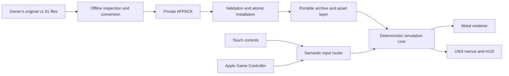

# Airfix Dogfighter reconstruction and private iOS port

This repository contains an evidence-driven, native reimplementation of
**Airfix Dogfighter v1.01 (2000)** and the foundations of a private iOS port.
The goal is to preserve the original single-player experience on modern Apple
hardware, then add optional improvements such as higher rendering resolution
and modern lighting without changing faithful-mode gameplay.

The project is under active development and is **not yet a playable port**.
It currently provides the portable archive/asset pipeline, deterministic input
core, private content-package infrastructure, fail-closed render submission and
texture-upload preparation, diagnostic rendering, and a data-less UIKit/Metal
application shell with an authenticated private-room loading path and the first
native touch/controller input slice.

## Project scope

| Area | Version 1 target |
|---|---|
| Distribution | Private installation on the owner's registered devices |
| Platform | Native ARM64 iOS application; no x86 emulation or JIT |
| Minimum OS | iOS 16.4 deployment target |
| Gameplay | Single-player campaign and required menus |
| Input | Complete touch controls and Bluetooth/USB extended controllers |
| Rendering | Faithful Metal path first; optional enhanced mode later |
| Content | Imported locally from the owner's original v1.01 files |
| Out of scope | App Store release, public asset distribution, multiplayer, House Editor, Paint Room |
| Music | Original CD audio is unavailable and remains optional/absent |

The initial device-validation matrix is:

| Device | Runtime OS | Role |
|---|---:|---|
| iPhone 17 Pro Max | iOS 26.6 | Large-screen, high-performance target |
| iPhone SE (3rd generation) | iOS 26.3 | Compact-screen and performance floor |

These are target test devices, not a claim that the unfinished game has already
passed device acceptance. GitHub Actions currently verifies unsigned
`iphoneos` and `iphonesimulator` builds with deployment target 16.4.

## Legal and content boundary

This is a compatibility and preservation project. It assumes that each user:

- owns a lawfully acquired copy of Airfix Dogfighter v1.01;
- is permitted by the laws applicable to them to make and use a private
  compatibility copy;
- keeps all original and converted game content private; and
- does not redistribute original executables, archives, media, converted
  `.afpack` files, or app packages containing that content.

Original game binaries and assets are deliberately excluded from Git. The
repository contains independently written source code, format documentation,
synthetic test fixtures, and aggregate observations only. Conversion reads an
owner-supplied installation without modifying it and produces a private,
validated runtime package outside the repository.

This is not legal advice, does not grant rights to the original game, and is
not affiliated with or endorsed by the game's developers, publishers, or
trademark owners. Do not obtain missing music or assets from unofficial
sources.

## Current status

| Component | State |
|---|---|
| Reverse engineering | Ongoing, with functions and claims tied to reproducible evidence |
| `UDSP` archives | Bounded single-handle metadata/parser and entry-read APIs, lookup, decompression, verification, and CLI implemented |
| Legacy assets | GTI textures plus bounded CCF scene, room/fog/BSP, mesh, material, blueprint, and placed-node parsing implemented |
| Dependency resolution | Object-to-scene, blueprint/placed graphs, BSP polygons, verified world-to-CCF binding, rooms, meshes, portals, materials, and texture edges implemented |
| Private packaging | AFPACK writer, validation, transactional install/recovery, and native iOS import/rollback UI implemented |
| Runtime content loading | Exact authenticated active lease/session, atomic World → CCF → GTI → draw-submission room loading, and revision/serial-gated one-shot native handoff implemented |
| Rendering | Bounded explicit-room assembly, stable texture IDs, atomic RGBA8 upload preparation, CPU diagnostics, synthetic bootstrap, and two-phase private-room Metal publication implemented |
| Input core | Deterministic semantic router for touch/controller/test sources implemented |
| Native controls | First UIKit stick/fire/pause overlay and Apple extended-controller slice implemented; complete V1 action set pending |
| Game simulation | Reconstruction in progress; no complete playable loop yet |
| Continuous integration | Portable C++ tests plus unsigned device/simulator iOS builds |

Detailed, frequently updated progress lives in
[docs/progress/STATUS.md](docs/progress/STATUS.md) and
[docs/progress/LOG.md](docs/progress/LOG.md).

The public synthetic Metal scene remains the data-less bootstrap and regression
fixture. Once private content is authenticated, the native coordinator keeps
the adopted AFPACK session on its serialized worker, loads the initial
`Game/Worlds/axis_1.world` logical asset at physical CCF room index 1, and
issues a one-shot CPU room snapshot. Publication requires both the exact
`{generation, size, digest}` content revision and the current monotonic request
serial, so replaced requests, content changes, and lifecycle invalidation cannot
publish stale work.

Metal publication is two-phase. Complete buffers, RGBA8 textures, and generated
mips are prepared off the main thread; the main thread rechecks the snapshot
gate and publishes the complete immutable room with one pointer assignment.
Buffers and textures are suballocated from retained Metal heaps. A checked heap
descriptor plan is admitted before allocation, then each accepted snapshot is
charged exactly once by its measured `MTLHeap.currentAllocatedSize` in a shared
384 MiB ledger. Prepared, published, retired, and command-buffer-retained
snapshots all remain charged until their resources and heaps are destroyed off
main. Metal may page-round a heap beyond its descriptor plan without exposing a
documented pre-creation upper bound; any measured difference needs supplemental
admission before publication, but that short unpublished allocation window is
not claimed as a hard physical byte ceiling.

The portable UDSP layer now supports a stable, caller-owned binary stream from
metadata parsing through indexed entry reads. `Archive::open(path)` uses one
file handle; `Archive::open(stream, sourceLabel)` and the stream overloads of
`readFilePrefix`/`readFile` never reopen `sourceLabel`, which is diagnostic
text only. Exact current stream size, archive and payload regions, indices,
limits, and `streamoff`/`streamsize` representability are checked before the
corresponding allocation or read.

The portable recovery layer now returns a move-only active-content lease. It
keeps the exact file handle used for the full AFPACK SHA-256 check together
with the already parsed pack, strict manifest, and exact
`source/Resource.up` archive. `airfix_content` consumes that lease without
reopening, rehashing, or reparsing the package. Its diagnostic label is never
opened as a path, and only serialized, bounded nested-file reads are exposed.
An independent stream-opening entry point remains for synthetic tests.

`WorldRoomLoader` composes that session into one immutable, revision-tagged
room result. It resolves an exact World and its exact `CCFF`, selects only an
explicit physical CCF room, derives dense texture IDs, preflights aggregate
source/decoded/upload/resident/CPU budgets, prepares every GTI, assembles the
draw model, and validates the final draw submission before publishing anything.
An external, private-data smoke run has completed this full transaction on an
installed original-content package. The immutable room contained 62 meshes,
62 instances, 23 dense texture assets, and 167 validated draw commands; no
private package, original-derived bytes, or generated artifacts were committed.
The public synthetic end-to-end tests include valid texture ID zero, empty
receiver rooms, multiple CCF candidates, deduplication, cancellation, malformed
later dependencies, compressed-source peak memory, and exact/one-under limits.
The portable suite passes 33/33 synthetic tests. Physical-device rendering and
visual acceptance remain pending.

## Architecture

The port is a native reimplementation, not a recompilation of x86 assembly for
iOS. Decompilation and static analysis are used to understand observable file
formats and behavior; maintainable C++20 and Objective-C++ code is then written
for ARM64 and Metal.



The main boundaries are:

- **Reverse-engineering evidence:** function catalogues, format notes, and
  reproducible experiments; generated decompiler databases stay local.
- **Portable core:** bounded parsers, deterministic input, reconstructed game
  rules, content identity, platform-neutral render payloads, and validated
  texture/draw handoff plans.
- **Private content pipeline:** offline conversion, cryptographic validation,
  content-addressed installation, activation, and rollback.
- **iOS platform layer:** UIKit lifecycle, Metal presentation, Game Controller,
  touch UI, audio, haptics, and sandbox storage.
- **CI/release layer:** cross-platform tests and unsigned iOS builds today;
  protected private signing later.

See [docs/ARCHITECTURE.md](docs/ARCHITECTURE.md) for the full design and
[docs/adr/0001-port-strategy.md](docs/adr/0001-port-strategy.md) for the chosen
reconstruction strategy.

## Control system

The game must remain fully usable with either touch or a supported extended
controller.

The implemented first slice provides a landscape virtual flight stick, primary
fire, and pause/resume. It supports simultaneous stick and fire touches,
safe-area-aware capture targets, selective hit testing, accessibility actions,
and complete neutralization on content, visibility, and lifecycle boundaries.
The final layout still needs throttle, secondary fire, weapon selection,
camera/rear view, mission status, customization, and haptics.

Bluetooth pairing remains managed by iOS. The native Apple Game Controller
adapter currently maps an extended controller's left stick, right trigger, and
menu/options controls. It preserves short digital edges between fixed ticks,
handles hot-plug and disconnect with forced pause, and requires neutral state
after reconnect. Calibration, remapping, controller-only menus, glyphs, and
optional rumble remain future work. Touch stays available when a controller is
connected.

Both platform adapters feed the implemented deterministic semantic input
router. The simulation sees immutable per-tick actions rather than UIKit or
controller objects, which keeps gameplay testable and independent of frame
rate. The complete contract is documented in
[docs/systems/INPUT.md](docs/systems/INPUT.md).

## Build and test the portable code

Prerequisites:

- CMake 3.25 or newer;
- a C++20 compiler;
- Ninja or another CMake-supported build tool.

From the repository root:

```bash
cmake -S . -B build -DCMAKE_BUILD_TYPE=Release \
  -DAIRFIX_BUILD_TESTS=ON \
  -DAIRFIX_BUILD_TOOLS=ON
cmake --build build --config Release --parallel
ctest --test-dir build --build-config Release --output-on-failure
```

Tests use synthetic fixtures and do not require proprietary game files. The
read-only archive inspector can be run against a privately supplied archive:

```text
udsp-list [--summary|--verify|--inventory|--resolve-objects] <archive.up>
```

Diagnostic preview outputs and all private/generated content belong in ignored
local directories and must never be committed.

## iOS builds

GitHub Actions is the current Apple build host, so portable development and
compile validation do not require a local Mac. The workflow builds a data-less
UIKit/Metal shell for both ARM64 devices and the simulator and verifies that no
private content enters the app bundle.

Device signing and installation are a later protected workflow using the
owner's Apple Developer credentials and provisioning profile. Signed IPAs,
certificates, profiles, device identifiers, original assets, and `.afpack`
content must not be published as public artifacts. A MacBook is introduced only
if an on-device task cannot be completed through the accepted workflow or it
provides a documented material acceleration.

See [docs/ci/GITHUB-ACTIONS-IOS.md](docs/ci/GITHUB-ACTIONS-IOS.md) and
[docs/process/MACBOOK-GATE.md](docs/process/MACBOOK-GATE.md).

## Repository guide

```text
apps/airfix-ios/       UIKit, Metal, and Objective-C++ platform shell
src/airfix/archive/    UDSP archive parsing and bounded entry reads
src/airfix/assets/     Legacy formats, dependency graphs, render-ready data
src/airfix/content/    Authenticated single-handle runtime content sessions
src/airfix/input/      Deterministic semantic input router
src/airfix/io/         Cross-platform durable file primitives
src/airfix/package/    Private AFPACK format, validation, and installation
src/airfix/render/     Geometry, texture preparation, draw plans, diagnostics
src/airfix/runtime/    Platform-neutral application/session state
tests/                 Synthetic unit and malformed-input tests
tools/                 Read-only inspectors, converters, and CI checks
docs/                  Plans, ADRs, format notes, evidence, and progress logs
```

Recommended starting points:

- [Project plan](docs/PROJECT-PLAN.md)
- [Version 1 scope](docs/design/V1-SCOPE.md)
- [iOS requirements](docs/design/IOS-PORT-REQUIREMENTS.md)
- [Architecture](docs/ARCHITECTURE.md)
- [Reverse-engineering workflow](docs/RE-WORKFLOW.md)
- [Private content format](docs/formats/AFPACK.md)
- [Input and controller design](docs/systems/INPUT.md)
- [Current status](docs/progress/STATUS.md)

## Contributing safely

- Never commit or attach original game files, converted assets, memory dumps,
  decompiler projects, signed IPAs, certificates, profiles, or device IDs.
- Use synthetic fixtures for tests and report corpus findings only as bounded
  aggregate facts.
- Keep parsers defensive: validate sizes and limits before allocation or reads.
- Separate proven behavior from hypotheses and link implementation claims to
  evidence or a reproducible experiment.
- Preserve faithful behavior before proposing enhanced graphics or controls.
- Run the portable tests and public-boundary check before publishing changes.

No source-code license has been selected yet. Publication of this repository
does not grant rights to the original Airfix Dogfighter software or content;
third-party tools and references retain their own licenses.
