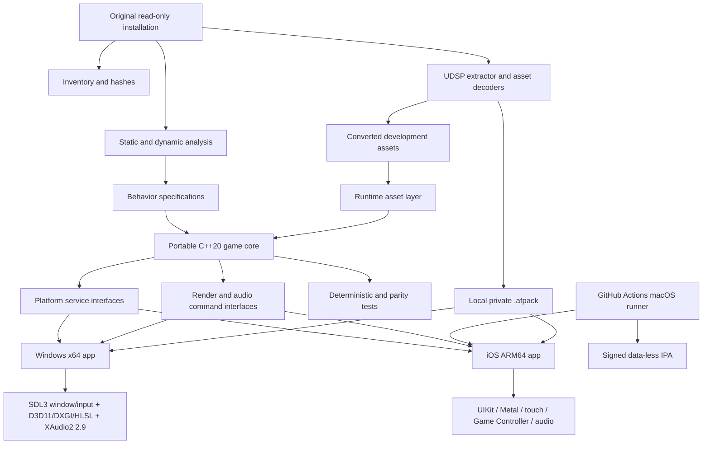

# Target architecture

**Status:** active target architecture
**Last updated:** 2026-07-29

## Constraints

- The reference build is Windows PE32/x86 and uses DirectX 7-era APIs plus an
  optional Glide renderer.
- Version 1 has a native Windows x64 playable product. It is the primary rapid
  debugging and controlled original-comparison environment; it does not load or
  translate original x86 executable modules.
- iOS requires a native ARM64 application and Xcode build/signing, provided by
  an explicit GitHub-hosted macOS runner. A local Mac is required later for
  interactive device debugging and profiling.
- The original source code is unavailable. Decompiled output is evidence, not
  production-ready source.
- Original assets are in custom `UDSP` packages and must be understood before a
  complete vertical slice can load.
- Fidelity and modernization are separate acceptance dimensions.
- The iOS version 1 product is a private signed sideload with deployment target
  iOS 16.4. Runtime tests use iPhone 17 Pro Max/iOS 26.6 and iPhone SE
  3/iOS 26.3.
- Windows and iOS share one portable C++20 game, physics, resource, save,
  semantic-input, and platform-neutral render/audio implementation. Their
  window/lifecycle, renderer, physical-input, audio, and filesystem adapters
  remain separate.
- Multiplayer, House Editor, Paint Room, App Store services, and unavailable CD
  music are outside the v1.0 product boundary.

## Architecture



## Component boundaries

### `engine/core`

Portable C++20 only. Owns math conventions, object identity, update order,
timers, serialization primitives, event dispatch, and deterministic random
number generation. No Windows, Apple, graphics, or filesystem headers.

### `game`

Reconstructed actors and rules: aircraft, ground and water units, projectiles,
pickups, effects, interaction, AI, missions, dogfight, and single-player flow.
Subsystems initially mirror the original `.type` and `.mode` module boundaries;
they may be refactored only after parity tests protect behavior.

### `simulation`

Portable deterministic state and update rules. It depends on semantic
`airfix::input`, not UIKit, Game Controller, Metal, wall-clock timestamps, or
render math. The first implemented slice is a frozen-pose player-control state:
it carries uninterpreted Q15 bank/pitch intentions, exact primary-fire state and
edge counts, a completed-step counter, and a canonical field encoding. Recovered
flight equations will replace the frozen-pose boundary only after their units,
branch conditions, constants, and dynamic actor binding are evidence-backed.
The reference scheduler order and player command signs are already recovered.

### `assets`

Two layers:

- Offline tools parse `UDSP` and convert original formats into documented,
  versioned intermediate data.
- Runtime loaders consume the intermediate representation and validate schema,
  bounds, and checksums.

The first extractor must also support a listing-only mode so research can
progress without copying full assets.

Both public product builds are data-less. An owner-local converter creates one
private, versioned `.afpack` runtime representation consumed through
platform-specific import/storage adapters on Windows and iOS. Original and
converted game content never enters the GitHub repository, public Actions
caches, logs, or artifacts.

### `render`

The game emits API-neutral draw commands and lighting data. The playable
Windows product and the iOS product own separate renderer backends over that
same contract. Windows uses D3D11/DXGI with HLSL and is the primary rapid-debug
and reference-capture path; iOS uses native Metal. SDL3 does not own rendering.
The faithful pipeline models observed output and render-state semantics without
recreating DirectX 7 interfaces. Modern lighting, shadows, post-processing,
higher-resolution textures, and upscaling are optional feature layers with
independent toggles and performance budgets.

Static room payloads and GPU resources remain immutable after publication.
Future actor motion enters through a separate bounded
`ScenePoseExchange`: complete absolute instance transforms are published
atomically by simulation and acquired through stable read leases by the
renderer. The exchange is tied to one scene identity, never mutates
`LoadedWorldRoom`, and returns the authored transform when an instance has no
override. It deliberately does not decide which instances belong to a player;
that binding awaits the recovered dynamic actor/spawn pipeline.

### `audio`

Recovered gameplay state produces semantic sound operations in `simulation`.
`LegacyAircraftAudioCoordinator` joins the AirCraft engine and destroyed-dive
transitions at the exact recovered fifth-call boundary, then translates play,
stop, gain, and pitch operations into bounded `airfix::audio` command batches.
The coordinator contains no platform API, decoded sample, file path, mixer, or
device state.

The owner-local content/runtime layer binds each recovered sound role to a
validated clip ID and a voice ID unique to one aircraft instance. Platform
backends register owned decoded PCM for those clip IDs and consume the same
monotonic command batches. Windows uses XAudio2 2.9; iOS uses AVAudioEngine
with one player/varispeed chain per active voice. See `docs/systems/AUDIO.md`.

### `platform`

Narrow interfaces for input, audio, timing, files, localization, lifecycle, and
video. The products implement separate outer layers:

- Windows uses SDL3 for its window, operating-system events, keyboard, mouse,
  and game controllers; D3D11/DXGI with HLSL for rendering; XAudio2 2.9 for
  native audio; and separate adapters for owner-local content import, saves,
  and diagnostics.
- iOS owns UIKit lifecycle, touch and Game Controller input, Metal, Apple audio
  session/device integration, sandboxed content import, saves, and safe areas
  behind small Objective-C++ bridges.

ADR-0008 selects the Windows window/input and renderer stack. ADR-0009 selects
XAudio2 2.9; ADR-0010 selects AVAudioEngine and the explicit-resume iOS audio
session policy over the same shared command contract. ADR-0011 binds the six
recovered aircraft roles to PCM decoded from one authenticated owner-local
content transaction on both products. The exact minimum Windows release, D3D
feature-level floor, and packaging remain bounded follow-up decisions. ADR-0002
records the staged input decision.

Input is a distinct subsystem: platform adapters produce normalized physical
events, a context/binding router resolves semantic actions, and the simulation
receives immutable per-tick `InputFrame` values. Windows keyboard/mouse and
controller input, iOS touch and Game Controller input, desktop test input, and
optional motion never enter the game core as platform key/button codes. See
`docs/systems/INPUT.md` and ADR-0002.

### `apps`

- `airfix-windows`: native x64 playable application, primary debug/parity
  environment, and faithful-reference capture host. Its data-less SDL3,
  D3D11/DXGI/HLSL, input, and XAudio2 2.9 platform shell is implemented;
  authenticated aircraft-audio loading is implemented, while mission/world and
  reconstructed gameplay integration remain.
- `airfix-ios`: CMake-generated Objective-C++/UIKit/Metal application target.
  The first shell is data-less, iPhone-landscape only, delegates lifecycle
  state to portable `airfix::runtime`, and owns native AVAudioEngine/session
  handling. Owner-local mission preparation now atomically carries and
  registers the authenticated aircraft clip set; see ADR-0006, ADR-0010, and
  ADR-0011.
- Optional diagnostic viewers for archives, models, levels, and effects.

## Dependency direction

Dependencies point inward: app shells and backends depend on interfaces; game
logic depends on the portable core; the portable core never depends on a
platform. Asset conversion tools are build-time programs and are not linked into
the shipping game unless a small, audited runtime reader is necessary.

## Proposed source layout

```text
apps/
  airfix-windows/
  airfix-ios/
src/
  core/
  game/
  assets/
  render/
    windows/
    metal/
  audio/
    windows/
    ios/
  platform/
    windows/
    ios/
tools/
  inventory/
  udsp/
  viewers/
tests/
  unit/
  integration/
  parity/
docs/
analysis/                 # local heavy data; ignored by Git
private-fixtures/         # original-derived fixtures; ignored by Git
```

## Decisions deliberately deferred

- Exact minimum Windows release, D3D feature-level floor, and packaging: decide
  through focused product spikes while preserving ADR-0007 through ADR-0009.
- Runtime intermediate model/level formats: decide after `UDSP` contents are
  inventoried.
- Post-v1 multiplayer/editor scope: preserve useful shared-interface findings,
  but do not schedule implementation during v1.0.
- Runtime coverage below iOS 26.3: iOS 16.4 remains a deployment/availability
  contract but has no accepted runtime test device.
- Whether `GCVirtualController` is useful for the first device spike before the
  final custom touch overlay is ready.
- Windows-compatible installation method for the signed IPA produced by Actions.
