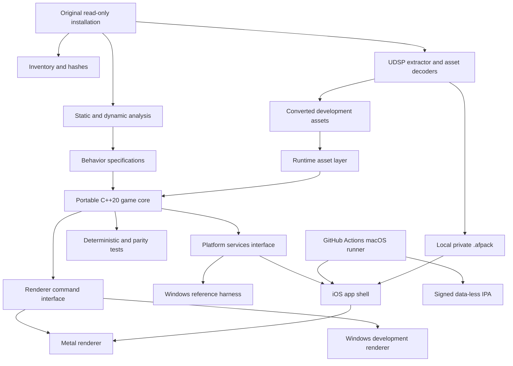

# Target architecture

**Status:** active target architecture
**Last updated:** 2026-07-24

## Constraints

- The reference build is Windows PE32/x86 and uses DirectX 7-era APIs plus an
  optional Glide renderer.
- iOS requires a native ARM64 application and Xcode build/signing, provided by
  an explicit GitHub-hosted macOS runner. A local Mac is not required by default
  and is introduced only under the blocker/20% acceleration gate.
- The original source code is unavailable. Decompiled output is evidence, not
  production-ready source.
- Original assets are in custom `UDSP` packages and must be understood before a
  complete vertical slice can load.
- Fidelity and modernization are separate acceptance dimensions.
- Version 1.0 is a private signed sideload with deployment target iOS 16.4.
  Runtime tests use iPhone 17 Pro Max/iOS 26.6 and iPhone SE 3/iOS 26.3.
- Multiplayer, House Editor, Paint Room, App Store services, and unavailable CD
  music are outside the v1.0 product boundary.

## Architecture



## Component boundaries

### `engine/core`

Portable C++20 only. Owns math conventions, object identity, update order,
timers, serialization primitives, event dispatch, and deterministic random
number generation. No Windows, Apple, graphics, or filesystem headers.

### `game`

Reconstructed actors and rules: aircraft, ground and water units, projectiles,
pickups, effects, interaction, AI, missions, dogfight, and single-player flow.
Subsystems initially mirror the original `.type` and `.mode` module boundaries;
they may be refactored only after parity tests protect behavior.

### `simulation`

Portable deterministic state and update rules. It depends on semantic
`airfix::input`, not UIKit, Game Controller, Metal, wall-clock timestamps, or
render math. The first implemented slice is a frozen-pose player-control state:
it carries uninterpreted Q15 bank/pitch intentions, exact primary-fire state and
edge counts, a completed-step counter, and a canonical field encoding. Recovered
flight equations will replace the frozen-pose boundary only after their
scheduler, units, signs, and constants are evidence-backed.

### `assets`

Two layers:

- Offline tools parse `UDSP` and convert original formats into documented,
  versioned intermediate data.
- Runtime loaders consume the intermediate representation and validate schema,
  bounds, and checksums.

The first extractor must also support a listing-only mode so research can
progress without copying full assets.

The production iOS app is built without original data. The Windows converter
creates a private, versioned `.afpack` imported after installation. Original and
converted game content never enters the GitHub repository, Actions cache, logs,
or artifacts.

### `render`

The game emits API-neutral draw commands and lighting data. A Windows backend
supports rapid desktop development; the shipping iOS backend uses Metal.
The faithful pipeline is implemented first. Modern lighting, shadows,
post-processing, higher-resolution textures, and upscaling are optional feature
layers with independent toggles and performance budgets.

### `platform`

Narrow interfaces for input, game controllers, touch, audio, timing, files,
localization, lifecycle, and video. The first iOS vertical slice uses native
UIKit and Game Controller adapters behind a small Objective-C++ bridge, which
also owns lifecycle, storage, safe-area, audio-session, and Metal integration.
SDL3 remains an optional later desktop/common adapter, not an iOS prerequisite;
ADR-0002 records the staged decision.

Input is a distinct subsystem: platform adapters produce normalized physical
events, a context/binding router resolves semantic actions, and the simulation
receives immutable per-tick `InputFrame` values. Touch, controllers, desktop test
input, and optional motion never enter the game core as platform key/button
codes. See `docs/systems/INPUT.md` and ADR-0002.

### `apps`

- `reference-win`: desktop executable used during reconstruction and comparison.
- `airfix-ios`: CMake-generated Objective-C++/UIKit/Metal application target.
  The first shell is data-less, iPhone-landscape only, and delegates lifecycle
  state to portable `airfix::runtime`; see ADR-0006.
- Optional diagnostic viewers for archives, models, levels, and effects.

## Dependency direction

Dependencies point inward: app shells and backends depend on interfaces; game
logic depends on the portable core; the portable core never depends on a
platform. Asset conversion tools are build-time programs and are not linked into
the shipping game unless a small, audited runtime reader is necessary.

## Proposed source layout

```text
apps/
  reference-win/
  airfix-ios/
src/
  core/
  game/
  assets/
  render/
  platform/
tools/
  inventory/
  udsp/
  viewers/
tests/
  unit/
  integration/
  parity/
docs/
analysis/                 # local heavy data; ignored by Git
private-fixtures/         # original-derived fixtures; ignored by Git
```

## Decisions deliberately deferred

- Exact desktop graphics API: decide after a small draw-command spike.
- Runtime intermediate model/level formats: decide after `UDSP` contents are
  inventoried.
- Post-v1 multiplayer/editor scope: preserve useful shared-interface findings,
  but do not schedule implementation during v1.0.
- Runtime coverage below iOS 26.3: iOS 16.4 remains a deployment/availability
  contract but has no accepted runtime test device.
- Whether `GCVirtualController` is useful for the first device spike before the
  final custom touch overlay is ready.
- Windows-compatible installation method for the signed IPA produced by Actions.
