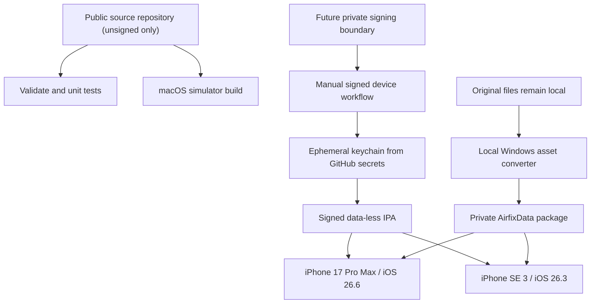

# GitHub Actions iOS build and signing design

**Status:** unsigned shell implemented; private signing design accepted but
disabled

**Related decision:** ADR-0004

## Goals

- Build all iOS configurations on GitHub-hosted macOS runners.
- Require no locally owned Mac or local Xcode installation.
- Keep the iOS 16.4 deployment target while testing physical devices on iOS
  26.x.
- Produce a private signed IPA for the registered owner devices.
- Never upload original Airfix files, converted game assets, signing credentials,
  or reverse-engineering dumps as repository content, cache, logs, or workflow
  artifacts.
- Make every IPA traceable to source commit, workflow run, compiler, SDK, and
  asset-package schema.

The connected source repository is currently public. Only the no-secret,
unsigned workflow is enabled there. Before signed IPA work, either this remote
must become private or signing must move to a separate private repository and
protected workflow. No certificate, profile, UDID, signed IPA, or private asset
package may enter the public remote.

## Accepted device matrix

| Device | Runtime OS | Primary purpose |
|---|---|---|
| iPhone 17 Pro Max | iOS 26.6 | large Dynamic Island display, 120 Hz behavior, high-end Metal, heat and controller/touch soak |
| iPhone SE (3rd generation) | iOS 26.3 | compact 4.7-inch display, Home-button geometry, A15 performance floor for available hardware |

The deployment target remains iOS 16.4. No runtime test on iOS 16.4 is planned.
Compatibility at that boundary is build-time and static: deployment metadata,
availability guards, dependency minimum versions, and API/link checks. Runtime
behavior is verified only on the two listed iOS 26.x devices unless the matrix is
expanded later.

## Build topology

The application and game data are separate deliverables. CI never needs the
original installation.

## Workflow layers

### 1. `validate`

Trigger: every pull request and push.

Runs portable unit tests, format-parser tests using synthetic fixtures, lint,
formatting, generated-file checks, and checks that forbidden original/signing
files are absent. It can use Windows/Linux runners where appropriate.

No secrets. No signed outputs.

### 2. `ios-unsigned`

Trigger: every pull request and push after the iOS target exists.

- Use the explicit GitHub `macos-26` runner label, not the moving
  `macos-latest` alias.
- Select `/Applications/Xcode_26.6.app/Contents/Developer`; preflight fails if
  it disappears. This currently provides the iOS 26.5 SDK.
- Print `xcodebuild -version`, SDK version, compiler version, CMake version, and
  runner image metadata into a build manifest.
- Build ARM64 `iphoneos` and ARM64 `iphonesimulator` bundles with code signing
  disabled.
- Do not upload either bundle from the public repository.
- Verify `IPHONEOS_DEPLOYMENT_TARGET=16.4` and fail if a dependency raises it.

The first green run was `29898694161`: device build and bundle validation took
45 seconds; simulator build and validation took 66 seconds. Runtime simulator
launch is a later check and is not implied by this compile/link milestone.

### 3. `ios-private-ipa`

Trigger: manual `workflow_dispatch` and optionally an explicit private release
tag. Never run for pull requests or untrusted branches.

- Attach the job to a protected GitHub Environment such as `ios-private`.
- Require manual approval before secrets are made available.
- Import certificate/profile into a temporary keychain on the ephemeral runner.
- Build/archive/export a signed ARM64 IPA for the registered devices.
- Verify signature, entitlements, provisioning profile, bundle identifier,
  minimum OS, architecture, and forbidden files.
- Upload only the final IPA plus a non-sensitive build manifest and checksums.
- Use the shortest practical artifact retention, initially one day.

Physical installation and testing are manual after artifact download. GitHub
Actions does not replace the device test pass.

A MacBook is introduced only under `docs/process/MACBOOK-GATE.md`: a hard
blocker or evidence that it reduces the remaining affected work by at least 20%.

## Signing secrets

The protected environment holds only the items required for signing:

| Secret | Contents |
|---|---|
| `BUILD_CERTIFICATE_BASE64` | base64-encoded `.p12` signing certificate/private key |
| `P12_PASSWORD` | password for the `.p12` |
| `BUILD_PROVISION_PROFILE_BASE64` | base64-encoded `.mobileprovision` containing both device UDIDs |
| `KEYCHAIN_PASSWORD` | random password for the temporary runner keychain |

Team ID, bundle ID, profile name, and selected Xcode version are configuration
variables unless disclosure would be undesirable. No Apple account password or
long-lived interactive login belongs in the workflow.

Rules:

- Never echo secrets or decoded paths/content.
- GitHub-hosted VMs are ephemeral, but cleanup runs under `if: always()` as
  defense in depth.
- Rotate/revoke the certificate/profile if logs or artifacts could have exposed
  them.
- Restrict `GITHUB_TOKEN` to `contents: read` unless a job proves it needs more.
- Pin third-party actions to reviewed commit SHAs; minimize the action set.
- Workflows receiving signing secrets never run code from forks or untrusted
  pull requests.

## Game-data separation

The original folder exists only on the Windows analysis machine. The local asset
pipeline produces a versioned package, provisionally named
`AirfixData-<schema>-<sourceBuild>.afpack`.

The CI-built application:

- starts without the package and shows an import/install screen;
- imports the package through an iOS Files/document-picker or another private
  transfer path selected during the device spike;
- copies it atomically into Application Support after validating header,
  schema, source-build ID, required entries, checksums, sizes, and available
  storage;
- never writes into the imported source file;
- can replace/recover the package without deleting saves;
- treats music as optional and absent in the current content set.

CI uses only generated/synthetic fixtures. The `.afpack`, extracted files,
original videos, converted textures/models/audio, and full game screenshots are
forbidden in GitHub Actions uploads and caches.

## Artifact policy

- The source repository may remain public only for unsigned jobs; a private
  boundary is mandatory before signing workflows are enabled.
- Signed IPA artifact retention starts at one day.
- Test logs/results may use a longer documented retention only when they contain
  no private content.
- Never upload crash dumps, memory dumps, source-derived gameplay captures, or
  full asset-package listings without review.
- Build manifest includes commit SHA, workflow run ID, runner image, Xcode/SDK,
  deployment target, architecture, dependency lock hash, and IPA SHA-256.
- The downloaded IPA is stored privately by the owner; GitHub is not a permanent
  release archive.

## Required CI checks

| Check | Failure means |
|---|---|
| deployment target equals 16.4 | dependency/project silently raised minimum OS |
| ARM64 device slice exists | invalid device artifact |
| simulator build succeeds | Apple-platform boundary/compiler regression |
| signature and entitlements verify | IPA cannot be trusted/installed as planned |
| provisioning includes expected bundle/device set | wrong profile |
| forbidden-file scan is empty | private/original/signing material leaked into output |
| app boots without asset package | CI build accidentally depends on local data |
| synthetic package import tests pass | asset installer regression |
| unit/replay tests pass | portable behavior regression |

## Device test handoff

For every candidate IPA, record:

- IPA SHA-256 and build manifest ID;
- device model and exact iOS version;
- installation method and provisioning expiration;
- imported `.afpack` SHA-256/schema/source build;
- touch/controller model and mapping profile;
- passed/failed scenario IDs;
- crash/thermal/performance notes.

The Windows-compatible IPA installation method is selected during the first
signed device spike. It is separate from compilation and must not require App
Store publication.

## Risks and mitigations

| Risk | Mitigation |
|---|---|
| runner image removes/pivots Xcode | explicit runner/Xcode pin plus preflight and planned upgrades |
| private-repo macOS minute cost | keep PR jobs narrow; cache only dependencies; signed build manual |
| signing secret exposure | protected environment, manual approval, minimal permissions, short logs/artifacts |
| original assets uploaded by mistake | forbidden-file/hash scan and data-less app architecture |
| IPA cannot reach device without Mac | validate Windows installation path in the first device spike |
| iOS 16.4 regression remains unseen | label it build-time compatibility only; add older runtime/device only if required |
| Actions success mistaken for device success | separate physical scenario checklist on both phones |
| cloud/device feedback loop becomes too slow | measure one full loop and apply the MacBook 20% acceleration gate |

## Implementation order

1. Connect the source repository and enforce a public/private file boundary.
2. Add the portable validation workflow and CMake test skeleton.
3. Add data-less iOS simulator/device builds with deployment target 16.4.
4. Implement the synthetic `.afpack` parser and package tests.
5. Register both device UDIDs and create the private provisioning profile.
6. Configure protected signing secrets/environment.
7. Produce and inspect the first signed IPA.
8. Select/verify Windows-to-iPhone IPA installation method.
9. Import the locally converted private data package.
10. Execute device scenarios on iOS 26.6 and 26.3.
11. Measure Actions queue/build/download/install/debug feedback time and evaluate
    the MacBook gate before intensive Metal/input/performance iteration.

## Authoritative references

- GitHub-hosted runners
  <https://docs.github.com/en/actions/reference/runners/github-hosted-runners>
- GitHub macOS 26 runner image inventory
  <https://github.com/actions/runner-images/blob/main/images/macos/macos-26-Readme.md>
- GitHub Apple certificate and provisioning-profile workflow
  <https://docs.github.com/actions/deployment/deploying-xcode-applications/installing-an-apple-certificate-on-macos-runners-for-xcode-development>
- GitHub Actions secrets
  <https://docs.github.com/en/actions/reference/security/secrets>
- Workflow artifacts and retention
  <https://docs.github.com/en/actions/concepts/workflows-and-actions/workflow-artifacts>
