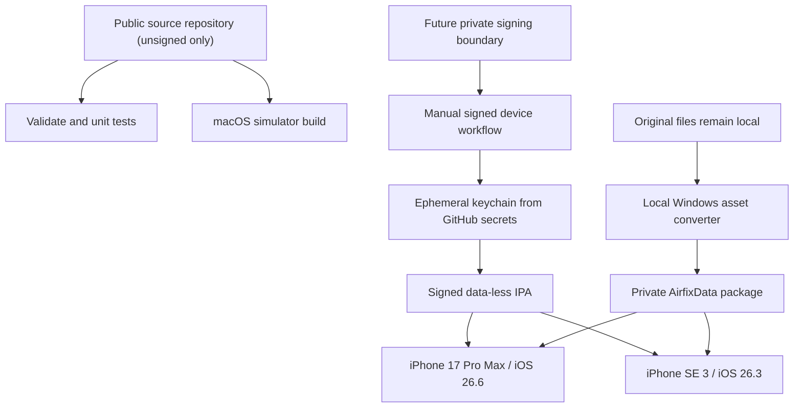

# GitHub Actions iOS build and signing design

**Status:** unsigned shell and data-less simulator runtime smoke implemented;
private signing design accepted but disabled

**Related decision:** ADR-0004

## Goals

- Build all iOS configurations on GitHub-hosted macOS runners.
- Require no locally owned Mac or local Xcode installation.
- Keep the iOS 16.4 deployment target while testing physical devices on iOS
  26.x.
- Produce a private signed IPA for the registered owner devices.
- Never upload original Airfix files, converted game assets, signing credentials,
  or reverse-engineering dumps as repository content, cache, logs, or workflow
  artifacts.
- Make every IPA traceable to source commit, workflow run, compiler, SDK, and
  asset-package schema.

The connected source repository is currently public. Only the no-secret,
unsigned workflow is enabled there. Before signed IPA work, either this remote
must become private or signing must move to a separate private repository and
protected workflow. No certificate, profile, UDID, signed IPA, or private asset
package may enter the public remote.

## Accepted device matrix

| Device | Runtime OS | Primary purpose |
|---|---|---|
| iPhone 17 Pro Max | iOS 26.6 | large Dynamic Island display, 120 Hz behavior, high-end Metal, heat and controller/touch soak |
| iPhone SE (3rd generation) | iOS 26.3 | compact 4.7-inch display, Home-button geometry, A15 performance floor for available hardware |

The deployment target remains iOS 16.4. No runtime test on iOS 16.4 is planned.
Compatibility at that boundary is build-time and static: deployment metadata,
availability guards, dependency minimum versions, and API/link checks. Runtime
behavior is verified only on the two listed iOS 26.x devices unless the matrix is
expanded later.

## Build topology

The application and game data are separate deliverables. CI never needs the
original installation.

The public source defaults are also launch-data-less: no setup or Level path is
committed, inferred, or embedded unless a private build explicitly supplies
the optional configuration described below.

## Workflow layers

### 1. `validate`

Trigger: every pull request and push.

Runs portable unit tests, format-parser tests using synthetic fixtures, lint,
formatting, generated-file checks, and checks that forbidden original/signing
files are absent. It can use Windows/Linux runners where appropriate.

No secrets. No signed outputs.

### 2. `ios-unsigned`

Trigger: every pull request and push after the iOS target exists.

- Use the explicit GitHub `macos-26` runner label, not the moving
  `macos-latest` alias.
- Select `/Applications/Xcode_26.6.app/Contents/Developer`; preflight fails if
  it disappears. This currently provides the iOS 26.5 SDK.
- Print `xcodebuild -version`, SDK version, compiler version, CMake version, and
  runner image metadata into a build manifest.
- Build ARM64 `iphoneos` and ARM64 `iphonesimulator` bundles with code signing
  disabled.
- The simulator configuration alone enables the explicit
  `AIRFIX_IOS_SIMULATOR_SMOKE` harness. CI boots a fresh simulator, installs
  and launches the app through the standard bounded `simctl launch`
  acknowledgement path without requesting termination of a pre-existing app
  process, which cannot exist on this newly created device. It then resolves
  the data container after launch and requires a bounded JSON result written
  atomically inside that container. The
  result proves that the normal renderer
  completed a command buffer containing the public synthetic scene, then that
  the existing resign-active, background, foreground, and active lifecycle
  calls left both the session and `MTKView` paused without auto-resume.
  This is an immediate handler-contract check: it invokes the same four native
  handlers in order inside the app, rather than claiming to validate
  SpringBoard's delivery timing.
- A paused `MTKView` is retried for a bounded 40 seconds while the fresh
  simulator establishes its presentation surface. If no completed command
  buffer is observed, or a later lifecycle invariant fails, the app writes the
  same atomic result file with a strict, allow-listed simulator-only failure
  stage. CI can therefore distinguish a missing drawable, presentation
  mismatch, resource gate, submitted buffer that never completed, Metal
  failure, or lifecycle failure without recording paths, checksums, or private
  data.
- An independent simulator-only watchdog is armed before Metal renderer
  initialization. It reports an initializer or synchronous draw stall without
  relying on the main run loop. Result serialization, creation of the
  application Documents directory, and the atomic write are checked; failures
  emit only a fixed path-free diagnostic marker. Its 42-second deadline fits
  inside the runner's 60-second result window with explicit launch and write
  margin. A short set of fixed, path-free milestones distinguishes watchdog
  arming, renderer completion, first-draw entry/return, and result publication.
- A launch command that times out or does not return a valid positive PID is
  treated as an inconclusive CoreSimulator startup. The runner discards that
  fresh device and retries exactly once with a second isolated device. After a
  valid PID acknowledgement, a structured failure or missing atomic result is
  authoritative and is never retried. The 30-minute job ceiling bounds both
  isolated launch attempts, configuration, build, diagnostics, and cleanup.
- The current Metal Simulator runtime rejects shared-storage heaps. The public
  smoke snapshot therefore uses directly allocated shared/tracked buffers and
  textures on `TARGET_OS_SIMULATOR`. It also avoids heap size/alignment queries
  and direct-resource `allocatedSize` queries. Instead it reserves the full
  64 MiB ceiling independently for the public snapshot and persistent fallback
  before allocation, so either owner can be destroyed without releasing the
  other's conservative debit. Simulator presentation targets likewise use
  their checked logical size plus an explicit 128 KiB policy estimate. That
  estimate is not presented as a backend-exact allocation bound: diagnostics
  label simulator GPU memory as estimated and report the ledger rather than
  querying driver allocation metadata. Physical `iphoneos` retains measured
  shared-heap planning and reconciliation. A private-heap staging/blit
  pipeline is not introduced for this small CPU-populated CI snapshot.
- The harness is not compiled into ordinary simulator builds or any `iphoneos`
  build. CMake rejects the option for a non-simulator SDK, and bundle
  verification scans the device executable for the harness schema marker.
- Keep every pull-request invocation data-less. This workflow never reads
  repository secrets or forwards private initial-mission inputs.
- Do not upload either bundle from the public repository.
- Verify `IPHONEOS_DEPLOYMENT_TARGET=16.4` and fail if a dependency raises it.

The first compile-only green run was `29898694161`: device build and bundle
validation took 45 seconds; simulator build and validation took 66 seconds.
Current simulator success additionally requires application launch, a real
public Metal submission, and the lifecycle paused invariant; compilation alone
cannot satisfy the job.

### 3. `ios-private-ipa`

Trigger: manual `workflow_dispatch` and optionally an explicit private release
tag. Never run for pull requests or untrusted branches.

- Attach the job to a protected GitHub Environment such as `ios-private`.
- Require manual approval before secrets are made available.
- Import certificate/profile into a temporary keychain on the ephemeral runner.
- Build/archive/export a signed ARM64 IPA for the registered devices.
- Verify signature, entitlements, provisioning profile, bundle identifier,
  minimum OS, architecture, and forbidden files.
- Upload only the final IPA plus a non-sensitive build manifest and checksums.
- Use the shortest practical artifact retention, initially one day.

Physical installation and testing are manual after artifact download. GitHub
Actions does not replace the device test pass.

## Optional private initial-mission configuration

The iOS target accepts four optional CMake cache inputs for a future protected
private build workflow or an explicit local build:

| GitHub secret | Generated value |
|---|---|
| `AIRFIX_IOS_INITIAL_SETUP_LOGICAL_PATH_BASE64` | Base64 of the explicit private setup logical path |
| `AIRFIX_IOS_INITIAL_LEVEL_LOGICAL_PATH_BASE64` | Base64 of the explicit private Level logical path |
| `AIRFIX_IOS_INITIAL_PLAYER_OBJECT_LOGICAL_PATH_BASE64` | Base64 of the optional exact player object-definition logical path |
| `AIRFIX_IOS_INITIAL_START_INDEX` | decimal unsigned start index in `0..4294967295` |

The public `ios-unsigned` workflow deliberately leaves all four values at their
defaults. A separate protected private workflow may forward them only after
manual environment approval and only from trusted source. CMake validates the
Base64 alphabet/padding and `uint32_t` range, then `configure_file` generates
`AirfixPrivateMissionConfig.h` inside the build directory. The generated header
and decoded logical paths are never source files and must not be uploaded as
artifacts or caches. Base64 is a safe source-generation transport, not
encryption.

All path inputs default to empty in public and unconfigured builds. Automatic
loading is disabled unless setup and Level both decode as non-empty UTF-8;
supplying only one is treated as incomplete configuration. The player object
path is optional, but a non-empty value is rejected unless the setup/Level pair
is complete and it decodes as non-empty UTF-8. The start index defaults to zero.
After the private package is authenticated, the native coordinator submits the
explicit setup + Level + optional player object + `uint32_t` request and builds
the mission manifest and aggregate room through the same verified session.

AFPACK v1 deliberately contains no launch metadata. A future AFPACK v2 may
replace these build inputs with an authenticated, bounded mission catalogue,
but that schema is not implemented. Until then, no private logical path belongs
in the repository or workflow YAML.

## Signing secrets

The protected environment holds only the items required for signing:

| Secret | Contents |
|---|---|
| `BUILD_CERTIFICATE_BASE64` | base64-encoded `.p12` signing certificate/private key |
| `P12_PASSWORD` | password for the `.p12` |
| `BUILD_PROVISION_PROFILE_BASE64` | base64-encoded `.mobileprovision` containing both device UDIDs |
| `KEYCHAIN_PASSWORD` | random password for the temporary runner keychain |

Team ID, bundle ID, profile name, and selected Xcode version are configuration
variables unless disclosure would be undesirable. No Apple account password or
long-lived interactive login belongs in the workflow.

Rules:

- Never echo secrets or decoded paths/content.
- GitHub-hosted VMs are ephemeral, but cleanup runs under `if: always()` as
  defense in depth.
- Rotate/revoke the certificate/profile if logs or artifacts could have exposed
  them.
- Restrict `GITHUB_TOKEN` to `contents: read` unless a job proves it needs more.
- Pin third-party actions to reviewed commit SHAs; minimize the action set.
- Workflows receiving signing secrets never run code from forks or untrusted
  pull requests.

## Game-data separation

The original folder exists only on the Windows analysis machine. The local asset
pipeline produces a versioned package, provisionally named
`AirfixData-<schema>-<sourceBuild>.afpack`.

The CI-built application:

- starts without the package and shows an import/install screen;
- remains data-less and does not auto-load a mission when the optional private
  configuration is empty;
- imports the package through an iOS Files/document-picker or another private
  transfer path selected during the device spike;
- copies it atomically into Application Support after validating header,
  schema, source-build ID, required entries, checksums, sizes, and available
  storage;
- never writes into the imported source file;
- can replace/recover the package without deleting saves;
- treats music as optional and absent in the current content set.

CI uses only generated/synthetic fixtures. The `.afpack`, extracted files,
original videos, converted textures/models/audio, and full game screenshots are
forbidden in GitHub Actions uploads and caches.

## Artifact policy

- The source repository may remain public only for unsigned jobs; a private
  boundary is mandatory before signing workflows are enabled.
- Signed IPA artifact retention starts at one day.
- Test logs/results may use a longer documented retention only when they contain
  no private content.
- Never upload crash dumps, memory dumps, source-derived gameplay captures, or
  full asset-package listings without review.
- Build manifest includes commit SHA, workflow run ID, runner image, Xcode/SDK,
  deployment target, architecture, dependency lock hash, and IPA SHA-256.
- The downloaded IPA is stored privately by the owner; GitHub is not a permanent
  release archive.

## Required CI checks

| Check | Failure means |
|---|---|
| deployment target equals 16.4 | dependency/project silently raised minimum OS |
| ARM64 device slice exists | invalid device artifact |
| simulator build succeeds | Apple-platform boundary/compiler regression |
| signature and entitlements verify | IPA cannot be trusted/installed as planned |
| provisioning includes expected bundle/device set | wrong profile |
| forbidden-file scan is empty | private/original/signing material leaked into output |
| app boots without asset package | CI build accidentally depends on local data |
| synthetic package import tests pass | asset installer regression |
| unit/replay tests pass | portable behavior regression |

## Device test handoff

For every candidate IPA, record:

- IPA SHA-256 and build manifest ID;
- device model and exact iOS version;
- installation method and provisioning expiration;
- imported `.afpack` SHA-256/schema/source build;
- touch/controller model and mapping profile;
- passed/failed scenario IDs;
- crash/thermal/performance notes.

The Windows-compatible IPA installation method is selected during the first
signed device spike. It is separate from compilation and must not require App
Store publication.

## Risks and mitigations

| Risk | Mitigation |
|---|---|
| runner image removes/pivots Xcode | explicit runner/Xcode pin plus preflight and planned upgrades |
| private-repo macOS minute cost | keep PR jobs narrow; cache only dependencies; signed build manual |
| signing secret exposure | protected environment, manual approval, minimal permissions, short logs/artifacts |
| original assets uploaded by mistake | forbidden-file/hash scan and data-less app architecture |
| IPA cannot reach device without Mac | validate Windows installation path in the first device spike |
| iOS 16.4 regression remains unseen | label it build-time compatibility only; add older runtime/device only if required |
| Actions success mistaken for device success | separate physical scenario checklist on both phones |
| cloud/device feedback loop becomes too slow | use a local Mac for interactive profiling and debugging |

## Implementation order

1. Connect the source repository and enforce a public/private file boundary.
2. Add the portable validation workflow and CMake test skeleton.
3. Add data-less iOS simulator/device builds with deployment target 16.4.
4. Implement the synthetic `.afpack` parser and package tests.
5. Register both device UDIDs and create the private provisioning profile.
6. Configure protected signing secrets/environment.
7. Produce and inspect the first signed IPA.
8. Select/verify Windows-to-iPhone IPA installation method.
9. Import the locally converted private data package.
10. Execute device scenarios on iOS 26.6 and 26.3.
11. Use local Xcode, LLDB, Metal tooling, or Instruments when interactive
    device profiling and debugging begin.

## Authoritative references

- GitHub-hosted runners
  <https://docs.github.com/en/actions/reference/runners/github-hosted-runners>
- GitHub macOS 26 runner image inventory
  <https://github.com/actions/runner-images/blob/main/images/macos/macos-26-Readme.md>
- GitHub Apple certificate and provisioning-profile workflow
  <https://docs.github.com/actions/deployment/deploying-xcode-applications/installing-an-apple-certificate-on-macos-runners-for-xcode-development>
- GitHub Actions secrets
  <https://docs.github.com/en/actions/reference/security/secrets>
- Workflow artifacts and retention
  <https://docs.github.com/en/actions/concepts/workflows-and-actions/workflow-artifacts>
