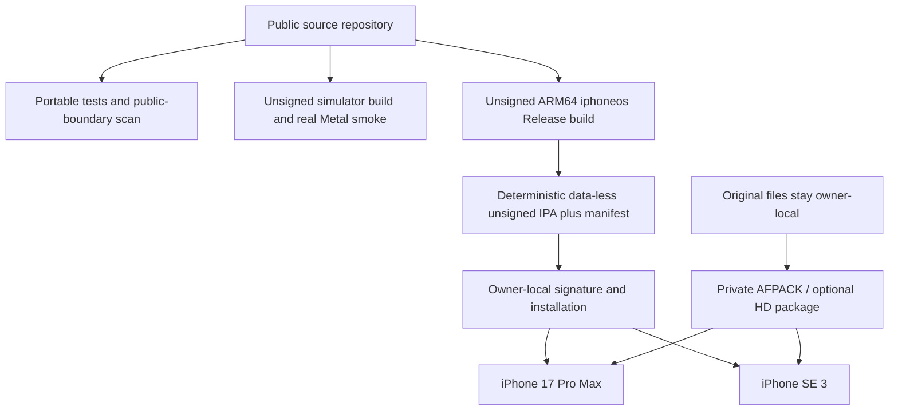

# GitHub Actions iOS build and local-signing design

**Status:** public unsigned device package and data-less simulator runtime smoke
implemented; owner-local signing, installation, AFPACK import, mission-selection
import, first static mission rendering, controls, and lifecycle have been
observed on one physical device; the complete two-phone matrix remains pending

**Related decision:** ADR-0004

## Decision summary

The source repository remains public. GitHub Actions compiles and validates the
iOS application without any Apple signing identity, provisioning profile,
device identifier, private mission selector, original game file, or HD texture.

For trusted `main` builds, Actions publishes a deterministic, data-less
`iphoneos` Release package named `AirfixDogfighter-<SHA>-unsigned.ipa` with a
strict build manifest. The package is deliberately **not installable as-is**.
It is an input to one of two owner-local signing paths:

1. **Xcode on a Mac — recommended:** generate the Xcode project from the same
   trusted source revision, opt in to automatic development signing, select a
   connected iPhone, and choose Product > Run. Xcode signs during the local
   build/install operation.
2. **Local sideloader:** download and verify the public unsigned IPA and
   manifest, then allow a reviewed local sideloader to re-sign and install it.
   The project does not select, bundle, automate, or upload credentials to a
   third-party signing service.

Signing material and signed outputs never enter GitHub. Original and converted
game data remain separate and are imported locally after installation.

## Accepted device matrix

| Device | Runtime OS | Primary purpose |
|---|---|---|
| iPhone 17 Pro Max | iOS 26.6 | Dynamic Island, high-refresh behavior, high-end Metal, touch/controller and short thermal observation |
| iPhone SE (3rd generation) | iOS 26.3 | compact safe area, Home-button geometry, A15 performance floor |

The deployment target remains iOS 16.4. Runtime compatibility is accepted only
on the devices above; the 16.4 boundary is verified through build metadata,
availability diagnostics, dependencies, and API/link checks.

## Build topology



The application and the game-data package are separate deliverables. The public
application starts without an AFPACK and presents an import surface.

## Public workflows

### Portable validation

The portable workflow runs source-boundary, documentation, parser, C++20, and
platform checks on Linux, macOS, and Windows. It also runs the synthetic unsigned
iOS package suite. No job reads Apple credentials or private game data.

### `ios-unsigned`

The workflow uses `macos-26` and the pinned Xcode 26.6 installation.

- Pull requests compile unsigned ARM64 `iphoneos` Release and ARM64
  `iphonesimulator` Debug bundles, but publish no device artifact.
- The simulator job boots a new isolated device, completes the same
  asynchronous no-content inspection used by device startup, and then requires
  an atomic result from a real public Metal command buffer plus the paused
  lifecycle sequence.
- A pre-launch CoreSimulator failure may retry once on a second fresh device.
  After a valid launch PID, a crash, timeout, structured application failure,
  or missing result is authoritative and is not retried.
- The simulator-only smoke harness is excluded from every `iphoneos` binary.
- Pushes to trusted `main` and manual runs on `main` additionally package the
  verified device bundle as a public unsigned IPA and retain it for seven days.
- Pull requests never upload an IPA, so an unreviewed branch cannot be mistaken
  for a device candidate.

The simulator uses direct shared/tracked Metal resources for its bounded public
snapshot because the hosted runtime rejects shared-storage heaps. Physical
`iphoneos` builds retain the measured shared-heap path. Simulator GPU accounting
is explicitly reported as estimated; the device path retains backend-measured
accounting.

## Unsigned IPA contract

`tools/ci/package_ios_unsigned_ipa.py` implements both packaging and independent
verification. It rejects the candidate unless all of these are true:

- exactly one `Payload/AirfixDogfighter.app` exists;
- the file tree is the exact allow-listed data-less product tree;
- no symlink, encrypted entry, duplicate canonical path, traversal, ZIP extra
  field, archive comment, unexpected directory, or unexpected file exists;
- the executable is a thin ARM64 Mach-O `MH_EXECUTE` for platform iOS with
  minimum OS 16.4;
- no Mach-O code-signature command, `_CodeSignature`, or
  `embedded.mobileprovision` exists;
- the simulator-smoke marker is absent;
- the processed Info.plist has the expected executable, bundle identifier,
  package type, `LSRequiresIPhoneOS`, and minimum OS;
- the offline Metal library and third-party license are present;
- no absolute Windows, macOS-user, or Linux-home path is embedded; and
- total file, archive, entry, and expanded sizes remain within fixed bounds.

Packaging uses canonical member order, permissions, timestamps, compression,
and paths. The adjacent `build-manifest.json` records:

- source SHA and workflow run ID;
- runner, compiler, SDK, configuration, platform, architecture, minimum OS, and
  bundle identifier;
- dependency-lock SHA-256 after strict UTF-8 and LF normalization, so the same
  committed text has one identity in macOS and Windows checkouts;
- IPA filename, size, and SHA-256; and
- explicit booleans proving that the package is unsigned, data-less, not
  installable before local signing, and contains no original data, HD package,
  or signing material.

After downloading the two files, verify them before giving the IPA to any local
signer:

```powershell
python tools/ci/package_ios_unsigned_ipa.py verify `
  --ipa AirfixDogfighter-<SHA>-unsigned.ipa `
  --manifest build-manifest.json `
  --expected-source-sha <FULL_40_CHARACTER_SHA>

Get-FileHash AirfixDogfighter-<SHA>-unsigned.ipa -Algorithm SHA256
```

The Python verifier is portable and does not contact a network service.

## Local Xcode signing — recommended

Apple documents Xcode automatic signing as the normal development-device path.
On the Mac that will run the device test:

1. Check out the exact manifest `sourceSha` from the public repository.
2. Sign in under Xcode > Settings > Accounts.
3. Connect and trust the iPhone and enable Developer Mode on the phone.
4. Run:

   ```bash
   bash tools/ios/configure-local-xcode.sh \
     --source-sha <FULL_40_CHARACTER_SHA> \
     --team-id ABCDE12345 \
     --bundle-id com.tryk016.airfixdogfighter
   ```

5. Open the one generated `.xcodeproj`, select the `airfix_ios` scheme and the
   connected iPhone, then choose Product > Run.

The script keeps every optional initial-mission value empty. Xcode uses
automatic development signing only after the explicit
`AIRFIX_IOS_ENABLE_LOCAL_SIGNING=ON` gate and a validated ten-character Team ID.
It also requires an exact clean tracked checkout matching the requested source
SHA. The default CI configuration continues to forbid signing.

The local Team ID, Xcode account state, device ID, provisioning profile, and
resulting signature remain on the Mac/Apple account. Do not paste them into
chat, commit them, or upload the generated build directory.

## Local sideloader contract

A sideloader path is acceptable only when it:

- runs locally on an owner-controlled computer;
- signs the verified unsigned IPA locally rather than uploading the binary or
  credentials to a cloud-signing service;
- uses an owner-controlled Apple account/certificate and a profile valid for
  the target device;
- does not inject libraries, plugins, advertisements, extra entitlements, or
  payload files; and
- clearly reports the resulting bundle identifier and signature lifetime.

The project intentionally does not automate Apple credentials for third-party
software. Selection of a concrete sideloader and acceptance of its signed
output happen during the first Windows-to-iPhone installation spike. Xcode is
the fallback and reference path whenever a local Mac is available.

## Private content separation

The public IPA is always data-less. It contains no AFPACK, GTI, CCF, object,
level, audio corpus, HD PNG, private manifest, reverse-engineering database, or
original executable.

After installation, the owner transfers the AFPACK through a private channel
and imports it with the system document picker. The app validates and copies it
atomically into Application Support. Optional HD content uses the separately
validated private root and always falls back safely to Classic GTI content.

AFPACK v1 deliberately contains no launch catalogue. The public build therefore
accepts a separate owner-local `.afmission` document through `Import Mission
Selection`. The file is created by `afmission-create`, contains only bounded
logical paths plus a start ordinal, and is persisted privately with current and
backup recovery. Public Actions never create, read, or upload a filled document.

The three historical CMake initial-mission Base64 inputs remain available only
for explicit owner-local experiments. They are not secrets encryption and are
always empty in public CI, in the public unsigned IPA, and in the provided local
Xcode configuration script.

### Owner-local Files workspace and diagnostic journal

The iOS bundle enables `UIFileSharingEnabled` together with
`LSSupportsOpeningDocumentsInPlace`. iOS therefore exposes the application's
`Documents` container in Files as `On My iPhone/Airfix Dogfighter`. The app
creates two bounded-purpose directories:

- `README.txt` explains the workspace without containing a device path or
  private value.
- `Imports` is a convenient owner-local staging location for `.afpack` and
  `.afmission` documents. Placing a file there does not trust or activate it;
  the corresponding in-app import control still performs coordinated,
  bounded, atomic validation and protected installation. After a successful
  import, the staging copy may be removed because runtime uses the validated
  private installation rather than the mutable Documents file.
- `Diagnostics` contains `latest.jsonl` and at most one rotated
  `previous.jsonl`. Each file is capped at 1 MiB and 4096 records. Records use
  the fixed `airfix.ios-diagnostics-v1` schema and contain only controlled
  state names, booleans, counters, input samples, and deterministic state
  hashes.

The journal never receives an AFPACK or mission logical path, filename,
checksum, source URL, device-local path, signing identity, or original byte.
It records lifecycle, content readiness, mission load stages, successful
mesh/texture/draw counts, explicit pause/resume, controller connection,
rate-limited input/simulation samples, and memory warnings. It is support
evidence, not telemetry: the app performs no upload and the owner decides
whether to copy or share a log. Public simulator CI independently validates
the directories, the bounded JSONL schema, renderer/content milestones, and
the exact no-auto-resume lifecycle suffix.

## Artifact and security policy

- Public Actions uploads only the deterministic unsigned IPA and its
  non-sensitive manifest.
- The artifact is retained for seven days and is not a permanent release.
- Signing keys, profiles, Apple session data, device IDs, signed IPA files, and
  filled device-test records remain owner-local.
- Original/converted resources, private HD data, crash dumps containing private
  content, and screenshots of game assets are never uploaded to public CI.
- A successful unsigned build is not evidence of installability or physical
  behavior; both require the device checklist.

## Required gates

| Gate | Evidence |
|---|---|
| portable code | Linux, macOS, and Windows build/test jobs pass |
| Windows x64 shell | D3D11/XAudio2/SDL3 product job passes |
| iOS API boundary | ARM64 iphoneos Release build at minimum iOS 16.4 |
| simulator runtime | fresh-device Metal/audio-probe/lifecycle result passes |
| public package boundary | unsigned package synthetic suite and actual-package verifier pass |
| source identity | manifest source SHA equals the trusted downloaded revision |
| artifact identity | downloaded IPA SHA-256 equals manifest SHA-256 |
| local signing | Xcode or accepted local sideloader signs for the selected phone |
| physical behavior | every row is recorded independently on both iPhones |

## Next sequence

1. Download each trusted-main seven-day artifact and verify it locally.
2. Sign locally with Xcode or a reviewed sideloader and update without deleting
   the installed app when persistence is under test.
3. Confirm the Files workspace and retain a private copy of its diagnostic log.
4. Repeat the complete checklist independently on iPhone 17 Pro Max and SE 3.
5. Test Classic and optional Enhanced fallback with the owner-local AFPACK and
   `.afmission`.
6. Retain the filled `IOS-DEVICE-CHECKLIST.md` record privately.
7. Move to a local Mac only when LLDB, Metal diagnostics, Instruments, or rapid
   physical-device iteration materially requires it.

## Authoritative references

- [Running an app on a physical device with Xcode](https://developer.apple.com/documentation/Xcode/running-your-app-on-simulated-or-physical-devices)
- [Creating a development provisioning profile](https://developer.apple.com/help/account/provisioning-profiles/create-a-development-provisioning-profile)
- [Distributing to registered devices](https://developer.apple.com/documentation/Xcode/distributing-your-app-to-registered-devices)
- [GitHub-hosted runners](https://docs.github.com/en/actions/reference/runners/github-hosted-runners)
- [Workflow artifacts](https://docs.github.com/en/actions/concepts/workflows-and-actions/workflow-artifacts)
