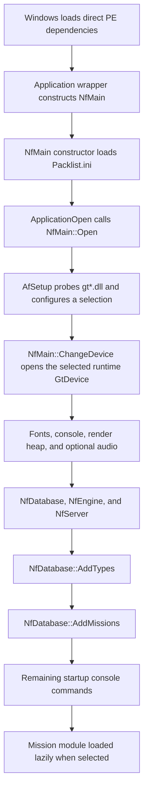

# Bootstrap and module-loading static cross-check

**Date:** 2026-07-30

**Evidence ID:** `EV-20260730-002`

**Scenarios:** `SCN-BOOT-001`, `SCN-STARTUP-001`, `SCN-PACKAGE-001`,
`SCN-PLUGIN-001`

**Scope:** static analysis only; no original executable or plugin was run

**Result:** GO for a deterministic portable startup/registry design; NO-GO for
emulating the protected `.icd` path or Windows directory-enumeration order

## Question

Which module owns each part of startup, in what order are packages, render
drivers, type plugins, and mission plugins discovered, and what keeps a
dynamically loaded module alive?

The earlier startup note had the right high-level plugin ABIs, but it did not
separate setup-time graphics probing from the runtime `Cc.dll` device loader.
It also left the executable's virtual application loop and successful-module
teardown insufficiently bounded.

## Inputs and method

All analysis used SHA-256-verified files in the ignored working-copy boundary.
The canonical hashes are recorded in
[`source-manifest.sha256`](../evidence/source-manifest.sha256). No source
binary, installation file, or archive was modified.

Tools:

- Ghidra `12.1.2` headless as the canonical decompiler;
- Rizin `0.9.1` plus `rzpipe 0.6.2` as the independent boundary/call/reference
  check;
- the repository PE inspector for the complete 16-module import/export
  inventory.

Representative reproducible commands are:

```powershell
./tools/Invoke-GhidraAnalysis.ps1 `
  -ProgramName 'AfEngine.dll' `
  -PostScript 'ExportCallersOfNamedFunctions.java' `
  -PostScriptArguments @(
    'LoadLibraryA',
    'LoadLibraryExA',
    'GetProcAddress',
    'FreeLibrary',
    'FindFirstFileA',
    'FindNextFileA'
  ) `
  -ReportSuffix 'module-loader-callers'

./tools/Invoke-RizinAnalysis.ps1 `
  -InputFile 'analysis/work-copies/<manifest-id>/AfEngine.dll' `
  -ExpectedSha256 '<hash from source-manifest.sha256>' `
  -FunctionId 'FN-AFENGINE-00027100' `
  -Rva '00027100'
```

Generated Ghidra projects and reports, Rizin JSON, and working copies remain
ignored local artifacts.

## Complete dynamic-loader ownership

Across all 16 PE32/i386 code modules, only `AfEngine.dll` and `Cc.dll` import
the dynamic-loader APIs used by the recovered plugin system:

| Owner | Dynamic behavior |
|---|---|
| `Dogfighter.exe` | no `LoadLibrary*`/`GetProcAddress`; directly imports the engine, common runtime, input, archive, and Win32 dependencies |
| `AfEngine.dll` | discovers/probes setup drivers, discovers type/mode plugins, and lazily loads mission factories |
| `Cc.dll` | exposes the actual graphics-device enumeration/open/release boundary |
| `*.type`, `*.mode`, graphics adapters, `UdsPack.dll` | no recovered dynamic-loader ownership |

This means `Dogfighter.exe` is an application shell, not a hidden plugin
loader. The protected/high-entropy `Dogfighter.icd` remains an unexecuted
historical artifact; no recovered v1.01 path transfers control from the
ordinary executable to it.

## Executable bootstrap and frame shell

The effective WinMain-style function is
`Dogfighter.exe` VA `0x00416090`, RVA `0x00016090`. It:

1. seeds the CRT random generator from `timeGetTime`;
2. sets `FX_GLIDE_NO_SPLASH`;
3. registers `AirfixClass`;
4. creates the main window and startup dialog;
5. allocates a `0xF8`-byte application wrapper through RVA `0x00010260`;
6. opens it, destroys the startup dialog, and enters its virtual loop;
7. destroys the wrapper/window and unregisters the class.

The wrapper installs its primary vtable at VA `0x004393FC`. The recovered
entries used by startup are:

| Slot | VA / RVA | Working name | Confirmed behavior |
|---:|---|---|---|
| `+0x04` | `0x00410A10` / `0x00010A10` | `ApplicationOpen` | closes prior state, calls `NfMain::Open`, links the application render object, and initializes input |
| `+0x08` | `0x00410AD0` / `0x00010AD0` | `ApplicationClose` | unlinks owned render objects and calls `NfMain::Close` |
| `+0x0C` | `0x00410C00` / `0x00010C00` | `ApplicationWindowMessage` | handles activation, character input, CD notification, and graphics-device activation state |
| `+0x10` | `0x00410FF0` / `0x00010FF0` | `PumpMessagesAndContinue` | drains `PeekMessageA`; returns false after `WM_QUIT` |
| `+0x14` | `0x00410FA0` / `0x00010FA0` | `PollInputAndAdvanceTime` | dispatches input, consumes a pending console flag, then advances game/real time |
| `+0x18` | `0x00411460` / `0x00011460` | `DispatchActiveFrameEvent` | when active, resets the timer and saves/processes one event constructed with `0xFF000000` and `4` |

The loop order is exact:

```text
while (PumpMessagesAndContinue()) {
    PollInputAndAdvanceTime();
    DispatchActiveFrameEvent();
}
```

`PollInputAndAdvanceTime` reaches RVA `0x00010DE0`, which uses
`QueryPerformanceCounter` and calls both `NfMain::SetTime` and
`NfMain::SetRealTime`. The semantic name of the `(0xFF000000, 4)` event is not
claimed without a separate event-enum proof.

## Ordered startup phases

The statically recovered order is:



`NfMain::NfMain`, RVA `0x00043A50`, calls
`LoadPackages("Packlist.ini")` before console construction. A later language
configuration command can rebuild the package chain. This ordering explains
why variable substitution is unavailable on the first pass and available on
the later pass.

## Graphics: three distinct paths

### Setup metadata probe

`AfSetup::Open`, RVA `0x0003B8B0`, searches the current directory using
`gt*.dll` (or a suffix-qualified form), skips `_debug` and `_profile`
candidates, and creates one setup record per accepted driver.

The record probe at RVA `0x0003AF20`:

1. calls `LoadLibraryExA(candidate, nullptr, 1)`;
2. requires data export `dllVer == 0x3B`;
3. requires data export `dllName`;
4. copies the name and unloads the probe handle.

Flag `1` is the legacy `DONT_RESOLVE_DLL_REFERENCES` value. This path is only
a metadata probe.

### Setup card/mode enumeration

RVA `0x0003B030` calls RVA `0x0003B690` for each accepted setup record.
The latter loads the adapter normally, resolves `dllCreate`, calls
`dllCreate(module, 0)`, enumerates device cards/modes through the returned
object, then calls `GtDevice::Release`. This is temporary setup enumeration,
not the runtime render-device owner.

### Runtime device

`NfMain::ChangeDevice`, RVA `0x00045730`, releases the prior device, appends
`.dll` to the selected driver name, and calls exported
`Cc.dll::GtOpenDevice(driver, window, card)`.

`GtOpenDevice`, RVA `0x0003E600`, requires all three exports
`dllVer`, `dllName`, and `dllCreate`, requires `dllVer == 0x3B`, calls
`dllCreate(module, window)`, then invokes the returned device's virtual open
method with the selected card. A successful device retains the module handle.
`GtDevice::Release`, RVA `0x0003EBA0`, snapshots that handle, releases the
device, and finally calls `FreeLibrary`.

`Cc.dll::GtEnumDevices`, RVA `0x0003E4D0`, is a separate public enumeration
API. It lowercases `gt*.dll` candidates, skips `_profile.dll` and `_debug.dll`,
checks `dllName`/`dllVer == 0x3B`, invokes a callback, and unloads each probe.
The recovered `AfSetup::Open` path performs its own enumeration and does not
call `GtEnumDevices`.

## Type-plugin lifecycle

`NfDatabase::AddTypes`, RVA `0x00027100`, uses `typepath` or
`game\types`, then enumerates `*.type`. With its normal null argument it makes
one counting pass for progress and a second loading pass. There is no explicit
sort between `FindFirstFileA`/`FindNextFileA` results.

For each candidate:

1. `LoadLibraryA`;
2. require data export `nfVersion`;
3. require factory export `typeCreate`;
4. require `*(int32_t*)nfVersion == 0x6D`;
5. call `typeCreate(database, module, fullPath)`;
6. unload immediately if any gate or the factory's low-byte result fails;
7. otherwise let registered `NfType` objects retain the module ownership.

`NfType::Release`, RVA `0x00028320`, snapshots its stored module handle,
destroys the type, and conditionally calls `FreeLibrary` according to a virtual
release result. The exact coordination when several types share one module
handle remains unknown; the evidence does prove that successful type modules
are not unconditionally leaked until process exit.

One bad type candidate is skipped; it does not abort the remaining directory
scan.

## Mission-plugin lifecycle

`NfDatabase::AddMissions`, RVA `0x00027370`, uses `missionpath` or
`game\modes`, then enumerates `*.mode` without an explicit sort.

Discovery requires:

- data export `nfVersion == 0x6D`;
- data export `missionName`;
- optional data byte `bMultiplayer`, defaulting to false.

It stores the display name, base name, full module path, and multiplayer flag,
then unloads every discovery handle.

`NfMissionInfo::CreateMission`, RVA `0x0002A510`, lazily loads the stored path,
resolves exactly `missionCreate`, and calls:

```text
NfMission* missionCreate(NfMain*, NfMissionInfo*)
```

Missing export or a null factory result unloads the module and clears the
stored handle. Success retains the handle at `NfMissionInfo+0x1C`; the
destructor at RVA `0x0002A4A0` unloads it. The additional multiplayer/info
hooks remain outside the version-1 port scope.

## Ghidra/Rizin comparison

Rizin independently identified the same PE32/x86 image bases, function starts,
and end-exclusive boundaries for the representative loader functions:

| Function | Ghidra/Rizin boundary | Key agreement |
|---|---|---|
| `WindowsApplicationMain` | `[0x00416090, 0x00416226)` | virtual open/continue/two-step loop |
| `NfDatabase::AddTypes` | `[0x10027100, 0x10027364)` | two-pass scan, two exports, `0x6D`, failure unload |
| `NfDatabase::AddMissions` | `[0x10027370, 0x1002763A)` | three metadata exports and unconditional discovery unload |
| `NfMissionInfo::CreateMission` | `[0x1002A510, 0x1002A57F)` | lazy handle, factory, both failure unloads |
| setup probe | `[0x1003AF20, 0x1003AFC8)` | `LoadLibraryExA`, `dllVer`, `dllName`, unload |
| setup device enumeration | `[0x1003B690, 0x1003B830)` | normal load, `dllCreate`, temporary device release |
| `NfMain::Open` | `[0x100448F0, 0x10045370)` | setup/device before database, types before missions |
| `GtEnumDevices` | `[0x1003E4D0, 0x1003E5F7)` | wildcard/filter/version/name/callback/unload |
| `GtOpenDevice` | `[0x1003E600, 0x1003E704)` | three-export gate, factory, selected-card open |

Ghidra was more reliable for recovered C++ symbols, parameter intent, and
pseudocode. Rizin was equally reliable for these function boundaries and
direct call/data-reference sites, and caught no conflicting loader edge.

## Portable reconstruction decision

**GO** for preserving the semantic phases with deterministic C++20
registries:

```text
PackageSources
RenderBackendRegistry
TypeRegistry
ModeRegistry
```

The Windows port uses its SDL3/D3D11 platform layer and the iOS port uses its
native Metal layer. Neither should reproduce `LoadLibrary`, the historical
graphics-adapter ABI, nor the old Win32 wrapper vtable.

Registry order must be explicit and testable. The original performs no
visible sort around Win32 directory enumeration, so filesystem enumeration
order is evidence about the legacy implementation, not a deterministic
cross-platform contract.

The portable startup should preserve:

- package/content availability before type and mission registration;
- render backend/device readiness before resources that require GPU objects;
- type registration before mode catalogue/factory use;
- lazy mission-instance creation;
- isolated failure reporting so one optional module does not corrupt global
  startup state;
- clear reverse-order teardown of mission, types, device, and packages.

**NO-GO** for:

- executing or emulating the protected `.icd` artifact;
- copying the unsorted Windows wildcard order into portable behavior;
- loading original `.type`, `.mode`, or graphics DLLs in the reconstructed
  products;
- assigning a semantic event name to the frame-shell arguments without
  separate enum evidence.

## Confidence and remaining unknowns

| Claim | Confidence | Remaining limit |
|---|---|---|
| loader-owning modules and export names | high | none in the inspected 16-module set |
| executable loop call order | high | working names are interpretive |
| setup probe versus setup enumeration versus runtime device split | high | private class names at unnamed AfEngine RVAs remain provisional |
| type/mode version gates and factory arguments | high | formal source-level types are reconstructed |
| successful graphics/mode handle lifetime | high | none for the observed paths |
| successful type-module shared-handle teardown | medium | virtual coordination across multiple registered types is not yet named |
| `.icd` relationship to the patched executable | unknown | intentionally not executed or unpacked |
| directory enumeration order across machines | unknown/non-contractual | no sort exists in the recovered code |
