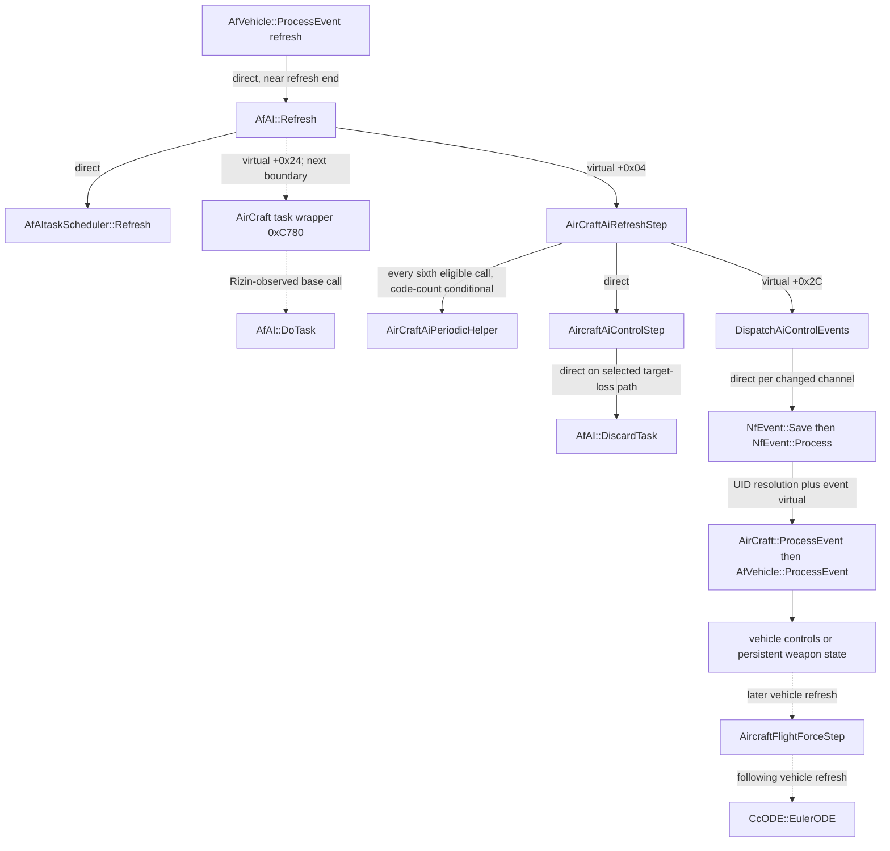

# EXP-20260803-113: bounded AirCraft AI-to-physics cycle

**Date:** 2026-08-03

**Evidence ID:** `EV-20260803-001`

**Status:** complete static report for one conditional, end-to-end AI subcycle;
no runtime C++20 changed

**Decision:** GO for the numeric task-state contract, the selected target-loss
transition, the ordered five-channel dispatcher, the event-to-field join, and
the later force-phase join; NO-GO for a full behavior port, live bit parity,
wall-clock cadence, or cross-producer ordering

**Reference build:** hashes below and
`docs/evidence/source-manifest.sha256`

## Result and exact boundary

This experiment closes one falsifiable AirCraft AI subcycle rather than
assigning semantics to the entire 8,362-byte control function:

```text
eligible AfAI refresh with AirCraft mode 1 and a nonzero target UID
  -> target resolution fails
  -> active task is discarded: mode 1 -> 0
  -> target/goal fields are cleared
  -> bounded fallback leaves raw controls 50, 0, 0, -100, -100
  -> changed channels dispatch synchronously in order
       THRUST_SET -> PITCH_SET -> BANK_SET -> PRIMARY_ATTACK -> SECONDARY_ATTACK
  -> AfVehicle writes target-thrust/pitch/bank fields or weapon fire state
  -> a later AirCraft force step reads those fields
  -> the following CcODE Euler step consumes the resulting accumulators
```

The witness conditions below make all five events observable in one dispatcher
call. They are a static path predicate, not a claim that this is the common
runtime state. The complete semantics of the large target/geometry control
body, the derived task wrappers at AirCraft RVAs `0x0000C780` and
`0x0000C7C0`, and weapon projectile scheduling remain the explicit next
boundaries.

This result also corrects one material statement in
[EXP-20260730-067](EXP-20260730-067-native-pitch-bank-producer-ordering.md):
`AIControls::HasChanged` does **not** generally suppress an unchanged raw
value after `GetRelative`. The two functions use different encodings of
`0.01`, and the comparison is policy-sensitive in x87 extended registers.

No original executable, game, GUI, debugger, or dynamic trace was run. No
product source, analysis database, binary, or private resource is part of this
change.

## Sources and method

Ghidra Headless 12.1.2 is the primary source. Rizin 0.9.1 with rz-ghidra
independently checked function boundaries, vtable targets, calls, operand
widths, event payload stores, constants, and the discriminating x87 vectors.
Both tools operated on hash-verified working copies.

| Module | Image base | SHA-256 |
|---|---:|---|
| `AirCraft.type` | `0x10000000` | `9745842BDE40406390B46F935E9F12D6626675F89A8FBB303CB135D76CF7DD1E` |
| `AfEngine.dll` | `0x10000000` | `A4CCC7E59E4119488322E80077803A5BB9922731D84CE1A420FD27516D45711E` |
| `Cc.dll` | `0x10000000` | `18002A3AF1405D932579C6D6888256CE26B8A479735093D33441F10FC27AA8AF` |

The already established pitch/bank consumer, producer order, 12 ms scheduler,
and rigid-body equations were treated as prerequisites, not repeated. See
[EXP-20260729-056](EXP-20260729-056-native-pitch-bank-event-research.md),
[EXP-20260730-067](EXP-20260730-067-native-pitch-bank-producer-ordering.md),
[EXP-20260730-068](EXP-20260730-068-rigid-body-integration-kernel.md), and
[EXP-20260730-078](EXP-20260730-078-x87-runtime-policy-static-audit.md).

## Function map

VA ranges are end-exclusive. Every listed image has base `0x10000000`, so the
RVA is the VA minus that base.

| Module / working function | VA range | RVA range | Agreement |
|---|---:|---:|---|
| `AfEngine.dll!AfAI::Refresh` | `[0x10036520,0x10036663)` | `[0x00036520,0x00036663)` | Ghidra/Rizin |
| `AfEngine.dll!AfAI::DiscardTask` | `[0x10036670,0x10036691)` | `[0x00036670,0x00036691)` | Ghidra/Rizin |
| `AfEngine.dll!AfAI::DoTask` | `[0x10036970,0x10036A29)` | `[0x00036970,0x00036A29)` | Ghidra/Rizin |
| `AfEngine.dll!AIControls::SetRange` | `[0x10037000,0x10037016)` | `[0x00037000,0x00037016)` | Ghidra; exported entry |
| `AfEngine.dll!AIControls::SetValue` | `[0x10037020,0x10037073)` | `[0x00037020,0x00037073)` | Ghidra/Rizin |
| `AfEngine.dll!AIControls::AddValue` | `[0x10037080,0x100370A8)` | `[0x00037080,0x000370A8)` | Ghidra; exported entry |
| `AfEngine.dll!AIControls::HasChanged` | `[0x100370B0,0x100370F2)` | `[0x000370B0,0x000370F2)` | Ghidra/Rizin |
| `AfEngine.dll!AIControls::GetRelative` | `[0x10037100,0x10037153)` | `[0x00037100,0x00037153)` | Ghidra/Rizin |
| `AfEngine.dll!AIControls::GetAbsolute` | `[0x10037160,0x1003716B)` | `[0x00037160,0x0003716B)` | Ghidra; exported entry |
| `AfEngine.dll!AfAItaskScheduler::EnqueueTask` | `[0x10037440,0x100376E1)` | `[0x00037440,0x000376E1)` | Ghidra/Rizin |
| `AirCraft.type!AirCraftAiRefreshStep` | `[0x10009650,0x100096BF)` | `[0x00009650,0x000096BF)` | Ghidra/Rizin, vtable-seeded |
| `AirCraft.type!AirCraftAiPeriodicHelper` | `[0x100096C0,0x1000A36C)` | `[0x000096C0,0x0000A36C)` | Ghidra/Rizin |
| `AirCraft.type!AircraftAiControlStep` | `[0x1000A370,0x1000C41A)` | `[0x0000A370,0x0000C41A)` | Ghidra/Rizin |
| `AirCraft.type!DispatchAiControlEvents` | `[0x1000C420,0x1000C610)` | `[0x0000C420,0x0000C610)` | Ghidra/Rizin, vtable-seeded |
| `AirCraft.type!AircraftSetPrimaryAttack` | `[0x10007430,0x100075A8)` | `[0x00007430,0x000075A8)` | existing Ghidra evidence |
| `AirCraft.type!AircraftSetSecondaryAttack` | `[0x100075B0,0x100075F3)` | `[0x000075B0,0x000075F3)` | existing Ghidra evidence |
| `AirCraft.type!AircraftFlightForceStep` | `[0x10003F40,0x100065A3)` | `[0x00003F40,0x000065A3)` | prerequisite cross-check |
| `AfEngine.dll!AfVehicle::ProcessEvent` | `[0x1001B6C0,0x1001FA6C)` | `[0x0001B6C0,0x0001FA6C)` | prerequisite cross-check |
| `AfEngine.dll!NfEvent::Process` | `[0x10057910,0x10057A80)` | `[0x00057910,0x00057A80)` | prerequisite cross-check |
| `Cc.dll!CcODE::EulerODE` | `[0x1002A420,0x1002A484)` | `[0x0002A420,0x0002A484)` | prerequisite cross-check |

`AirCraft.type` vtable VA `0x1000D7C4` resolves slot `+0x04` to
`AirCraftAiRefreshStep`, slot `+0x24` to entry `0x1000C780`, slot `+0x28` to
entry `0x1000C7C0`, and slot `+0x2C` to `DispatchAiControlEvents`. Rizin sees
the `0x1000C780` wrapper clear task/target fields and reach base
`AfAI::DoTask`; its complete Ghidra-primary boundary and the companion
completion wrapper are deliberately not promoted in this report.

## Call graph and edge kinds



The dashed physics edges mean phase-delayed data flow, not direct calls from
the dispatcher. `NfEvent::Process` is synchronous for the concrete actor UID:
one event returns through the target's event virtual and its local destructor
before the dispatcher tests the next channel. `Save` precedes `Process`, but
this report makes no claim about the network or log meaning of `Save`.

`AirCraftAiRefreshStep` also copies an 11-DWORD vehicle snapshot into
AI `+0x3F4` when the controlled vehicle exists. Its counter `+0x430`,
initialized to zero, invokes the helper at RVA `0x000096C0` when the entry
value is at least five, resets it, then increments after dispatch. With no
other writer this is every sixth eligible AI call. It is a code-count fact,
not a wall-clock cadence.

## Numeric task states and transitions

The task type is a DWORD at event `+0x05`. These values are members of the
exported `AIEVENT` type, not the ordinary one-byte gameplay event table.
No symbolic enumerator names were recovered.

| Producer / type | Exact payload | Confirmed `AfAI` transition |
|---|---|---|
| `AfAI` constructor | none | `+0x304 = 0` |
| `AfAI::DoTask`, `0x01100001` | DWORD `event+0x38` | `+0x304 = 1`; payload to `+0x318` |
| `AfAI::DoTask`, `0x01100002` | f32 words `+0x38/+0x3C/+0x40`; DWORD `+0x44` | `+0x304 = 4`; vector to `+0x320/+0x324/+0x328`; Ghidra resolves `+0x44` as a room ID to pointer `+0x32C` |
| `AfAI::DoTask`, `0x01100003` | byte `event+0x38` | `+0x304 = 3`; byte to `+0x314` |
| `AfAI::DiscardTask` | current task pointer | any mode to `0`; clears task-event time DWORDs `+0x20/+0x24/+0x28/+0x2C` |
| `AfAI::ClearRoute` | current task | calls `DiscardTask` only when a task exists and mode is `3` |

`AfAItaskScheduler::EnqueueTask` independently clones the same widths:
DWORD for `0x01100001`, vec3 plus DWORD for `0x01100002`, and byte for
`0x01100003`. No producer of mode `2` was found in this bounded set.
`DoTask(nullptr)` or an unrecognized type clears `+0x32C` but, in the base
function alone, does not write `+0x304`. Semantic labels such as chase,
patrol, or go-to are therefore hypotheses and are not used here.

At the interval threshold, `AfAI::Refresh` asks the scheduler for the selected
task, invokes virtual slot `+0x24` when appropriate, tests task completion via
virtual slot `+0x28`, may call `DiscardTask`, then always invokes the derived
refresh slot `+0x04` and resets accumulator `+0x344` to positive zero. The
AirCraft overrides at slots `+0x24/+0x28` remain the adjacent open boundary;
the numeric base transitions above do not depend on invented wrapper names.

## Selected complete target-loss witness

The selected path has these explicit preconditions:

- mode `+0x304 == 1` and target UID `+0x318 != 0`;
- current task `+0x33C != nullptr`, so the loss path calls `DiscardTask` and
  really performs `1 -> 0`;
- UID resolution returns null, or both still-unnamed target virtual probes at
  slots `+0x94/+0x98` return zero;
- cadence counter `+0x430 < 5`, isolating this call from the large periodic
  helper;
- after target clearing, `+0x3E4 == 0`, `+0x410 == +0.0f`, the vehicle is on
  the ground, the squared length returned through vehicle slot `+0x54` is at
  most `1.0f`, vehicle pitch field `+0x448 >= 0.9f`, and target thrust
  `+0x444 >= +0x44C * 0.3f`;
- before dispatch, the cached relative f32 vector for channels `0,1,3,5,6`
  is the reachable prior-`+100` vector `{255,32,32,1,1}`, with bits
  `{0x437F0000,0x42000000,0x42000000,0x3F800000,0x3F800000}`. Every entry
  therefore differs from this call's exact PC53/nearest-even `HasChanged`
  candidate, including the two zero-valued attack candidates.

The path is exact:

1. RVA `0x0000A7B7` reads the target UID; calls at `0x0000A7D5` and
   `0x0000A7DD` attempt engine/actor resolution.
2. The loss edge reaches RVA `0x0000A80F`; with a current task the direct call
   at `0x0000A81C` executes `AfAI::DiscardTask` and sets mode zero.
3. Stores at RVAs `0x0000A822`, `0x0000A828`,
   `0x0000A82E/0x0000A834/0x0000A83A`, and `0x0000A840` clear respectively
   `+0x438`, `+0x318`, `+0x320/+0x324/+0x328`, and `+0x32C`.
4. The control-step prefix has already written channel 3 raw zero at
   `0x0000A4BA`, channel 1 raw zero at `0x0000A4C1`, channel 0 raw `+100` at
   `0x0000A5DD`, and channels 6 then 5 raw `-100` at
   `0x0000A5E8/0x0000A5F3`.
5. Under the remaining predicates, calls at RVAs `0x0000B609`,
   `0x0000B611`, and `0x0000B619` overwrite channels 0, 1, and 3 with raw
   `+50`, zero, and zero. The selected tail does not overwrite them again.

Thus the exact final raw vector for dispatcher channels `0,1,3,5,6` is
`{50,0,0,-100,-100}`. This closes one decision outcome and its state
transition without claiming completeness for all later control branches.

## Event order, payloads, and consumers

`DispatchAiControlEvents` tests five channels in an invariant order. Each
present branch performs
`HasChanged -> construct -> GetRelative -> _ftol -> Save -> Process -> destroy`
to completion before the next row.

| Order | Channel / range | Event | Branch VA / RVA | signed payload store | Immediate owner effect |
|---:|---|---|---|---|---|
| 1 | 0, `[-255,+255]` | `0x63 THRUST_SET` | `[0x1000C42F,0x1000C496)` / `[0x0000C42F,0x0000C496)` | DWORD `event+0x11` | `vehicle+0x444 = payload * f32(1/255)` |
| 2 | 1, `[-32,+32]` | `0x5F PITCH_SET` | `[0x1000C496,0x1000C4F1)` / `[0x0000C496,0x0000C4F1)` | DWORD `event+0x11` | `vehicle+0x448 = payload * 0.043f` |
| 3 | 3, `[-32,+32]` | `0x65 BANK_SET` | `[0x1000C4F1,0x1000C54C)` / `[0x0000C4F1,0x0000C54C)` | DWORD `event+0x11` | `vehicle+0x44C = payload * 0.043f` |
| 4 | 5, `[0,1]` | `0xB9 PRIMARY_ATTACK` | `[0x1000C54C,0x1000C5AA)` / `[0x0000C54C,0x0000C5AA)` | DWORD `event+0x11` | virtual `+0xC0` to primary weapon `+0x490` fire state |
| 5 | 6, `[0,1]` | `0xBA SECONDARY_ATTACK` | `[0x1000C5AA,0x1000C608)` / `[0x0000C5AA,0x0000C608)` | DWORD `event+0x11` | virtual `+0xC4` to secondary weapon `+0x494` fire state |

The five direct `NfEvent::Process` call sites are RVAs `0x0000C486`,
`0x0000C4E1`, `0x0000C53C`, `0x0000C59A`, and `0x0000C5F8`.
If a channel is unchanged under the active numeric policy, its whole row is
absent and the result is an ordered subsequence. Under the selected witness's
exact prior cache vector and the explicit PC53/nearest-even oracle, all five
payloads are exactly `{128,0,0,0,0}`.

`AfVehicle::ProcessEvent` gates these writes on inactive byte `+0x460 == 0`.
The relevant branch ranges are:

| Event | VA / RVA branch | Confirmed action |
|---|---|---|
| `THRUST_SET` | `[0x1001E492,0x1001E4B3)` / `[0x0001E492,0x0001E4B3)` | signed payload times f32 `0x3B808081` to `+0x444` |
| `BANK_SET` | `[0x1001E4D4,0x1001E4F5)` / `[0x0001E4D4,0x0001E4F5)` | signed payload times f32 `0x3D3020C5` to `+0x44C` |
| `PITCH_SET` | `[0x1001E4F5,0x1001E514)` / `[0x0001E4F5,0x0001E514)` | signed payload times f32 `0x3D3020C5` to `+0x448` |
| shared analog tail | `[0x1001E514,0x1001E536)` / `[0x0001E514,0x0001E536)` | a nonzero retained result clears signed rest duration `+0x458/+0x45C` |
| `PRIMARY_ATTACK` | `[0x1001F1FB,0x1001F222)` / `[0x0001F1FB,0x0001F222)` | boolean payload through vehicle slot `+0xC0` |
| `SECONDARY_ATTACK` | `[0x1001F250,0x1001F277)` / `[0x0001F250,0x0001F277)` | boolean payload through vehicle slot `+0xC4` |

The attack handlers set persistent weapon firing state. Projectile creation
belongs to a separate `WpMGun` time-dependant refresh and has no proven
ordering relative to this aircraft physics phase.

## Exact `AIControls` layout and numeric correction

AirCraft embeds `AIControls` at `+0x364`. For channel `i` its four f32 arrays
are:

| Field | Relative offset |
|---|---:|
| configured minimum | `+0x00 + 4*i` |
| configured maximum | `+0x20 + 4*i` |
| clamped raw value | `+0x40 + 4*i` |
| cached relative value | `+0x60 + 4*i` |

`SetValue` clamps finite input to `[-100,+100]`. `HasChanged` computes a
candidate with a binary32 scale loaded from VA `0x1007D0E4`; it compares the
retained x87 candidate directly with the cached binary32 value by `FCOMPP` and
does not spill the candidate to f32. `GetRelative` instead uses binary64
constants at VAs `0x1007DF88` and `0x1007DF90`, spills its mapped value to the
f32 cache, then recomputes and returns a retained x87 result.

| Constant | Exact bits | Exact value |
|---|---:|---:|
| `HasChanged` scale | f32 `0x3C23D70A` | `5368709 / 536870912` |
| `GetRelative` scale | f64 `0x3F847AE147AE147B` | `5764607523034235 / 576460752303423488` |
| half range | f64 `0x3FE0000000000000` | `1 / 2` |

The different scales invalidate the earlier unconditional equality model.
The following discriminators are exact for PC53/nearest-even after
`GetRelative` has populated the cache:

| Range / unchanged raw | cache f32 bits | retained `GetRelative` | retained `HasChanged` candidate | changed |
|---|---:|---|---|---:|
| `[-255,+255]`, `-100` | `0xC37F0000` | `-255` | `-255` | false |
| `[-255,+255]`, `0` | `0x00000000` | `+0` | `-765/134217728` | true |
| `[-255,+255]`, `50` | `0x42FF0000` | `255/2` | `34225518345/268435456` | true |
| `[-255,+255]`, `100` | `0x437F0000` | `255` | `17112759555/67108864` | true |
| `[-32,+32]`, `-100` | `0xC2000000` | `-32` | `-32` | false |
| `[-32,+32]`, `0` | `0x00000000` | `+0` | `-3/4194304` | true |
| `[-32,+32]`, `50` | `0x41800000` | `16` | `134217719/8388608` | true |
| `[-32,+32]`, `100` | `0x42000000` | `32` | `67108861/2097152` | true |
| `[0,1]`, `-100` | `0x00000000` | `+0` | `+0` | false |
| `[0,1]`, `0` | `0x3F000000` | `1/2` | `134217725/268435456` | true |
| `[0,1]`, `50` | `0x3F400000` | `3/4` | `402653175/536870912` | true |
| `[0,1]`, `100` | `0x3F800000` | `1` | `134217725/134217728` | true |

For unchanged raw zero in all three configured ranges, the exact policy
matrix is:

| x87 precision / rounding | `HasChanged` |
|---|---:|
| PC24 / nearest-even | false |
| PC24 / down, up, or toward zero | true |
| PC53 / any RC | true |
| PC64 / any RC | true |

The executable's startup requests PC53 but does not select RC, and no supplied
runtime module has a recognized later environment writer. That remains static
evidence, not the live gameplay-thread control word. Under PC53, selected thrust
raw 50 converts to integer 128 for nearest/up and 127 for down/toward-zero.
Under upward rounding, raw zero can become payload 1 and raw `+100` can become
`256`, `33`, or `2` for the thrust, pitch/bank, or attack ranges respectively.
The imported `_ftol` body and branch-time RC are not observed, so only
policy-labelled oracle vectors are portable evidence.

For finite values, `FCOMPP` equality returns unchanged and inequality returns
changed. An unordered comparison also has C3 set, so this implementation
returns unchanged for NaN. Separately, both `SetValue(NaN)` bound comparisons
are unordered and the function stores `-100.0f`. These are static instruction
facts, not a recommendation for portable non-finite behavior.

## Other exact fields, globals, and constants

| Owner | Offset / VA | Confirmed role |
|---|---:|---|
| `AfAI` | `+0x304` | numeric mode |
| `AfAI` | `+0x314` | byte payload for task type `0x01100003` |
| `AfAI` | `+0x318` | DWORD target UID for task type `0x01100001` |
| `AfAI` | `+0x320/+0x324/+0x328` | task vec3 |
| `AfAI` | `+0x32C` | resolved room pointer in base `DoTask` |
| `AfAI` | `+0x330` | controlled vehicle pointer |
| `AfAI` | `+0x334` | main/runtime pointer |
| `AfAI` | `+0x338` | task scheduler pointer |
| `AfAI` | `+0x33C` | current task pointer |
| `AfAI` | `+0x340/+0x344` | interval / accumulator f32 |
| AirCraft AI | `+0x364` | embedded `AIControls` |
| AirCraft AI | `+0x3F4` | 11-DWORD vehicle snapshot destination |
| AirCraft AI | `+0x430` | periodic-helper call counter |
| AirCraft AI | `+0x438` | cleared on selected target-loss path; semantic name unknown |
| `AfVehicle` | `+0x444/+0x448/+0x44C` | target thrust / pitch / bank controls |
| `AfVehicle` | `+0x458/+0x45C` | signed 64-bit rest duration |
| `AfVehicle` | `+0x460` | inactive latch |
| AirCraft | `+0x490/+0x494` | primary / selected-secondary weapon pointers |
| `AirCraft.type` | VA `0x1000D20C` | imported `AIControls::SetValue` target used by control step |
| `AirCraft.type` | VA `0x1000D7C4` | AirCraft AI vtable base used in this map |

| Material constant | Exact representation |
|---|---|
| vehicle nominal step | f32 `0x3C449BA6` = `6442451/536870912` seconds |
| AI interval | f32 `0x3DCCCCCD` = `13421773/134217728` seconds |
| selected fallback raw | f32 `0x42480000` = `50` |
| raw clamp/default endpoints | f32 `0x42C80000` / `0xC2C80000` = `+100/-100` |
| thrust configured endpoints | f32 `0xC37F0000` / `0x437F0000` = `-255/+255` |
| axis configured endpoints | f32 `0xC2000000` / `0x42000000` = `-32/+32` |
| thrust consumer scale | f32 `0x3B808081` = `8421505/2147483648` |
| pitch/bank consumer scale | f32 `0x3D3020C5` = `11542725/268435456` |
| selected tail factor | f32 `0x3E99999A` = `5033165/16777216` |
| selected pitch threshold | f32 `0x3F666666` = `7549747/8388608` |

The nominal `0.012f` and `0.1f` values constrain scheduler inputs and the
uninterrupted-step code count. They do not establish elapsed wall time.

## Physics phase join

The current active vehicle refresh performs:

1. `CcODE::EulerODE` using the previously accumulated force and torque;
2. `CcRigidBody::ResetForceAndTorque`;
3. `CcRigidBody::CalcAuxiliary`;
4. `AircraftFlightForceStep`, which prepares new accumulators;
5. collision, room, slot-44, and cannon work; and
6. `AfAI::Refresh`, including the selected event dispatch.

Consequently, conditional on an active/non-sleeping later path and no
intervening control producer:

| Refresh | Effect |
|---:|---|
| `N` | AI writes `+0x444/+0x448/+0x44C` after the current force work |
| `N+1` | Euler consumes accumulators made with the older controls; after reset, `AircraftFlightForceStep` reads the AI fields and prepares force/torque |
| `N+2` | Euler consumes the force/torque prepared from those AI fields |

The thrust field feeds target clamp/update, smoothing through `+0x560`, and
the force call at AirCraft RVA `0x000046C8`. Pitch feeds the torque call at
RVA `0x000049AF`. Bank feeds the torque call at RVA `0x00004AB3` and a
separate ground side-force path at RVA `0x00004E0D`. This is a phase-order
contract, not a claim that one AI event alone determines the complete force or
that the three refreshes have a fixed wall-clock spacing.

## Evidence classification

### Confirmed static facts

- all listed function and branch boundaries, task/event widths, vtable entries,
  field offsets, constants, direct calls, and dispatcher order;
- task modes `0`, `1`, `3`, and `4`, plus the selected `1 -> 0` loss path;
- the selected final raw vector and, under explicitly named PC53/nearest-even,
  the five signed payloads;
- synchronous per-event completion and the event-to-owner field writes; and
- the two-refresh force/integration delay after an AI field write.

### Conditional conclusions

- every sixth-call helper cadence assumes no unobserved writer of `+0x430`;
- all five witness events require the stated exact prior cache vector and
  finite path predicates;
- numeric payloads require an explicit x87 PC/RC plus compatible `_ftol`
  model; and
- the `N/N+1/N+2` join requires active later refreshes with no intervening
  producer write.

### Hypotheses deliberately not promoted

- semantic names for `AIEVENT 0x01100001..3`, the modes, target probes, or
  the field at `+0x438`;
- gameplay meaning of every branch in the large periodic and control helpers;
  and
- ordinary prevalence of the selected target-loss witness.

### Unknowns

- live branch-time x87 CW/SW, RC, exception state, and imported helper policy;
- derived task-wrapper completion semantics at RVAs `0x0000C780/0x0000C7C0`;
- full target/geometry/random behavior in RVAs `0x000096C0` and
  `0x0000A370`;
- global ordering against remote or independent player producers;
- wall-clock cadence and driver/API behavior; and
- projectile scheduling after persistent weapon fire state changes.

## Portable C++20 assessment

| Element | Decision | Reason |
|---|---|---|
| `AIControls` layout and finite clamp | **GO** | exact arrays, offsets, and endpoints are recovered |
| task IDs and numeric modes `0/1/3/4` | **GO** | exact writes and payload widths are recovered; keep names numeric |
| complete task-wrapper scheduler composition | **NO-GO** | AirCraft overrides at `0xC780/0xC7C0` remain an explicit boundary |
| selected target-loss transition and clears | **GO, conditional** | exact preconditions, calls, and stores are closed |
| entire `AircraftAiControlStep` behavior | **NO-GO** | all target, geometry, random, and override branches are not classified |
| five-event dispatcher order | **GO** | invariant ordered-subsequence contract is closed |
| `HasChanged/GetRelative/_ftol` oracle | **GO, policy-labelled** | exact schedules and PC/RC vectors are available |
| native bit-parity control conversion | **NO-GO** | live PC/RC and imported helper behavior remain unobserved |
| THRUST/PITCH/BANK event-to-field reducers | **GO** | already implemented evidence boundaries remain valid |
| attack boolean to persistent weapon state | **GO** | handlers and weapon pointers are closed; projectile production is separate |
| field-to-later-force phase join | **GO, structural** | scheduler order and consumer sites are exact |
| bit-parity `CcRigidBody` runtime kernel | **NO-GO** | live floating policy remains unresolved |
| wall-clock scheduler or cross-producer integration | **NO-GO** | neither global order nor cadence is statically proven |

## Validation

- The targeted Ghidra 12.1.2 exports completed without unresolved addresses;
  independent Rizin 0.9.1 reports cover all 11 newly cross-checked function
  boundaries and preserved the input hashes.
- The Ghidra and Rizin wrapper suites pass. All 12 Rizin exporter tests pass.
- The function catalogue has 380 rows and 14 columns, unique function IDs and
  module/RVA pairs, valid source paths, and only its two known historical
  missing CC references. All 11 Rizin ranges and the task/event/payload tokens
  occur in the public ledger.
- Synthetic public-boundary tests and the actual 760-file public scan pass.
  Changed Markdown links resolve and the added-line local-path scan is empty.
- After a fresh fetch, all 216 available refs and all reachable object paths
  contain neither reserved identifier. The six working-tree paths containing
  `EXP-20260803-113` or `EV-20260803-001` are exactly the intended new report
  and updated public ledgers; no remote topic branch exists.
- `git diff --check` passes. Independent final review found one P1 cache-vector
  precondition gap; the exact reachable five-channel cache was added and the
  re-review returned `GO` with no open P0-P3 finding.

No product source changed, so a product compile would not exercise this
documentation-only evidence.

## Related evidence

- [Aircraft flight boundary](../re/systems/AIRCRAFT-FLIGHT.md)
- [Aircraft flight law](../re/systems/AIRCRAFT-FLIGHT-LAW.md)
- [CcRigidBody boundary](../re/systems/CC-RIGID-BODY.md)
- [Native thrust event reducer](EXP-20260729-054-native-thrust-event-reducer.md)
- [Native pitch/bank SET consumer](EXP-20260729-056-native-pitch-bank-event-research.md)
- [Producer and scheduler ordering](EXP-20260730-067-native-pitch-bank-producer-ordering.md)
- [Rigid-body integration kernel](EXP-20260730-068-rigid-body-integration-kernel.md)
- [Static x87 policy audit](EXP-20260730-078-x87-runtime-policy-static-audit.md)
- [Reverse-engineering workflow](../RE-WORKFLOW.md)
