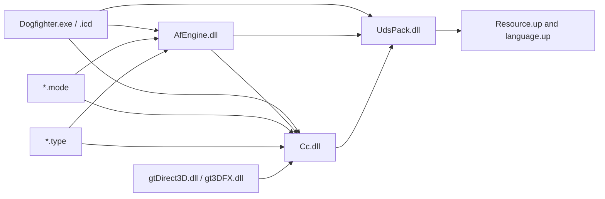
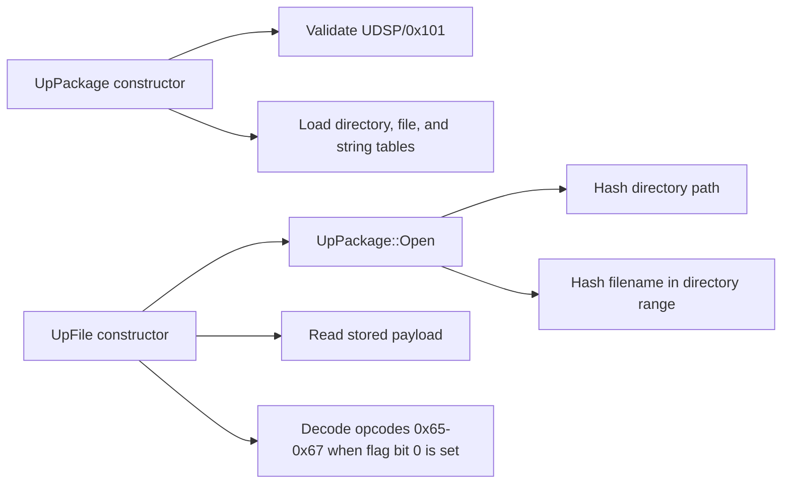

# Module map

**Build key:** SHA-256 values in `docs/evidence/source-manifest.sha256`  
**State:** archive, startup/plugin, asset, aircraft control-event, scheduler,
and first flight/collision call paths recovered; remaining modules await
targeted reports

## Confirmed static import layers

Arrows above are confirmed PE imports. Runtime loading edges from the executable
or engine to `.mode`, `.type`, and graphics adapter modules remain to be located
because those plugins do not appear in static import tables.

## Module register

| Module ID | File | Role hypothesis | Confidence | First question |
|---|---|---|---:|---|
| `DOGFIGHTER` | `Dogfighter.exe` | launcher/bootstrap | 1 | Does it launch `.icd`, or contain the patched game entry? |
| `DOGFIGHTER_ICD` | `Dogfighter.icd` | older protected/compressed executable body | 2 | Is it retained only as a SafeDisc-era artifact after the v1.01 patch? |
| `AFENGINE` | `AfEngine.dll` | core runtime and service interfaces | 2 | What is its exported bootstrap/update API? |
| `CC` | `Cc.dll` | scene graph plus CCF/GTI asset runtime | 3 | What are the exact nested mesh/material field contracts? |
| `UDSPACK` | `UdsPack.dll` | archive open/list/read/decompress | 3 | What are the two remaining unknown directory fields? |
| `GTDIRECT3D` | `gtDirect3D.dll` | Direct3D renderer adapter | 3 | What abstract renderer interface does it implement? |
| `GT3DFX` | `gt3DFX.dll` | Glide renderer adapter | 3 | Which entry points match the Direct3D adapter? |
| `MODE_DOGFIGHT` | `Game/Modes/Dogfight.mode` | dogfight flow/rules | 2 | What mode factory/export registers it? |
| `MODE_SINGLEPLAYER` | `Game/Modes/Singleplayer.mode` | campaign/mission flow | 2 | Where are mission transitions and objectives dispatched? |
| `TYPE_AFFX` | `Game/Types/AfFX.type` | effects actor registrations | 2 | Which effects alter simulation versus rendering only? |
| `TYPE_AIRCRAFT` | `Game/Types/AirCraft.type` | aircraft registration, force/torque, collision, and AI | 3 | What are the physical units, runtime tolerances/traces, combined room-contributor drawing, and dynamic actor-to-instance publication rules? |
| `TYPE_GROUNDUNIT` | `Game/Types/GroundUnit.type` | ground actor registrations | 2 | Which base actor interface is shared? |
| `TYPE_INTERACTIVE` | `Game/Types/Interactive.type` | interactive scenery actors | 2 | How are triggers/events serialized? |
| `TYPE_PICKUPS` | `Game/Types/Pickups.type` | pickup actors | 2 | What inventory/effect interface is called? |
| `TYPE_PROJECTILES` | `Game/Types/Projectiles.type` | weapons/projectile actors | 2 | Which damage/collision contracts are shared? |
| `TYPE_WATERUNIT` | `Game/Types/WaterUnit.type` | water actor registrations | 2 | Does water physics live here or in the engine? |

## Required next reports

- Section entropy and compiler/RTTI classification.
- Export-to-export similarity between both graphics adapters.
- Module load order and dynamic lookup strings (`LoadLibrary`/`GetProcAddress`).
- Remaining MSVC RTTI, vtables, exception data, and decorated names.
- Cross-module factory/registration interfaces.

## Confirmed aircraft boundary

`EV-20260724-001` recovered 22 methods from the `AirCraft.type` vtable,
including a force-producing aircraft method at `0x10003F40`, a static/BSP
collision resolver at `0x10007920`, and separate AI control logic. The plugin
registers 17 aircraft records through one common constructor.

`EV-20260724-002` joins player commands, analog input, and AI channels to the
vehicle event dispatcher and exact control fields read by the force method.
Aircraft use `EVENT_THRUST_SET/APPLY`; the similarly named
`EVENT_THROTTLE_SET/APPLY` values fall through this inheritance chain without
a control-field write.

`EV-20260724-003` recovers the active scheduler:
`NfTimeHeap -> NfActor::Refresh -> AfVehicle::ProcessEvent`. Each physics path
integrates the previously accumulated force/torque, resets the accumulators,
rebuilds auxiliary state, invokes AirCraft slot 45 to accumulate forces for
the next integration, resolves static collisions through slot 30, and invokes
slot 44.

`EV-20260724-004` closes the static flight-law body: AirCraft receives a 12 ms
dependant interval, AfEngine converts it to `0.012f` seconds, all 21 rigid-body
force/torque call sites and direct state transitions are mapped, and each
constructor tuple value is joined to its storage and immediate consumers.
`EV-20260724-005` closes the player spawn/type/primary-actor chain, the mission
start selector, the retained single-CCF normalization helper, and the selected
skin's complete hierarchy for every present slot among up to three blueprints.
`EV-20260724-006` closes the mission-root load order, `CcName` comparison,
`CcWorld::GetRoomByName`, root lifetime, and ordered multi-CCF room publication.
`EV-20260724-007` closes per-load `CcLoadedScene` reference rebinding, placed
publication masks, receiver fallback, source-local resource identity, room
ownership, and `FreezeAll` static-BSP rebuilding. The portable source-aware
plan/assembly now combines all contributors without treating BSP as geometry.
`EV-20260728-022` closes the serialized placed-object dynamic-BSP publication
slice: first physical mesh use owns the cached tree, the loader's forced
unlink/relink prepends that builder object to its room list, and a later cache
hit performs no relink. The portable material-bound assembly authenticates
those source/room/object relations and emits native-order immutable ranges for
the combined line query. The authenticated mission snapshot now owns and
budgets the assembly, and a segmented immutable mesh view composes it with the
live player frame without copying BSP arenas. At native handoff, the
non-moving mission runtime takes the static arena and both dynamic owners,
allocates exact flat frame buffers once, and portal-traces only its last
complete producer publication.
`EV-20260727-003` independently cross-checks the mission start pose: x/y/z
radians, mode zero, exact Z-X-Y matrix construction, and absolute-world
position/matrix semantics with separate room membership. The portable
publication now derives and atomically commits that authenticated pose.
`EV-20260727-004` closes the initially visible actor visual: the literal
`thirdperson`, `damaged`, and `destroyed` blueprint slots, complete subtree
cloning, slot-0 visibility/object-ID assignment, and the root-local zero plus
Y(pi) override. It also proves that every descendant must be derived relative
to the selected authored root before the player world pose is applied once.
Physical units, runtime contact traces, a retained runtime-room catalogue,
dynamic actor-to-instance publication, projectile creation, and the original
damaged/destroyed visibility transitions remain open. See
`docs/re/systems/AIRCRAFT-FLIGHT.md`,
`docs/re/systems/AIRCRAFT-FLIGHT-LAW.md`, and
`docs/re/systems/PLAYER-SPAWN.md`.

## Confirmed `UDSPACK` interface

LLVM reports 44 named MSVC C++ exports and imports only MSVCRT plus
`DisableThreadLibraryCalls` from KERNEL32. The exported surface contains
constructors/destructors and operations for `UpPackage`, `UpFile`,
`UpFileInfo`, and `UpHashTable`.

Static call path:

See `docs/formats/UDSP.md` and the `FN-UDSPACK-*` catalog entries for durable
contracts. Raw decompiler output remains local under the ignored `artifacts/`
tree.

## Plugin ABI evidence

`EV-20260721-011` confirms a deliberately small C-style plugin boundary:

| Module family | Exports | Confirmed names |
|---|---:|---|
| each `*.type` | 2 | `nfVersion`, `typeCreate` |
| `Singleplayer.mode` | 4 | `bMultiplayer`, `missionCreate`, `missionName`, `nfVersion` |
| `Dogfight.mode` | 6 | the four mode exports plus `setupServer`, `showInfo` |
| each graphics adapter | 3 | `dllCreate`, `dllName`, `dllVer` |

This gives reconstruction seams for actor registration, mission creation, and
renderer selection without preserving the original Windows DLL ABI on iOS.

## Report inventory

`tools/Inspect-Pe.ps1` reproduces raw LLVM file-header, section, import, and
export reports under ignored `artifacts/pe/`. The current run covered all 16
PE32/i386 modules. Notable export counts are 2,089 for `AfEngine.dll`, 1,220 for
`Cc.dll`, 44 for `UdsPack.dll`, 2 per type module, 4/6 per mode module, and 3 per
graphics adapter.

`Dogfighter.icd` has near-maximal entropy in `.text` (7.984 bits/byte) and
`.data` (7.986), a 2000 timestamp, and almost no readable gameplay strings.
`Dogfighter.exe` has ordinary code/data entropy (6.240/4.459), complete Windows
bootstrap imports, readable game strings, and the same 2001 timestamp family as
the v1.01 modules. Static reconstruction therefore uses `Dogfighter.exe` as the
v1.01 executable reference and retains `.icd` only as corroborating metadata.

`tools/Invoke-GhidraAnalysis.ps1` remains the canonical deterministic
decompiler/report path. `tools/Invoke-RizinAnalysis.ps1` independently records
normalized PE32/x86 boundaries, calls, data references, and optional
Rizin-family pseudocode. `EV-20260727-002` cross-checked representative
rendering, input, and aircraft-flight routines; the complete comparison is in
[`EXP-20260727-001`](../experiments/EXP-20260727-001-static-tool-crosscheck.md).
Binary Ninja Free's offline controls are confirmed. Its optional manual
comparison remains pending an operator-scheduled GUI window.
x32dbg has been verified and staged locally but has not executed a game binary.
