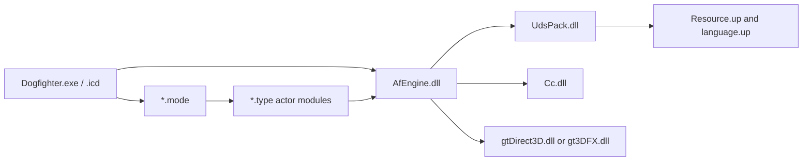

# Module map

**Build key:** SHA-256 values in `docs/evidence/source-manifest.sha256`  
**State:** initial hypotheses; imports/exports and call edges not yet collected

## Provisional layers

Arrows are dependency hypotheses, not confirmed import edges.

## Module register

| Module ID | File | Role hypothesis | Confidence | First question |
|---|---|---|---:|---|
| `DOGFIGHTER` | `Dogfighter.exe` | launcher/bootstrap | 1 | Does it launch `.icd`, or contain the patched game entry? |
| `DOGFIGHTER_ICD` | `Dogfighter.icd` | original/protected executable body | 1 | What imports and section entropy distinguish it from the launcher? |
| `AFENGINE` | `AfEngine.dll` | core runtime and service interfaces | 2 | What is its exported bootstrap/update API? |
| `CC` | `Cc.dll` | unknown shared component | 0 | Who imports its exports and what strings/RTTI identify it? |
| `UDSPACK` | `UdsPack.dll` | archive open/list/read/decompress | 2 | What record points to the first directory entry? |
| `GTDIRECT3D` | `gtDirect3D.dll` | Direct3D renderer adapter | 3 | What abstract renderer interface does it implement? |
| `GT3DFX` | `gt3DFX.dll` | Glide renderer adapter | 3 | Which entry points match the Direct3D adapter? |
| `MODE_DOGFIGHT` | `Game/Modes/Dogfight.mode` | dogfight flow/rules | 2 | What mode factory/export registers it? |
| `MODE_SINGLEPLAYER` | `Game/Modes/Singleplayer.mode` | campaign/mission flow | 2 | Where are mission transitions and objectives dispatched? |
| `TYPE_AFFX` | `Game/Types/AfFX.type` | effects actor registrations | 2 | Which effects alter simulation versus rendering only? |
| `TYPE_AIRCRAFT` | `Game/Types/AirCraft.type` | aircraft/flight actor registrations | 2 | Where is integration order and control input applied? |
| `TYPE_GROUNDUNIT` | `Game/Types/GroundUnit.type` | ground actor registrations | 2 | Which base actor interface is shared? |
| `TYPE_INTERACTIVE` | `Game/Types/Interactive.type` | interactive scenery actors | 2 | How are triggers/events serialized? |
| `TYPE_PICKUPS` | `Game/Types/Pickups.type` | pickup actors | 2 | What inventory/effect interface is called? |
| `TYPE_PROJECTILES` | `Game/Types/Projectiles.type` | weapons/projectile actors | 2 | Which damage/collision contracts are shared? |
| `TYPE_WATERUNIT` | `Game/Types/WaterUnit.type` | water actor registrations | 2 | Does water physics live here or in the engine? |

## Required next reports

- PE sections and entropy.
- Imports and exports, including ordinals and forwarded entries.
- Export-to-export similarity between both graphics adapters.
- Module load order and dynamic lookup strings (`LoadLibrary`/`GetProcAddress`).
- MSVC RTTI, vtables, exception data, and decorated names.
- Cross-module factory/registration interfaces.

