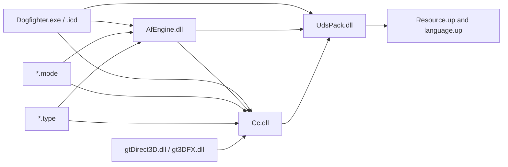
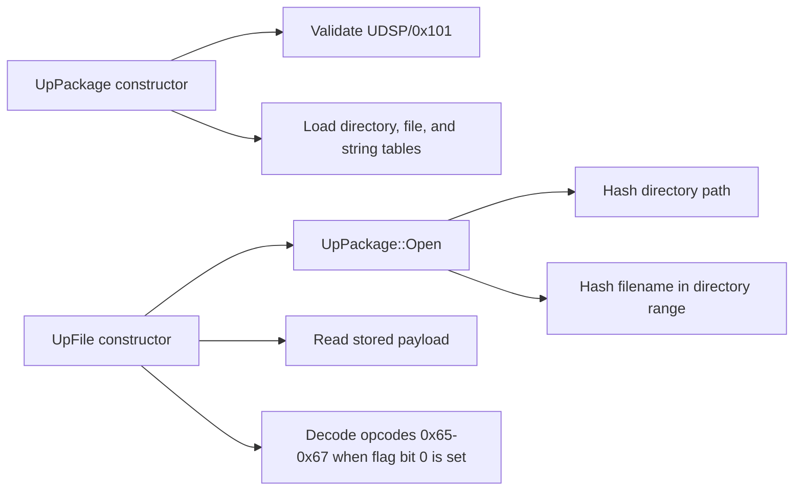

# Module map

**Build key:** SHA-256 values in `docs/evidence/source-manifest.sha256`  
**State:** archive, startup/plugin, asset, and first aircraft-flight call paths
recovered; remaining modules await targeted reports

## Confirmed static import layers

Arrows above are confirmed PE imports. Runtime loading edges from the executable
or engine to `.mode`, `.type`, and graphics adapter modules remain to be located
because those plugins do not appear in static import tables.

## Module register

| Module ID | File | Role hypothesis | Confidence | First question |
|---|---|---|---:|---|
| `DOGFIGHTER` | `Dogfighter.exe` | launcher/bootstrap | 1 | Does it launch `.icd`, or contain the patched game entry? |
| `DOGFIGHTER_ICD` | `Dogfighter.icd` | older protected/compressed executable body | 2 | Is it retained only as a SafeDisc-era artifact after the v1.01 patch? |
| `AFENGINE` | `AfEngine.dll` | core runtime and service interfaces | 2 | What is its exported bootstrap/update API? |
| `CC` | `Cc.dll` | scene graph plus CCF/GTI asset runtime | 3 | What are the exact nested mesh/material field contracts? |
| `UDSPACK` | `UdsPack.dll` | archive open/list/read/decompress | 3 | What are the two remaining unknown directory fields? |
| `GTDIRECT3D` | `gtDirect3D.dll` | Direct3D renderer adapter | 3 | What abstract renderer interface does it implement? |
| `GT3DFX` | `gt3DFX.dll` | Glide renderer adapter | 3 | Which entry points match the Direct3D adapter? |
| `MODE_DOGFIGHT` | `Game/Modes/Dogfight.mode` | dogfight flow/rules | 2 | What mode factory/export registers it? |
| `MODE_SINGLEPLAYER` | `Game/Modes/Singleplayer.mode` | campaign/mission flow | 2 | Where are mission transitions and objectives dispatched? |
| `TYPE_AFFX` | `Game/Types/AfFX.type` | effects actor registrations | 2 | Which effects alter simulation versus rendering only? |
| `TYPE_AIRCRAFT` | `Game/Types/AirCraft.type` | aircraft registration, force/torque, collision, and AI | 2 | Which scheduler stage feeds player controls into the recovered force step? |
| `TYPE_GROUNDUNIT` | `Game/Types/GroundUnit.type` | ground actor registrations | 2 | Which base actor interface is shared? |
| `TYPE_INTERACTIVE` | `Game/Types/Interactive.type` | interactive scenery actors | 2 | How are triggers/events serialized? |
| `TYPE_PICKUPS` | `Game/Types/Pickups.type` | pickup actors | 2 | What inventory/effect interface is called? |
| `TYPE_PROJECTILES` | `Game/Types/Projectiles.type` | weapons/projectile actors | 2 | Which damage/collision contracts are shared? |
| `TYPE_WATERUNIT` | `Game/Types/WaterUnit.type` | water actor registrations | 2 | Does water physics live here or in the engine? |

## Required next reports

- Section entropy and compiler/RTTI classification.
- Export-to-export similarity between both graphics adapters.
- Module load order and dynamic lookup strings (`LoadLibrary`/`GetProcAddress`).
- Remaining MSVC RTTI, vtables, exception data, and decorated names.
- Cross-module factory/registration interfaces.

## Confirmed aircraft boundary

`EV-20260724-001` recovered 22 methods from the `AirCraft.type` vtable,
including a force-producing aircraft method at `0x10003F40`, a
collision/rigid-body auxiliary method at `0x10007920`, and separate AI control
logic at `0x1000A370`. The plugin registers 17 aircraft records through one
common constructor.

The force method calls `CcRigidBody::ApplyForce`, `ApplyForceOnly`, and
`ApplyTorqueOnly`; the collision-oriented method calls `CalcAuxiliary`.
Scheduler order, player-control application, units, constructor-field
semantics, and the complete flight law remain open. See
`docs/re/systems/AIRCRAFT-FLIGHT.md`.

## Confirmed `UDSPACK` interface

LLVM reports 44 named MSVC C++ exports and imports only MSVCRT plus
`DisableThreadLibraryCalls` from KERNEL32. The exported surface contains
constructors/destructors and operations for `UpPackage`, `UpFile`,
`UpFileInfo`, and `UpHashTable`.

Static call path:

See `docs/formats/UDSP.md` and the `FN-UDSPACK-*` catalog entries for durable
contracts. Raw decompiler output remains local under the ignored `artifacts/`
tree.

## Plugin ABI evidence

`EV-20260721-011` confirms a deliberately small C-style plugin boundary:

| Module family | Exports | Confirmed names |
|---|---:|---|
| each `*.type` | 2 | `nfVersion`, `typeCreate` |
| `Singleplayer.mode` | 4 | `bMultiplayer`, `missionCreate`, `missionName`, `nfVersion` |
| `Dogfight.mode` | 6 | the four mode exports plus `setupServer`, `showInfo` |
| each graphics adapter | 3 | `dllCreate`, `dllName`, `dllVer` |

This gives reconstruction seams for actor registration, mission creation, and
renderer selection without preserving the original Windows DLL ABI on iOS.

## Report inventory

`tools/Inspect-Pe.ps1` reproduces raw LLVM file-header, section, import, and
export reports under ignored `artifacts/pe/`. The current run covered all 16
PE32/i386 modules. Notable export counts are 2,089 for `AfEngine.dll`, 1,220 for
`Cc.dll`, 44 for `UdsPack.dll`, 2 per type module, 4/6 per mode module, and 3 per
graphics adapter.

`Dogfighter.icd` has near-maximal entropy in `.text` (7.984 bits/byte) and
`.data` (7.986), a 2000 timestamp, and almost no readable gameplay strings.
`Dogfighter.exe` has ordinary code/data entropy (6.240/4.459), complete Windows
bootstrap imports, readable game strings, and the same 2001 timestamp family as
the v1.01 modules. Static reconstruction therefore uses `Dogfighter.exe` as the
v1.01 executable reference and retains `.icd` only as corroborating metadata.
