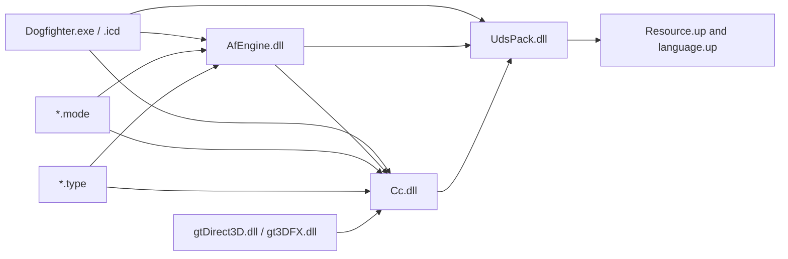
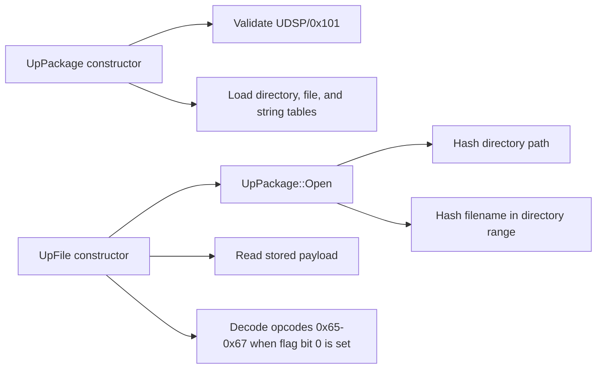

# Module map

**Build key:** SHA-256 values in `docs/evidence/source-manifest.sha256`  
**State:** archive, startup/plugin, asset, frontend/campaign/profile-save,
aircraft control-event, scheduler, and first flight/collision call paths
recovered; remaining modules await targeted reports

## Confirmed static import layers

Arrows above are confirmed PE imports. The dynamic edges are also recovered:
`AfEngine.dll` loads `.type` and `.mode` plugins, probes setup graphics
adapters, and lazily loads a selected mission; `Cc.dll::GtOpenDevice` owns the
actual runtime graphics-adapter load. `Dogfighter.exe` does not import
`LoadLibrary*` or `GetProcAddress`.

## Module register

| Module ID | File | Role hypothesis | Confidence | First question |
|---|---|---|---:|---|
| `DOGFIGHTER` | `Dogfighter.exe` | v1.01 application/bootstrap and frontend/campaign shell | 3 | What are the complete frontend command enum and modal precedence? |
| `DOGFIGHTER_ICD` | `Dogfighter.icd` | older protected/compressed executable body | 2 | Is it retained only as a SafeDisc-era artifact after the v1.01 patch? |
| `AFENGINE` | `AfEngine.dll` | core runtime services plus embedded profile container and stat registration | 2 | What are the complete roster record semantics and safe migration rules? |
| `CC` | `Cc.dll` | scene graph plus CCF/GTI asset runtime | 3 | What are the exact nested mesh/material field contracts? |
| `UDSPACK` | `UdsPack.dll` | archive open/list/read/decompress | 3 | What are the two remaining unknown directory fields? |
| `GTDIRECT3D` | `gtDirect3D.dll` | Direct3D renderer adapter | 3 | What abstract renderer interface does it implement? |
| `GT3DFX` | `gt3DFX.dll` | Glide renderer adapter | 3 | Which entry points match the Direct3D adapter? |
| `MODE_DOGFIGHT` | `Game/Modes/Dogfight.mode` | dogfight flow/rules | 2 | What mode factory/export registers it? |
| `MODE_SINGLEPLAYER` | `Game/Modes/Singleplayer.mode` | selected single-player mission implementation | 2 | Which normal-play producers award medals equipment and thread completion? |
| `TYPE_AFFX` | `Game/Types/AfFX.type` | effects actor registrations | 2 | Which effects alter simulation versus rendering only? |
| `TYPE_AIRCRAFT` | `Game/Types/AirCraft.type` | aircraft registration, force/torque, collision, and AI | 3 | What are the physical units, runtime tolerances/traces, combined room-contributor drawing, and dynamic actor-to-instance publication rules? |
| `TYPE_GROUNDUNIT` | `Game/Types/GroundUnit.type` | ground actor registrations | 2 | Which base actor interface is shared? |
| `TYPE_INTERACTIVE` | `Game/Types/Interactive.type` | interactive scenery actors | 2 | How are triggers/events serialized? |
| `TYPE_PICKUPS` | `Game/Types/Pickups.type` | pickup actors | 2 | What inventory/effect interface is called? |
| `TYPE_PROJECTILES` | `Game/Types/Projectiles.type` | weapons/projectile actors | 2 | Which damage/collision contracts are shared? |
| `TYPE_WATERUNIT` | `Game/Types/WaterUnit.type` | water actor registrations | 2 | Does water physics live here or in the engine? |

## Required next reports

- Section entropy and compiler/RTTI classification.
- Export-to-export similarity between both graphics adapters.
- Remaining MSVC RTTI, vtables, exception data, and decorated names.
- Shared-handle teardown coordination across multiple types registered by one
  `.type` module.
- Persistent difficulty and ordinary medal/weapon/aircraft award producers.
- Representative roster corpus and golden round trips for any legacy exporter.

## Confirmed aircraft boundary

`EV-20260724-001` recovered 22 methods from the `AirCraft.type` vtable,
including a force-producing aircraft method at `0x10003F40`, a static/BSP
collision resolver at `0x10007920`, and separate AI control logic. The plugin
registers 17 aircraft records through one common constructor.

`EV-20260724-002` joins player commands, analog input, and AI channels to the
vehicle event dispatcher and exact control fields read by the force method.
Aircraft use `EVENT_THRUST_SET/APPLY`; the similarly named
`EVENT_THROTTLE_SET/APPLY` values fall through this inheritance chain without
a control-field write.

`EV-20260724-003` recovers the active scheduler:
`NfTimeHeap -> NfActor::Refresh -> AfVehicle::ProcessEvent`. Each physics path
integrates the previously accumulated force/torque, resets the accumulators,
rebuilds auxiliary state, invokes AirCraft slot 45 to accumulate forces for
the next integration, resolves static collisions through slot 30, and invokes
slot 44.

`EV-20260803-001` closes one conditional AI cycle across the module boundary:
numeric task mode 1 loses its UID target and returns to mode 0, the bounded
fallback writes raw thrust/pitch/bank/fire controls, and the dispatcher
synchronously processes the ordered channel subsequence `0,1,3,5,6` into
`AfVehicle` control fields or persistent weapon state. A later slot-45 step
reads those fields and the following Euler step consumes its accumulators.
The same evidence corrects unconditional AI change suppression: retained x87
comparison uses a binary32 `0.01` while cached mapping uses binary64 `0.01`,
so portable payloads remain conditional on an explicit PC/RC policy.

`EV-20260724-004` closes the static flight-law body: AirCraft receives a 12 ms
dependant interval, AfEngine converts it to `0.012f` seconds, all 21 rigid-body
force/torque call sites and direct state transitions are mapped, and each
constructor tuple value is joined to its storage and immediate consumers.
`EV-20260724-005` closes the player spawn/type/primary-actor chain, the mission
start selector, the retained single-CCF normalization helper, and the selected
skin's complete hierarchy for every present slot among up to three blueprints.
`EV-20260724-006` closes the mission-root load order, `CcName` comparison,
`CcWorld::GetRoomByName`, root lifetime, and ordered multi-CCF room publication.
`EV-20260724-007` closes per-load `CcLoadedScene` reference rebinding, placed
publication masks, receiver fallback, source-local resource identity, room
ownership, and `FreezeAll` static-BSP rebuilding. The portable source-aware
plan/assembly now combines all contributors without treating BSP as geometry.
`EV-20260728-022` closes the serialized placed-object dynamic-BSP publication
slice: first physical mesh use owns the cached tree, the loader's forced
unlink/relink prepends that builder object to its room list, and a later cache
hit performs no relink. The portable material-bound assembly authenticates
those source/room/object relations and emits native-order immutable ranges for
the combined line query. The authenticated mission snapshot now owns and
budgets the assembly, and a segmented immutable mesh view composes it with the
live player frame without copying BSP arenas. At native handoff, the
non-moving mission runtime takes the static arena and both dynamic owners,
allocates exact flat frame buffers once, and portal-traces only its last
complete producer publication.
`EV-20260727-003` independently cross-checks the mission start pose: x/y/z
radians, mode zero, exact Z-X-Y matrix construction, and absolute-world
position/matrix semantics with separate room membership. The portable
publication now derives and atomically commits that authenticated pose.
`EV-20260727-004` closes the initially visible actor visual: the literal
`thirdperson`, `damaged`, and `destroyed` blueprint slots, complete subtree
cloning, slot-0 visibility/object-ID assignment, and the root-local zero plus
Y(pi) override. It also proves that every descendant must be derived relative
to the selected authored root before the player world pose is applied once.
`EV-20260808-001` closes the analogous static Level `OBJE` boundary: physical
placement order, selected-blueprint subtree cloning, root-pose overwrite,
Z-X-Y radians, kind-aware root scalar, two native room lookups, root-kind
`SetRoom`, and fail-atomic whole-Level rejection for a missing selector, first
room, or instance. It authorizes only semantic future scene assembly;
per-placement skip is explicit non-native policy, while x87/trigonometric bit
parity and renderer list order remain outside that gate.
Physical units, runtime contact traces, a retained runtime-room catalogue,
dynamic actor-to-instance publication, projectile creation, and the original
damaged/destroyed visibility transitions remain open. See
`docs/re/systems/AIRCRAFT-FLIGHT.md`,
`docs/re/systems/AIRCRAFT-FLIGHT-LAW.md`, and
`docs/re/systems/PLAYER-SPAWN.md`.

## Confirmed `UDSPACK` interface

LLVM reports 44 named MSVC C++ exports and imports only MSVCRT plus
`DisableThreadLibraryCalls` from KERNEL32. The exported surface contains
constructors/destructors and operations for `UpPackage`, `UpFile`,
`UpFileInfo`, and `UpHashTable`.

Static call path:

See `docs/formats/UDSP.md` and the `FN-UDSPACK-*` catalog entries for durable
contracts. Raw decompiler output remains local under the ignored `artifacts/`
tree.

## Plugin ABI evidence

`EV-20260721-011` confirms a deliberately small C-style plugin boundary:

| Module family | Exports | Confirmed names |
|---|---:|---|
| each `*.type` | 2 | `nfVersion`, `typeCreate` |
| `Singleplayer.mode` | 4 | `bMultiplayer`, `missionCreate`, `missionName`, `nfVersion` |
| `Dogfight.mode` | 6 | the four mode exports plus `setupServer`, `showInfo` |
| each graphics adapter | 3 | `dllCreate`, `dllName`, `dllVer` |

This gives reconstruction seams for actor registration, mission creation, and
renderer selection without preserving the original Windows DLL ABI on iOS.

`EV-20260730-002` closes the loader ownership and lifetime map. The recovered
order is package-chain construction, setup driver probe/configuration, runtime
graphics-device open, core service creation, type registration, mission
catalogue registration, then lazy selected-mission creation. Setup-time
graphics enumeration is distinct from the retained runtime device. See
[`EXP-20260730-066`](../experiments/EXP-20260730-066-bootstrap-module-loading.md)
and
[`STARTUP-PLUGINS.md`](systems/STARTUP-PLUGINS.md).

`EV-20260730-005` closes the isolated mission-outcome state. The AFS
`MissionFail` and `MissionSuccess` calls set independent bytes, and only the
first terminal call requests `pause` followed by `menu`; later conflicting
calls can leave both bytes set. The mode's candidate RVA `0x12D0` is a cheat
callback, not an outcome override. `EV-20260731-001` additionally maps
`event` to explicit invocation, `action`/`timer` to Autoexec, and proves that
one process initially runs Autoexec declarations in reverse source order.
`EV-20260731-002` recovers the registered descriptor shape, its one ignored
argument word, the native `0x24, 0x26, descriptor-token` call instruction, the
source-`true` `0x1B, 1` argument producer, and their interpreter projections.
The portable schedule oracle and five-word recognizer own only those bounded
rules. `EV-20260803-003` later maps the complete 70-opcode runtime dispatch,
NUL-text compiler ingress, database/object/function/process/execution
ownership, first step, delay, immediate named calls, mutation snapshots,
reset, and final destruction. It also proves the native gameplay descriptor
map and six registered default-return-zero no-ops.

This is a static specification, not a runtime implementation. Safe parsing,
typed pointer replacement, re-entrant destruction, complete interpreter
integration, global ordering against AI/physics, numerical/time parity, and
multiplayer remain open. See [AFS-VM](systems/AFS-VM.md),
[FMT-AFS](../formats/AFS.md), and
[`MISSION-OUTCOME.md`](systems/MISSION-OUTCOME.md).

## Confirmed frontend, campaign, and profile-save boundary

`EV-20260803-002` joins the existing bootstrap and mission-outcome evidence to
the original frontend without reconstructing its renderer. Application update
loads or initializes a user, creates the main menu and profile selector, routes
the exact main-menu entries, creates the two-side campaign owner through
command case `0x2B`, and routes command case `6` to pause or mission result.

The campaign owner exposes selection and briefing substates, ten zero-based
rows per Axis/Allied side, exact mission/briefing command construction, and
success-only `THRD` plus signed side-maximum progression. The result path then
reads and removes old `SCOR` before its local-player gate; for a non-null player
it calculates the statically recovered score terms, calls
`NfPlayer::RegisterStats`, adds replacement `SCOR`, and attempts a remembered
roster write.

`NfMain+0x5F8` owns that profile as an embedded `AfChunkContainer`. Its legacy
reader is non-transactional and insufficiently bounded for malformed files;
its writer truncates the target directly with `wb`, has no atomic replacement,
and can falsely accept a short write missing up to eight trailing bytes. This
is evidence for a new bounded importer and modern durable schema, not permission
to copy unsafe behavior. See [CAMPAIGN-FLOW.md](systems/CAMPAIGN-FLOW.md),
[FMT-ROSTER](../formats/ROSTER.md), and
[EXP-20260803-114](../experiments/EXP-20260803-114-campaign-frontend-roster-flow.md).

## Report inventory

`tools/Inspect-Pe.ps1` reproduces raw LLVM file-header, section, import, and
export reports under ignored `artifacts/pe/`. The current run covered all 16
PE32/i386 modules. Notable export counts are 2,089 for `AfEngine.dll`, 1,220 for
`Cc.dll`, 44 for `UdsPack.dll`, 2 per type module, 4/6 per mode module, and 3 per
graphics adapter.

`Dogfighter.icd` has near-maximal entropy in `.text` (7.984 bits/byte) and
`.data` (7.986), a 2000 timestamp, and almost no readable gameplay strings.
`Dogfighter.exe` has ordinary code/data entropy (6.240/4.459), complete Windows
bootstrap imports, readable game strings, and the same 2001 timestamp family as
the v1.01 modules. Static reconstruction therefore uses `Dogfighter.exe` as the
v1.01 executable reference and retains `.icd` only as corroborating metadata.

`tools/Invoke-GhidraAnalysis.ps1` remains the canonical deterministic
decompiler/report path. `tools/Invoke-RizinAnalysis.ps1` independently records
normalized PE32/x86 boundaries, calls, data references, and optional
Rizin-family pseudocode. `EV-20260727-002` cross-checked representative
rendering, input, and aircraft-flight routines; the complete comparison is in
[`EXP-20260727-001`](../experiments/EXP-20260727-001-static-tool-crosscheck.md).
Binary Ninja Free's offline controls are confirmed. Its optional manual
comparison remains pending an operator-scheduled GUI window.
x32dbg has been verified and staged locally but has not executed a game binary.
