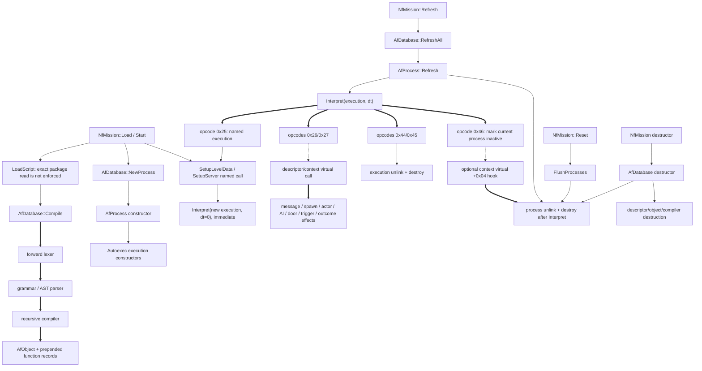
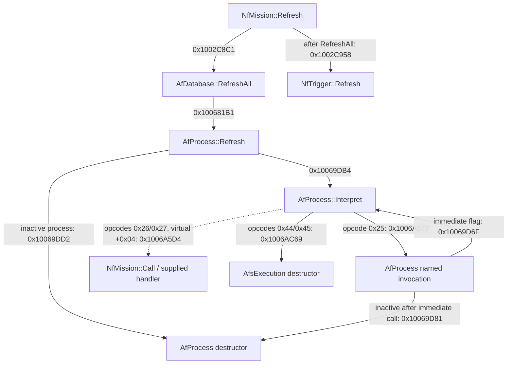
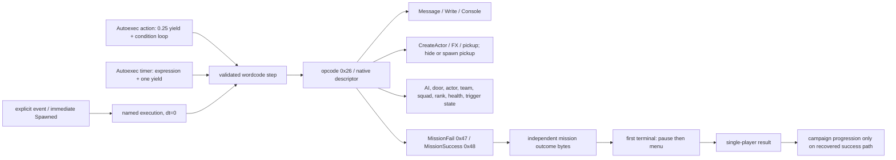

# EV-20260803-003 — AFS mission scripting VM

**Owner module:** `AfEngine.dll`

**Status:** documentation-only static reconstruction; no runtime implementation

**Confidence:** 2/3 (fresh Ghidra 12.1.2 primary analysis and independent
Rizin 0.9.1/rz-ghidra agreement; no running-original trace)

**Experiment:** [EXP-20260803-116](../../experiments/EXP-20260803-116-afs-vm-static-research.md)

**Format:** [FMT-AFS](../../formats/AFS.md)

## Decision first

The complete runtime dispatch contains 70 valid opcode IDs, `0x01–0x46`, and
its instruction framing, stack effects, control flow, process/execution state,
local scheduling order, lifecycle entry points, and destruction paths are now
statically mapped.

This is enough for **GO on a fail-closed parser specification**, **GO on the
static process data model**, and **GO on the recovered local scheduling
order**. It is **NO-GO for a complete interpreter**, native-pointer call and
reference opcodes, malformed-behavior compatibility, global ordering against
AI/physics, and binary-identical x87/time behavior. No C++20 runtime was added
or changed.

## Scope and evidence labels

This report covers AFS text ingress, validation behavior, compilation,
mission-owned VM initialization, process/execution creation, the first and
ordinary step, delay/yield, pause boundaries, termination, reset, destruction,
all runtime opcodes, native mission dispatch, gameplay effects, scheduler
mutation, structures, ownership, and safe-port gates.

Claims are marked as follows:

- **FACT[C2]** — directly supported by Ghidra and independently matched by
  Rizin for the central boundary/instruction set; static-only confidence 2.
- **CONDITIONAL[C1]** — follows from facts only when the named precondition
  holds; it has not been observed in the running original.
- **HYPOTHESIS[C0]** — plausible explanation, not suitable for implementation.
- **UNKNOWN[C0]** — evidence is insufficient; no default is invented.

All ranges are end-exclusive `[start, end)`. Addresses are image virtual
addresses (VA); the image base is `0x10000000`, so each RVA is `VA -
0x10000000`. Working names describe observed operations only. They are not
claims about original source names unless a symbol or registered literal is
shown.

## Earlier evidence reused

Confirmed work was reviewed before exporting new functions and was not
repeated:

| Existing evidence | Reused fact | Boundary added here |
|---|---|---|
| `EV-20260724-005`, `EV-20260724-006`, `EV-20260724-007` / [PLAYER-SPAWN](PLAYER-SPAWN.md) | selected mission ownership; synchronous main/backdrop/object/world load; start-position producer and 16-slot boundary | begins at AFS `LoadScript` and stops at native world/event calls rather than re-deriving room/spawn loading |
| `EV-20260730-005` / [EXP-20260730-070](../../experiments/EXP-20260730-070-mission-outcome-state.md) | independent `failed`/`accomplished` bytes, IDs `0x47`/`0x48`, first-terminal `pause` then `menu`, direct `Fail`, and reset | joins the native call to its exact VM opcode and scheduler position |
| `EV-20260730-006` / [EXP-20260730-075](../../experiments/EXP-20260730-075-mission-outcome-consumer.md) | failure precedence, result transition, ordinary process-before-trigger-poll order, and immediate `Spawned` exception | closes `RefreshAll`, per-process mutation, and the complete interpreter step |
| `EV-20260731-001` / [EXP-20260731-079](../../experiments/EXP-20260731-079-afs-function-order.md) | AST tags, Autoexec classification, reverse-source initial queue, newest-process/FIFO order, and three `NewProcess` sites | adds complete process/execution ownership, first-step behavior, reset, and destruction |
| `EV-20260731-002` / [EXP-20260731-080](../../experiments/EXP-20260731-080-afs-mission-outcome-bytecode.md) | exact five-word outcome call and native descriptor projection | fresh Ghidra compiler export independently closes the earlier Rizin-only emission leg and expands dispatch to all 70 opcodes |
| `EV-20260803-001` / [EXP-20260803-113](../../experiments/EXP-20260803-113-aircraft-ai-physics-cycle.md) | bounded intra-aircraft AI/force/Euler cycle only | used solely to state that no global AFS/aircraft join is proven |
| `EV-20260803-002` / [CAMPAIGN-FLOW](CAMPAIGN-FLOW.md) | result/frontend/campaign transition and persistence order | used only downstream of the already-recovered mission outcome flags |

The word `pause` has three distinct boundaries and they must not be merged:
opcode `0x43` yields one execution for a binary32 delay; `NfMission::Pause`
sets mission byte `+0x508`; and the first outcome call submits the console
command `pause` before `menu`. The latter two are presentation/mission-owner
state, not VM opcodes.

## Static architecture map

**FACT[C2]:** `NfMission` embeds one `AfDatabase` at full-object offset
`+0x4C0` and supplies its `AfFunctionCall` subobject at `+0x50` as the native
handler. The database owns the compiler/grammar object, compiled objects,
native/event descriptors, and the process-list head. Processes own cloned
object variables and FIFO execution nodes; each execution owns local variables
and a word stack.

This first diagram is an architecture/lifecycle map, not a claim that every
edge is a direct call. Solid arrows are direct calls, dashed arrows are
descriptor/virtual calls, and thick arrows are internal dispatch or downstream
data/state flow.



### Full-step call graph

This graph contains only calls on the core path of one mission scripting step.
Labels are exact call-site VAs in the caller. Solid arrows are direct calls;
the dashed arrow is the descriptor/context virtual dispatch shared by opcodes
`0x26` and `0x27`.



### Exact function ledger

| Working function | VA range | RVA range | Relevant xref/call fact |
|---|---:|---:|---|
| `NfMission` constructor | `0x1002A610–0x1002A9ED` | `0x0002A610–0x0002A9ED` | constructs embedded database and handler relation |
| `NfMission` destructor | `0x1002A9F0–0x1002ABA1` | `0x0002A9F0–0x0002ABA1` | calls `Free`, then database destruction |
| `NfMission::Load` | `0x1002ABB0–0x1002B0B7` | `0x0002ABB0–0x0002B0B7` | `NewProcess` at `0x1002ACA1`; named calls at `0x1002ACB3`, `0x1002AD4A` |
| `NfMission::Free` | `0x1002B0C0–0x1002B0CD` | `0x0002B0C0–0x0002B0CD` | clears start-position count only |
| `NfMission::ProcessEvent` | `0x1002B310–0x1002C083` | `0x0002B310–0x0002C083` | immediate named `Spawned` at `0x1002C025` |
| `NfMission::Refresh` | `0x1002C830–0x1002CB41` | `0x0002C830–0x0002CB41` | sole selected call to `RefreshAll`, at `0x1002C8C1` |
| `NfMission::Reset` | `0x1002CB90–0x1002CD98` | `0x0002CB90–0x0002CD98` | calls `FlushProcesses`, not `FlushAll` |
| `NfMission::Start` | `0x1002CDA0–0x1002CF95` | `0x0002CDA0–0x0002CF95` | `NewProcess` at `0x1002CE78`; named calls at `0x1002CE8A`, `0x1002CEC4` |
| `NfMission::Pause` | `0x1002D1A0–0x1002D1C5` | `0x0002D1A0–0x0002D1C5` | sets/clears mission byte `+0x508`; no VM call |
| `NfMission::LoadScript` | `0x1002EB10–0x1002EC4B` | `0x0002EB10–0x0002EC4B` | reads source and calls database compiler |
| `NfMission::Call` | `0x1002EC80–0x100315FE` | `0x0002EC80–0x000315FE` | native effect dispatch; third `NewProcess` at `0x1002F0C6` |
| token/grammar registration | `0x1005D0A0–0x10060AB7` | `0x0005D0A0–0x00060AB7` | owns source grammar and compiler tables |
| compiler-owner destructor | `0x10060AC0–0x10060C52` | `0x00060AC0–0x00060C52` | releases grammar/compiler lists |
| compiler entry | `0x10060C60–0x10060E15` | `0x00060C60–0x00060E15` | called by database compile at `0x100680BC` |
| word-vector append | `0x10061220–0x100612A3` | `0x00061220–0x000612A3` | unchecked growth helper |
| recursive compiler | `0x100612C0–0x10066A15` | `0x000612C0–0x00066A15` | recursive include at `0x10061911`; emits records/wordcode |
| compiler include-path helper | `0x10066EA0–0x10066EC5` | `0x00066EA0–0x00066EC5` | direct target of database wrapper call at `0x100680E7` |
| database constructor/destructor | `0x10067F10–0x10067F5A`; `0x10067F60–0x10067FF5` | `0x00067F10–0x00067F5A`; `0x00067F60–0x00067FF5` | allocates compiler owner; destruction order is explicit |
| `FlushAll` / `FlushProcesses` | `0x10068000–0x1006807F`; `0x10068080–0x100680A5` | `0x00068000–0x0006807F`; `0x00068080–0x000680A5` | full database state versus processes only |
| `AfDatabase::Compile` wrapper | `0x100680B0–0x100680C4` | `0x000680B0–0x000680C4` | called by `LoadScript` at `0x1002EBE6`; calls compiler entry at `0x100680BC -> 0x10060C60` |
| `AfDatabase::AddIncludePath` wrapper | `0x100680E0–0x100680EF` | `0x000680E0–0x000680EF` | calls compiler-owner helper at `0x100680E7 -> 0x10066EA0` |
| `NewProcess` | `0x100680F0–0x10068125` | `0x000680F0–0x00068125` | exactly three direct supplied-module callers |
| `GetProcessByName` | `0x10068130–0x1006819E` | `0x00068130–0x0006819E` | traverses newest to older |
| `RefreshAll` | `0x100681A0–0x100681C1` | `0x000681A0–0x000681C1` | snapshots process `+0x20` before refresh |
| `GetObjectByName` | `0x10068200–0x1006826F` | `0x00068200–0x0006826F` | traverses object head through `+0x24` |
| common/server registration | `0x100683F0–0x100686C0`; `0x100686C0–0x1006916B` | `0x000683F0–0x000686C0`; `0x000686C0–0x0006916B` | installs native descriptor names, widths, IDs |
| object constructor/destructor | `0x10069170–0x100691B8`; `0x100691C0–0x10069227` | `0x00069170–0x000691B8`; `0x000691C0–0x00069227` | compiled-record ownership and unlink |
| compiled-function lookup | `0x10069280–0x10069335` | `0x00069280–0x00069335` | returns descriptor and argument offset |
| compiled prepend/ctor/dtor | `0x10069340–0x10069360`; `0x10069360–0x10069393`; `0x100693A0–0x100693D2` | `0x00069340–0x00069360`; `0x00069360–0x00069393`; `0x000693A0–0x000693D2` | reverse-order list and wordcode ownership |
| cloned-variable allocator/destructor | `0x100696F0–0x10069718`; `0x10069780–0x1006979C` | `0x000696F0–0x00069718`; `0x00069780–0x0006979C` | creates/releases variable arrays |
| process ctor/dtor | `0x10069BC0–0x10069C73`; `0x10069C80–0x10069CEB` | `0x00069BC0–0x00069C73`; `0x00069C80–0x00069CEB` | list prepend, initial queue, full unlink |
| named invocation | `0x10069CF0–0x10069D95` | `0x00069CF0–0x00069D95` | only Autoexec-off record; optional immediate `dt=0` |
| process refresh | `0x10069DA0–0x10069DE6` | `0x00069DA0–0x00069DE6` | snapshots execution `+0x28`; may destroy current process |
| execution ctor/dtor | `0x10069DF0–0x10069E98`; `0x10069EA0–0x10069F04` | `0x00069DF0–0x00069E98`; `0x00069EA0–0x00069F04` | variables, stack, IP/SP, queue unlink |
| interpreter | `0x10069F10–0x1006AC84` | `0x00069F10–0x0006AC84` | 3444 bytes, 1212 instructions, 70-entry table at `0x1006AC84` |
| retain/release/ref-string ctor | `0x1006ADF0–0x1006ADF4`; `0x1006AE00–0x1006AE16`; `0x1006AE20–0x1006AE45` | `0x0006ADF0–0x0006ADF4`; `0x0006AE00–0x0006AE16`; `0x0006AE20–0x0006AE45` | reference operations used by VM |
| forward lexer / token append / parser | `0x1007A800–0x1007AA3C`; `0x1007AA70–0x1007AACF`; `0x1007AEF0–0x1007B069` | `0x0007A800–0x0007AA3C`; `0x0007AA70–0x0007AACF`; `0x0007AEF0–0x0007B069` | preserves source order through AST |

Ghidra and Rizin agree exactly on every central range selected for both tools.
The fresh Ghidra export also resolves the compiler-emission evidence that
EXP-080 previously had to attribute to Rizin alone.

### Cross-tool direct-call agreement

The 35-report Rizin set and the primary Ghidra export agree on these **17/17**
key direct-call edges; call sites and targets are VAs:

| Call site | Target | Observed edge |
|---:|---:|---|
| `0x1002ACA1` | `0x100680F0` | mission `Load` -> `NewProcess` |
| `0x1002ACB3` | `0x10069CF0` | mission `Load` -> first named setup invocation |
| `0x1002AD4A` | `0x10069CF0` | mission `Load` -> second named setup invocation |
| `0x1002C011` | `0x10068130` | `ProcessEvent` -> process lookup |
| `0x1002C025` | `0x10069CF0` | `ProcessEvent` -> named `Spawned` invocation |
| `0x1002C8C1` | `0x100681A0` | mission refresh -> `RefreshAll` |
| `0x1002CE78` | `0x100680F0` | mission `Start` -> `NewProcess` |
| `0x1002CE8A` | `0x10069CF0` | mission `Start` -> first named setup invocation |
| `0x1002CEC4` | `0x10069CF0` | mission `Start` -> second named setup invocation |
| `0x1002F0C6` | `0x100680F0` | native ID `0x04` route -> `NewProcess` |
| `0x1002F0DC` | `0x10069CF0` | native ID `0x04` route -> named invocation |
| `0x10061911` | `0x10060C60` | recursive include -> compiler entry |
| `0x100680E7` | `0x10066EA0` | database include wrapper -> compiler helper |
| `0x100681B1` | `0x10069DA0` | `RefreshAll` -> process refresh |
| `0x10069D6F` | `0x10069F10` | immediate named invocation -> interpreter |
| `0x10069DB4` | `0x10069F10` | process refresh -> interpreter |
| `0x1006A577` | `0x10069CF0` | interpreter opcode `0x25` -> named invocation |

The Ghidra-only wrapper edges `0x1002EBE6 -> 0x100680B0` and
`0x100680BC -> 0x10060C60` are also explicit in the ledger above, but are not
included in the 17/17 count because neither wrapper is one of the 35 normalized
Rizin reports. No cross-tool edge disagreement remains.

## Full lifecycle

### Construction and registration

**FACT[C2]:** the mission constructor creates the embedded 0x18-byte database,
whose constructor allocates a 0xB8-byte compiler/grammar owner. The mission
sets the database's predefinition/native handler to its `AfFunctionCall`
subobject. Common and server registrations create 0x2C-byte descriptors with
argument-word counts, return/type widths, handler pointers, and numeric native
IDs.

### Load and validation

**FACT[C2]:** `LoadScript` opens the selected package member, obtains a 32-bit
size, allocates `size + 1`, requests one read, writes a trailing NUL, and calls
`AfDatabase::Compile`. It returns false only when the package member itself is
invalid. For a valid member it returns true even if `Compile`/`IsError`
reported syntax or semantic errors. Diagnostics may be written, but they are
not a reliable load-failure result.

**FACT[C2]:** an invalid member returns before source allocation. Otherwise the
`size + 1` allocation call is `[0x1002EBC0,0x1002EBC5)` to `operator new` at
`0x1007BA32`, the compile call is at `0x1002EBE6`, and every ordinary
post-compile branch joins at `0x1002EC2C` before the source-buffer delete call
`[0x1002EC2D,0x1002EC32)` to `operator delete` at `0x1007BA2C`. Normal success
and reported compiler-error paths therefore release the temporary source
buffer. This does not make ingress safe: the requested read count is unchecked,
so a normal short read still compiles incomplete or uninitialized contents,
although it reaches ordinary deletion. Overflow, an unusable/null allocation
result, or a fault/exception before the join has no proven cleanup guarantee.
A compiler-null result with a nonnull diagnostic `FILE` can branch around
`fclose`; whether that state is feasible is **UNKNOWN[C0]**, while source
deletion still follows on the ordinary path.

The compiler lexes forward, builds an AST, recursively emits object/function
state, and directly links completed objects, descriptors, and records. Lexer
and parser callbacks diagnose unknown input, parse failure, unexpected EOF,
trailing syntax, and semantic/type errors. No transactional rollback was found.
Whether every mid-compile failure leaves partial database mutations is
**UNKNOWN[C0]**; a safe port must assume it can.

### Missing-reference behavior

Missing references do not share one error policy:

- **FACT[C2], compile-time function:** the compiler first calls the native
  `GetFunctionTypeByName` route at VA `0x1006667F` (RVA `0x0006667F`), then
  falls back to current-object compiled-function lookup at VA `0x1006669E`.
  If both return null, the path beginning at `0x100666A7` emits
  `%s(%d) : Error: Function %s is not declared.\n` through the diagnostic
  virtual call at `0x100666CB`, marks the compiler error through the virtual
  call at `0x100666D5` (target `0x1007ABA0`), and returns from that node at
  `0x100666E2`.
- **FACT[C2], inherited object:** the lookup call at `0x10063762` reaches its
  null path at `0x1006376B`, emits
  `%s(%d) : Error: Inherited object '%s' undeclared.\n` through the virtual
  call at `0x10063790`, and joins the error-marker block at `0x10066A00`
  (`call 0x10066A05`, return `0x10066A12`).
- **FACT[C2], required mission object:** `LoadScript` still returns true for a
  valid package member after those compiler errors. `NfMission::Load` detects
  a missing selected object after lookup at `0x1002AC7B`, enters diagnostics
  at `0x1002AD54`, writes the diagnostic at `0x1002ADCD`, sets false at
  `0x1002ADD8`, and returns at `0x1002ADE1`. `NfMission::Start` follows its
  missing-object branch after lookup at `0x1002CE4F`, writes at `0x1002CF41`,
  sets zero at `0x1002CF4B`, and returns at `0x1002CF54`; that ordinary zero is
  not a distinguishing success/failure code.
- **FACT[C2], named event/setup:** named invocation looks up the compiled
  record at `0x10069D0A`; a null result at `0x10069D11` or an Autoexec record
  rejected at `0x10069D15` returns silently at `0x10069D92`. The caller receives
  no status. `ProcessEvent` similarly skips a missing `mission` process after
  lookup at `0x1002C011` and returns through `0x1002C076`; when the process
  exists, its `Spawned` call is at `0x1002C025` and a missing function remains
  silent.
- **FACT[C2], runtime native `Call`:** native descriptor ID `0x04`, whose
  switch target begins at `0x1002F05C`, silently skips a missing object after
  the lookup call at `0x1002F07E`, a missing function after the lookup call at
  `0x1002F0A1`, or a record rejected by the `+0x2C -> +0x04 == 0` gate at
  `0x1002F0B2`. All three join cleanup at `0x1002F0E1`, release both supplied
  retained references, and return zero.
- **FACT[C2], malformed wordcode reference:** opcodes `0x25`–`0x27` instead
  dereference their embedded descriptor token and its widths/name/ID without a
  missing-reference guard. A corrupt token is therefore unsafe rather than a
  clean lookup miss.

The exact database residue after an earlier partial compile remains
**UNKNOWN[C0]**. No rollback call was found, so a safe port must reject the
whole transaction and publish none of it.

### Initialization and start

**FACT[C2]:** both mission `Load` and `Start` can compile the selected AFS,
look up its object, prepend a process named for the mission role, and invoke
named `SetupLevelData` and `SetupServer` executions immediately with `dt=0`.
The process constructor creates all initial Autoexec executions but does not
interpret them; they first run when `RefreshAll` reaches the process.

`Start` additionally resets mission time, chooses music, resets time again,
and submits `unpause` after successful setup. `SetupServer` is required only
after start positions exist on the observed path. The outer caller/vtable rule
that chooses between `Load` and `Start`, or guarantees a reset between them, is
**UNKNOWN[C0]**. A port must not assume that compiling twice or holding two
mission processes is impossible without recovering that owner lifecycle.

### First step, ordinary step, and delay

**FACT[C2]:** a new execution has `delay=0`, `IP=wordcode base`, and `SP=stack
base`. At interpreter entry:

```text
if delay > dt:
    delay = delay - dt
    return
delay = 0
if IP is null:
    return
dispatch instructions until yield, terminal, or unsupported opcode
```

Equality fires the instruction stream. Positive overshoot is discarded rather
than carried into the next delay. Negative and non-finite `dt`/delay values are
not rejected. A named setup/event call with the immediate flag executes its new
node at `dt=0` in the caller's stack before returning.

The action compiler emits a binary32 `0.25` (`0x1p-2`) yield before evaluating
its condition. Its exact word representation is `0x3E800000`; the immediate
at VA range `[0x100654F3,0x100654F8)` (RVA `0x000654F3`) is encoded as bytes
`68 00 00 80 3E`. The compiler stages opcode `0x1B`, the immediate bits, and
yield opcode `0x43` through mutable scratch dwords at VAs `0x100A2990`,
`0x100A2994`, and `0x100A2998` respectively; these are scratch, not a constant
pool. The condition branches back to that yield while false, marks its
declaration state when true, executes the body, and terminates. A timer
evaluates its time expression, yields once for that value, marks its
declaration state, executes the body, and terminates. No timer appeared in the
authenticated corpus, so mission-specific timer interactions remain
unobserved.

### Pause boundaries

**FACT[C2]:** `NfMission::Pause(bool)` writes mission byte `+0x508` for
single-player and clears it for multiplayer. `NfMission::Refresh` contains no
test of `+0x508` and always calls `RefreshAll` when it itself is invoked.
Whether an outer dispatcher suppresses `NfMission::Refresh` while paused is
**UNKNOWN[C0]**. Opcode `0x43` is the only recovered per-execution delay/yield.

### Termination, reset, and memory release

**FACT[C2]:** opcodes `0x44` and `0x45` have the same machine effect: destroy
and unlink the current execution, then return. Their distinct source-level
meaning is not named without compiler-site evidence. Opcode `0x46` calls the
context virtual slot `+0x04` when present, clears process active byte `+0x08`,
and continues dispatch without testing that byte again. It does not itself
return from `Interpret`; later bytecode still runs until another return path.
After `Interpret` eventually returns, either the enclosing
`AfProcess::Refresh` or the immediate named-invocation wrapper checks the byte
and destroys the inactive process. The immediate wrapper path is re-entrant
with opcode `0x25` and is therefore a lifetime hazard for a direct port.

`NfMission::Reset` calls `FlushProcesses`, destroying every process and
execution, then clears triggers/runtime lists and both outcome bytes. It does
not call `FlushAll`; compiled objects, descriptors, and compiler state remain.
`NfMission::Free` only clears the start-position count at `+0x80`. Final mission
destruction calls `Free` and then the database destructor, which destroys, in
order, processes, event descriptors, native-function descriptors, objects and
their compiled records, and the compiler/grammar owner.

## Exact order of one mission-scripting step

**FACT[C2]:** one direct call to `NfMission::Refresh(dt64)` has this order:

1. Convert `dt64` to binary32 seconds using the mission's global scale; update
   mission time fields.
2. Refresh effects, then the current mission message, and initialize the
   ordinary-trigger cursor when needed.
3. Call `AfDatabase::RefreshAll(dt32)`.
4. Traverse processes from database head, newest to older. Cache current
   process `+0x20` before refreshing it.
5. Within a process, traverse execution head to tail. Cache current execution
   `+0x28` before interpreting it.
6. Apply the delay test, then return if IP is null at this interpreter entry.
   Otherwise execute wordcode synchronously until a yield, terminal, or
   unsupported opcode returns. The decoder loop does not retest IP, so a
   malformed branch to null is dereferenced rather than caught. Opcode `0x46`
   only marks the process inactive and continues dispatch; destruction waits
   for a later interpreter return to the enclosing wrapper.
7. Execute native calls synchronously inside opcodes `0x26`/`0x27`; any world
   event, message, actor change, or mission outcome occurs before the VM call
   returns.
8. After every process completes for this pass, advance the mission trigger
   accumulator and poll the selected number of ordinary `NfTrigger::Refresh`
   nodes.
9. Refresh `NfNull` nodes and then the remaining path-record/mission state.

Thus an ordinary trigger condition set by step 8 is first visible to an action
on the next mission refresh. The explicit exception is `ProcessEvent` types
`0x6B`, `0x6C`, and `0x92`: each updates all triggers first, then invokes the
named `Spawned` execution immediately with `dt=0`.

An outcome native call occurs during step 7. It sets the mission flag and, for
the first terminal transition, submits `pause` then `menu` before the later
ordinary trigger poll. Downstream result and campaign behavior is documented
in [MISSION-OUTCOME](MISSION-OUTCOME.md) and
[CAMPAIGN-FLOW](CAMPAIGN-FLOW.md).

No AI, vehicle force, Euler integration, collision, or global time-heap refresh
call is inside this `NfMission::Refresh` body. Relative ordering between the
mission dependant and separate AI/physics dependants is **UNKNOWN[C0]**. The
aircraft-local cycle in `EV-20260803-001` must not be promoted into a global
AFS ordering claim.

### Mutation during a step

**FACT[C2]:** a process created and prepended while `RefreshAll` is already
visiting an older process is not reached by that outer pass because the older
next pointer was cached first. Its explicitly invoked event may nevertheless
run immediately at `dt=0`.

The same snapshot rule is mutation-sensitive inside a process. A named node is
appended at the tail and, when requested, first runs immediately. If the
currently visited outer node was the tail, its cached next is null and the new
tail is not revisited by the outer loop until a later refresh. If an older
successor was already cached, traversal can eventually reach the appended
tail in the same process refresh after the successor chain. A compatibility
implementation needs focused scheduler oracles for these cases.

## Runtime state and ownership

### `AfDatabase` — 0x18 bytes

| Offset | Width | Owner/use |
|---:|---:|---|
| `+0x00` | 4 | heap compiler/grammar owner, size 0xB8 |
| `+0x04` | 4 | process-list head |
| `+0x08` | 4 | object-list head |
| `+0x0C` | 4 | event-descriptor head |
| `+0x10` | 4 | native-function-descriptor head |
| `+0x14` | 4 | predefinition/native handler |

### `AfObject` — 0x30 bytes

| Offset | Width | Owner/use |
|---:|---:|---|
| `+0x00..+0x17` | 0x18 | base variable-layout state; `+0x04` is variable words |
| `+0x18` | 4 | owned duplicated object name |
| `+0x1C` | 4 | compiled-function list head |
| `+0x20` | 4 | pointer to owner list-head slot |
| `+0x24` | 4 | next/older object |
| `+0x28` | 4 | previous/newer object |
| `+0x2C` | 4 | inherited/dependency list |

### Compiled function — 0x30 bytes

| Offset | Width | Owner/use |
|---:|---:|---|
| `+0x00..+0x17` | 0x18 | base variable layout; `+0x04` variable words |
| `+0x18` | 4 | execution-frame/stack words |
| `+0x1C` | 4 | owned wordcode allocation |
| `+0x20` | 1 | Autoexec |
| `+0x24/+0x28` | 4 each | next/previous compiled records |
| `+0x2C` | 4 | declaration/signature metadata |

### `AfProcess` — 0x28 bytes

| Offset | Width | Owner/use |
|---:|---:|---|
| `+0x00` | 4 | owned duplicated process name |
| `+0x04` | 4 | cloned object/process-variable array |
| `+0x08` | 1 | active byte, initialized to one |
| `+0x0C` | 4 | compiled `AfObject` |
| `+0x10` | 4 | native `AfFunctionCall` handler |
| `+0x14/+0x18` | 4 each | execution head/tail |
| `+0x1C` | 4 | pointer to database process-head slot |
| `+0x20/+0x24` | 4 each | next/older and previous/newer process |

### Execution — 0x30 bytes

| Offset | Width | Owner/use |
|---:|---:|---|
| `+0x00` | 4 | binary32 delay |
| `+0x04` | 4 | process/object-variable array base |
| `+0x08` | 4 | cloned function-local variable array |
| `+0x0C` | 4 | owned stack allocation base |
| `+0x10` | 4 | stack allocation end, stored but not checked by interpreter |
| `+0x14` | 4 | instruction pointer |
| `+0x18` | 4 | stack pointer, one word past top |
| `+0x1C` | 4 | native handler/context |
| `+0x20` | 4 | compiled-function record |
| `+0x24` | 4 | parent process |
| `+0x28/+0x2C` | 4 each | next/previous execution |

### Native function descriptor — 0x2C bytes

| Offset | Width | Owner/use |
|---:|---:|---|
| `+0x00` | 4 | owned name |
| `+0x04` | 4 | formal parameter count |
| `+0x08` | 4 | argument words |
| `+0x0C` | 4 | return/type width |
| `+0x10` | 4 | explicit native handler |
| `+0x14` | 4 | native call ID |
| `+0x18/+0x1C` | 4 each | parameter-list head/tail |
| `+0x20` | 4 | registry owner |
| `+0x24/+0x28` | 4 each | descriptor links |

A 0x10-byte parameter record stores name, type, word offset, and next link. A
retained text/reference object observed by the VM is 0x0C bytes: vtable,
reference count, and duplicated text pointer. These native layouts are
evidence, not portable ABI requirements.

### Static tables and mutable global scratch

**FACT[C2]:** live VM ownership is mission/database based; no separate global
process list or global VM singleton was found on the recovered path. The
relevant image-global data are:

| VA / RVA | Extent | Observed representation and use |
|---:|---:|---|
| `0x10031600` / `0x00031600` | 74 dwords, `[0x10031600,0x10031728)` | native `NfMission::Call` switch pointers for IDs `0x02–0x4B` after subtracting two |
| `0x1006AC84` / `0x0006AC84` | 70 dwords, `[0x1006AC84,0x1006AD9C)` | interpreter target pointers for opcode IDs `0x01–0x46` after subtracting one |
| `0x100A2990` / `0x000A2990` | at least three mutable dwords | recursive-compiler emission scratch; for the action delay these hold `0x1B`, `0x3E800000`, and `0x43` at `+0x00`, `+0x04`, and `+0x08` |

The scratch words are overwritten for other emissions and are not persistent
wordcode ownership. Whether the compiler is ever invoked concurrently is
**UNKNOWN[C0]**; a port must not reproduce shared mutable emission scratch.

## Complete opcode table

The table uses these port gates in addition to confidence:

- **S** — operation is sufficiently specified for a checked, typed safe model;
  this is not a claim of bit-identical native arithmetic.
- **T** — execution is NO-GO until native references, descriptors, object
  fields, callbacks, or process ownership are replaced with validated typed
  handles.
- **N** — native numeric/text compatibility is NO-GO pending explicit x87,
  conversion, exceptional-value, overflow, and bounded-string policy.
- **L** — live execution is NO-GO until scheduler/lifecycle mutation tests and
  budgets exist.

`SP` points one word past the top. `a` is the lower of two popped words and `b`
the upper unless the observed effect states an exact sequence. “Sequential”
means the width shown has already been consumed.

| ID | Format / operand | Stack and observed effect | Condition | Next IP | Confidence | Gate |
|---:|---|---|---|---|---:|---|
| `01` | 1 word | pop `b,a`; push `a & b` | raw 32-bit | sequential | 2 | S |
| `02` | 1 word | pop `b,a`; push `a \| b` | raw 32-bit | sequential | 2 | S |
| `03` | 1 word | pop `b,a`; push `a ^ b` | raw 32-bit | sequential | 2 | S |
| `04` | 1 word | replace top with `top == 0` as word `0/1` | raw 32-bit truth | sequential | 2 | S |
| `05` | 1 word | pop two retained handles; pointer-equal succeeds, otherwise compare referenced NUL text when both nonnull; release both; push equality | null/pointer/text paths differ | sequential | 2 | T |
| `06` | 1 word | same retained-handle comparison as `05`; push inequality; release both | null/pointer/text paths differ | sequential | 2 | T |
| `07` | 1 word | pop `b,a`; push `a == b` | raw word | sequential | 2 | S |
| `08` | 1 word | pop `b,a`; push `a != b` | raw word | sequential | 2 | S |
| `09` | 1 word | pop `b,a`; push signed `a >= b` | int32 | sequential | 2 | S |
| `0A` | 1 word | pop `b,a`; push signed `a > b` | int32 | sequential | 2 | S |
| `0B` | 1 word | pop `b,a`; push signed `a <= b` | int32 | sequential | 2 | S |
| `0C` | 1 word | pop `b,a`; push signed `a < b` | int32 | sequential | 2 | S |
| `0D` | 1 word | pop `b,a`; push binary32 `a >= b` | x87 unordered/NaN also yields true | sequential | 2 | N |
| `0E` | 1 word | pop `b,a`; push binary32 `a > b` | x87 unordered/NaN also yields true | sequential | 2 | N |
| `0F` | 1 word | pop `b,a`; push binary32 `a <= b` | unordered yields false | sequential | 2 | N |
| `10` | 1 word | pop `b,a`; push binary32 `a < b` | unordered yields false | sequential | 2 | N |
| `11` | 2 words; absolute word index `k` | pop condition | branch when nonzero | `codeBase + 4*k`, else sequential | 2 | S |
| `12` | 2 words; absolute word index `k` | pop condition | branch when zero | `codeBase + 4*k`, else sequential | 2 | S |
| `13` | 2 words; absolute word index `k` | no stack change | unconditional | `codeBase + 4*k` | 2 | S |
| `14` | 1 word | pop nonnull retained handle; increment count at `+0x04` | null is skipped | sequential | 2 | T |
| `15` | 1 word | pop nonnull retained handle; decrement and virtual-destroy below one | null is skipped | sequential | 2 | T |
| `16` | 2 words; local index | retain handle stored in execution-local slot | index unchecked natively | sequential | 2 | T |
| `17` | 2 words; local index | release handle stored in execution-local slot | index unchecked natively | sequential | 2 | T |
| `18` | 2 words; process index | retain handle stored in process/object slot | index unchecked natively | sequential | 2 | T |
| `19` | 2 words; process index | release handle stored in process/object slot | index unchecked natively | sequential | 2 | T |
| `1A` | `2+n` words; payload count `n` | construct retained text from inline NUL payload; push handle, or null if the outer wrapper allocation fails | count/arithmetic and duplicated-text allocation unchecked | skip `n` payload words | 2 | T |
| `1B` | 2 words; immediate | push exact 32-bit bits | none | sequential | 2 | S |
| `1C` | 1 word | drop one raw word; does not release | underflow unchecked natively | sequential | 2 | S |
| `1D` | 2 words; local index | push execution-local slot | index unchecked natively | sequential | 2 | S |
| `1E` | 2 words; local index | pop into execution-local slot | index unchecked natively | sequential | 2 | S |
| `1F` | 2 words; process index | push process/object slot | index unchecked natively | sequential | 2 | S |
| `20` | 2 words; process index | pop into process/object slot | index unchecked natively | sequential | 2 | S |
| `21` | 2 words; field index | replace top object handle with indexed word from its storage; null becomes zero | handle/index unchecked beyond null | sequential | 2 | T |
| `22` | 2 words; field index | pop object handle and lower value; store value when nonnull; null discards both | handle/index unchecked beyond null | sequential | 2 | T |
| `23` | 1 word | push current execution's parent process | raw native pointer | sequential | 2 | T |
| `24` | 1 word | push current execution pointer | raw native pointer | sequential | 2 | T |
| `25` | 2 words; compiled descriptor pointer | remove receiver process plus `argWords`; when receiver is nonnull, append named execution by descriptor name and interpret it immediately with `dt=0`; null receiver only consumes | descriptor is dereferenced before the receiver null test; re-entrant destruction possible | sequential, after nested call when made | 2 | T,L |
| `26` | 2 words; native descriptor pointer | remove execution/object word plus descriptor `argWords`; choose descriptor explicit handler then execution context fallback; if a handler exists, call its descriptor ID and advance SP by returned words | null explicit handler and context skip call/returned-word growth; descriptor, widths, and nonnull handler result unchecked | sequential, after synchronous call when made | 2 | T,L |
| `27` | 2 words; native descriptor pointer | remove execution/object word plus descriptor `argWords`; use execution context only; if nonnull, call descriptor ID and advance SP by returned words | null context skips call/returned-word growth; descriptor, widths, and nonnull handler result unchecked | sequential, after synchronous call when made | 2 | T,L |
| `28` | 1 word | pop `b,a`; push int32 `a + b` | overflow policy unresolved | sequential | 2 | N |
| `29` | 1 word | pop `b,a`; push int32 `a - b` | overflow policy unresolved | sequential | 2 | N |
| `2A` | 1 word | pop `b,a`; push int32 `a * b` | overflow policy unresolved | sequential | 2 | N |
| `2B` | 1 word | pop `b,a`; push signed quotient `a / b` | zero and `INT_MIN/-1` unchecked | sequential | 2 | N |
| `2C` | 1 word | pop `b,a`; push signed remainder `a % b` | zero and overflow case unchecked | sequential | 2 | N |
| `2D` | 1 word | negate top int32 | minimum-value policy unresolved | sequential | 2 | N |
| `2E` | 1 word | pop `b,a`; push binary32 `a + b` | x87/store behavior | sequential | 2 | N |
| `2F` | 1 word | pop `b,a`; push binary32 `a - b` | x87/store behavior | sequential | 2 | N |
| `30` | 1 word | pop `b,a`; push binary32 `a * b` | x87/store behavior | sequential | 2 | N |
| `31` | 1 word | pop `b,a`; push binary32 `a / b` | zero/NaN/infinity not gated | sequential | 2 | N |
| `32` | 1 word | convert both binary32 operands through native integer conversion; signed remainder; convert result back to binary32 | not `fmod`; conversion and divide exceptions unchecked | sequential | 2 | N |
| `33` | 1 word | negate top binary32 | exact sign operation | sequential | 2 | N |
| `34` | 1 word | six binary32 words `(a0,a1,a2,b0,b1,b2)` become `(a0+b0,a1+b1,a2+b2)` | component stores | sequential | 2 | N |
| `35` | 1 word | six binary32 words become `(b0-a0,b1-a1,b2-a2)` | component stores | sequential | 2 | N |
| `36` | 1 word | six binary32 words become component-wise products | component stores | sequential | 2 | N |
| `37` | 1 word | six binary32 words `(w0..w5)` become `(w3/w0,w4/w1,w5/w2)` | component-wise divisions | sequential | 2 | N |
| `38` | 1 word | negate the top three binary32 words in place | component stores | sequential | 2 | N |
| `39` | 1 word | concatenate lower then upper referenced text in fixed 512-byte local buffer; each null operand contributes empty text, only nonnull handles are released; push new handle, or null if the outer wrapper allocation fails | unbounded native copy/length and duplicated-text allocation | sequential | 2 | T,N |
| `3A` | 1 word | binary32 top to signed int in place via native conversion helper | x87 conversion policy | sequential | 2 | N |
| `3B` | 1 word | signed int top to binary32 in place | x87 conversion policy | sequential | 2 | N |
| `3C` | 1 word | nonnull referenced text to signed int; release; replace top | null pops the handle and pushes no result | sequential | 2 | T,N |
| `3D` | 1 word | signed int to base-10 retained text in a local buffer | outer wrapper allocation failure pushes null; duplicated-text allocation remains unchecked | sequential | 2 | T,N |
| `3E` | 1 word | nonnull referenced text to binary32; release; replace top | null pops the handle and pushes no result | sequential | 2 | T,N |
| `3F` | 1 word | binary32 to retained text using exact `%.2f` format and a fixed 64-byte local buffer; outer wrapper allocation failure pushes null | locale/rounding and duplicated-text allocation unresolved | sequential | 2 | T,N |
| `40` | 1 word | copy exact scalar word into three identical words | stack growth unchecked natively | sequential | 2 | S |
| `41` | 1 word | convert signed int to binary32 and broadcast to three words | x87 conversion policy | sequential | 2 | N |
| `42` | 2 words; handler ID | replace top guard with context virtual-slot `+0x08` result; missing context or zero guard becomes zero | handler ID/return unchecked | sequential | 2 | T |
| `43` | 1 word | pop binary32 to execution delay and return without deleting node | zero still waits for another Interpret call; no finite/nonnegative gate | return | 2 | L,N |
| `44` | 1 word | destroy/unlink current execution and return | source-level distinction from `45` not named | terminal | 2 | L |
| `45` | 1 word | same machine target/effect as `44` | source-level distinction from `44` not named | terminal | 2 | L |
| `46` | 1 word | optional context virtual-slot `+0x04` call with reason `1`; clear parent process active byte; continue interpreting | after Interpret returns, enclosing process refresh or immediate named-invocation wrapper destroys the inactive process | sequential | 2 | T,L |

### Dispatch and malformed state

**FACT[C2]:** the interpreter reads the opcode, advances IP by one word, then
checks unsigned `(opcode - 1) <= 0x45`. Opcode zero or greater than `0x46`
therefore returns quietly after consuming the word. The invalid opcode itself
does not change the active byte or unlink state. If the process remains active,
the execution stays linked and resumes at the following word the next time the
scheduler reaches it—normally on the next refresh, but a newly appended child
can be reached later in the same process pass under the documented mutation
rule. If an earlier `0x46` in the same interpreter call already cleared active,
the normal enclosing-wrapper teardown destroys the process after this return.

No opcode checks a code-end pointer because the execution does not store one.
Missing operands and inline payloads read adjacent memory. No runtime check
compares SP with stack base/end. Variable/member indices, branch targets,
descriptor pointers, descriptor argument widths, and handler return widths are
unchecked. Allocation coverage is partial: outer wrapper constructors in
`0x1A`, `0x39`, `0x3D`, and `0x3F` can push null, while duplicated-text results
and other allocation paths remain unchecked. A branch loop has no instruction
budget.

The raw-instruction review resolved two analysis hazards:

- opcode `0x37` is exactly the symmetric six-consumed/three-produced operation
  shown above. Both tools exported the same bytes. A first manual Rizin reading
  missed the SP store at `0x1006A903`; replaying every SP update through
  `[0x1006A8DC,0x1006A948)` confirms net `-3` words and overwrites the lower
  three inputs with the three results;
- opcodes `0x3C` and `0x3E` have different stack deltas on null input. A
  verifier must reject a path whose type analysis cannot prove nonnull, or
  explicitly model the branch-dependent stack height.

## Native mission call map

Opcode IDs above are VM operations. The numeric IDs below are a separate
namespace stored at native descriptor `+0x14` and consumed by VM opcodes
`0x26`/`0x27`.

**FACT[C2]:** the two setup routines make 75 registration calls but only 74
unique native IDs: `0x02–0x4B`, with `0x0A` registered in both. Native
descriptor ID `0x01` is not registered. `NfMission::Call` subtracts two and
sends ID `0x01` to its default-return-zero path; this must not be confused with
VM opcode `0x01`. Likewise, opcode `0x46` passes reason word `1` to an optional
context virtual slot; that word is not a native descriptor ID.

| Native IDs | Registered literal(s) | Confirmed boundary |
|---|---|---|
| `01` | no registration | unregistered in both setup tables; direct dispatch would take the default-return-zero path |
| `02`, `03`, `04` | `LoadScript`, `KillProcess`, `Call` | dynamic script/process routes; `KillProcess` reaches the default no-op case in this handler |
| `05`, `06`, `07`, `08`, `09`, `0A` | unresolved three-byte common literal, `Write`, `Message`, `Console`, `Variable`, `AddStartPos` | output/message/console/variable and setup-position routes; the unresolved literal is not assigned a semantic name |
| `0B`, `0C`, `0D`, `0E`, `0F` | `CreateActor`, `CreateFX`, `CreatePickup`, `HidePickup`, `SpawnPickup` | actor/effect/pickup creation or visibility/spawn event routes; creation returns UID words where registered |
| `10`, `11`, `12`, `13` | `GetTeam`, `GetSquad`, `Restore`, `AddWeapon` | first three are registered but dispatch to default return zero; `AddWeapon` has an effect path |
| `14`–`24` | `AIDisablePath`, `AIEnablePath`, `AIActivate`, `AIDeactivate`, `AISetProperty`, `AISetAggression`, `AISetStayRoom`, `AISetPickupPrio`, `AISetAttackPrio`, `AISetTargetPos`, `AISetTargetActor`, `AISetTargetSquad`, `AISetWimpy`, `AIAddRoutePoint`, `AIInitRoute`, `AIClearRoute`, `AIDropTasks` | typed AI/path/task event and mutation routes |
| `25`–`2A` | `DoorSetOpen`, `DoorSetClosed`, `DoorOpen`, `DoorClose`, `DoorLock`, `DoorUnlock` | door state/event routes |
| `2B`, `2C` | `TurnOffLight`, `TurnOnLight` | registered, but both dispatch to default return zero in this handler |
| `2D`–`32` | `SetPickupType`, `SetRank`, `SetTeam`, `SetSquad`, `SetTechLevel`, `SetImportant` | pickup/actor/world property event routes |
| `33`–`3F` | `ResetTrigger`, `TriggerSphere`, `TriggerStaticSphere`, `TriggerRoom`, `TriggerKilled`, `TriggerSquadKilled`, `TriggerHit`, `TriggerWimpy`, `TriggerOpen`, `TriggerClosed`, `TriggerPickedup`, `TriggerCleared`, `TriggerIdle` | trigger creation/reset and state-query routes |
| `40`–`46` | `IsOnGround`, `GetSpeed`, `GetSpeedVector`, `GetHealth`, `SetHealth`, `BoostHealth`, `GetActorByName` | actor query/health routes |
| `47`, `48` | `MissionFail`, `MissionSuccess` | independent outcome bytes and first-terminal presentation |
| `49`, `4A`, `4B` | `LoadLevel`, `LoadUserLevel`, `LoadType` | common load routes; full product lifecycle outside this VM report |

**FACT[C2]:** `KillProcess`, `GetTeam`, `GetSquad`, `Restore`, `TurnOffLight`,
and `TurnOnLight` are not inferred effects: all six registered IDs land on the
same default return-zero target in `NfMission::Call`. Opcode `0x46`, not native
ID `03`, is the recovered process-inactivation operation; it does not end the
current interpreter call by itself.

No general `Despawn`/`Destroy` or `Objective` descriptor is registered in
these tables. Hide/spawn pickup are the only named visibility/spawn pair in
this boundary. **CONDITIONAL[C1]:** authored action/timer conditions and trigger
queries collectively form mission objectives, with `Message`/`Write`/`Console`
as presentation and IDs `47`/`48` as terminal decisions. There is no separately
recovered objective-state object in this evidence.

## Event/action/timer to world and result



Spawn and actor activation are synchronous native dispatch effects from the VM
perspective, but their downstream type/event delivery may have its own
scheduler. The native names alone do not prove draw, physics, network, or
destruction completion at the call site.

## Required Windows/iOS behavior

A playable portable scripting slice must preserve or deliberately replace:

1. bounded AFS source ingestion, include policy, declaration/type checking,
   and transactional publication;
2. event explicit-call versus action/timer Autoexec classification;
3. reverse-source initial Autoexec queue, newest-process traversal, and FIFO
   executions;
4. immediate `dt=0` named setup/event execution and the ordinary
   process-before-trigger-poll exception rules;
5. validated typed process/object and execution-local variables;
6. the complete decoded control-flow/stack contract, including distinct
   terminal/yield behavior and an explicit compatibility decision for null
   `0x3C`/`0x3E` paths;
7. descriptor IDs and signatures represented by stable handles, never native
   pointers;
8. gameplay adapters for messages, actor/effect/pickup creation, AI/door/world
   mutation, triggers, and mission outcome, including the six confirmed native
   no-ops unless a new product policy intentionally changes them;
9. deterministic finite time input, delay subtraction/equality/overshoot
   policy, and instruction/call/process budgets;
10. two-phase queue mutation and destruction that cannot resume through freed
    execution/process state;
11. bounded Unicode/text conversion independent of C locale and fixed native
    buffers; and
12. downstream result/campaign integration without inventing global ordering
    against actor AI or physics.

## Parser and runtime hardening requirements

The safe-port policy is detailed in [FMT-AFS](../../formats/AFS.md). In
addition, VM validation must be whole-program and fail closed: every path must
have a consistent typed stack height; every terminal/yield path must be
reachable within a budget; every call signature and returned width must fit;
and queue changes must be staged until no active interpreter frame can observe
freed storage.

The native log path also uses an unbounded 64-byte name format and passes a
compiler diagnostic as a `fprintf` format string. Those are historical facts,
not compatibility requirements; a port must use bounded, path-free structured
diagnostics and must never interpret diagnostic text as a format string.

## GO / NO-GO matrix

| Area | Decision | Reason / exit condition |
|---|---|---|
| safe parser | **GO** only for a new bounded, transactional, pointer-free, fail-closed policy; native malformed parity **NO-GO** | limits, exact reads, include policy, fixtures, and atomic compile must be specified/tested |
| process data model | static layout/ownership **GO** at confidence 2; implementation **CONDITIONAL GO** | replace intrusive raw pointers with stable ownership and test allocation/mutation failure |
| local scheduler | reverse-source Autoexec, newest-process/FIFO, immediate named first step, delay, and ordinary trigger seam **GO** as static behavior | scheduler mutation/re-entrancy oracles required before runtime integration |
| global scheduler | **NO-GO** | no recovered join to separate AI/physics/time-heap dependants |
| opcode decode `01–46` | **GO** for every ID and exact width/effect in the table | whole-program bounds/type/CFG validation still mandatory |
| opcodes marked S | **CONDITIONAL GO** for a checked typed model | numeric bit parity excluded unless also marked N |
| opcodes marked T | execution **NO-GO** | require typed handles, signatures, callbacks, reference ownership, and re-entrancy policy |
| opcodes marked N | native numeric/text parity **NO-GO** | require x87/NaN/overflow/conversion/locale oracle and safe exceptional policy |
| opcodes marked L | live execution **NO-GO** | require budgets, two-phase destruction, and scheduler mutation tests |
| full interpreter | **NO-GO** | pointer/call/ref integration, safe parser, budgets, scheduler oracles, and gameplay adapters are absent |
| numerical compatibility | **NO-GO** | x87 predicates/conversions, opcode `32`, `37`, overflow and text formatting are not portable by default |
| temporal compatibility | **NO-GO** | binary32 conversion, non-finite values, equality, discarded overshoot, outer pause, and global cadence remain untraced |

## Explicit unknowns and rejected hypotheses

- **UNKNOWN[C0]:** the outer call sequence that selects `Load` versus `Start`
  and guarantees—or does not guarantee—`Reset` between them.
- **UNKNOWN[C0]:** whether outer scheduling suppresses `NfMission::Refresh`
  while mission byte `+0x508` is set.
- **UNKNOWN[C0]:** global relative order of `NfMission`, actor AI, force,
  physics integration, and other dependants.
- **UNKNOWN[C0]:** compiler rollback state after every allocation or semantic
  failure and the complete accepted source grammar.
- **UNKNOWN[C0]:** source-level distinction between opcodes `0x44` and `0x45`
  despite their identical runtime target.
- **UNKNOWN[C0]:** full gameplay completion timing after native event creation,
  especially networked/multiplayer behavior.
- **HYPOTHESIS[C0] rejected for evidence:** the initial reading that opcode
  `0x37` retained one lower word and duplicated a denominator. The complete SP
  trace contradicts it.
- **HYPOTHESIS[C0] rejected for implementation:** registered native names
  necessarily imply effects. Six named registrations are confirmed no-ops.
