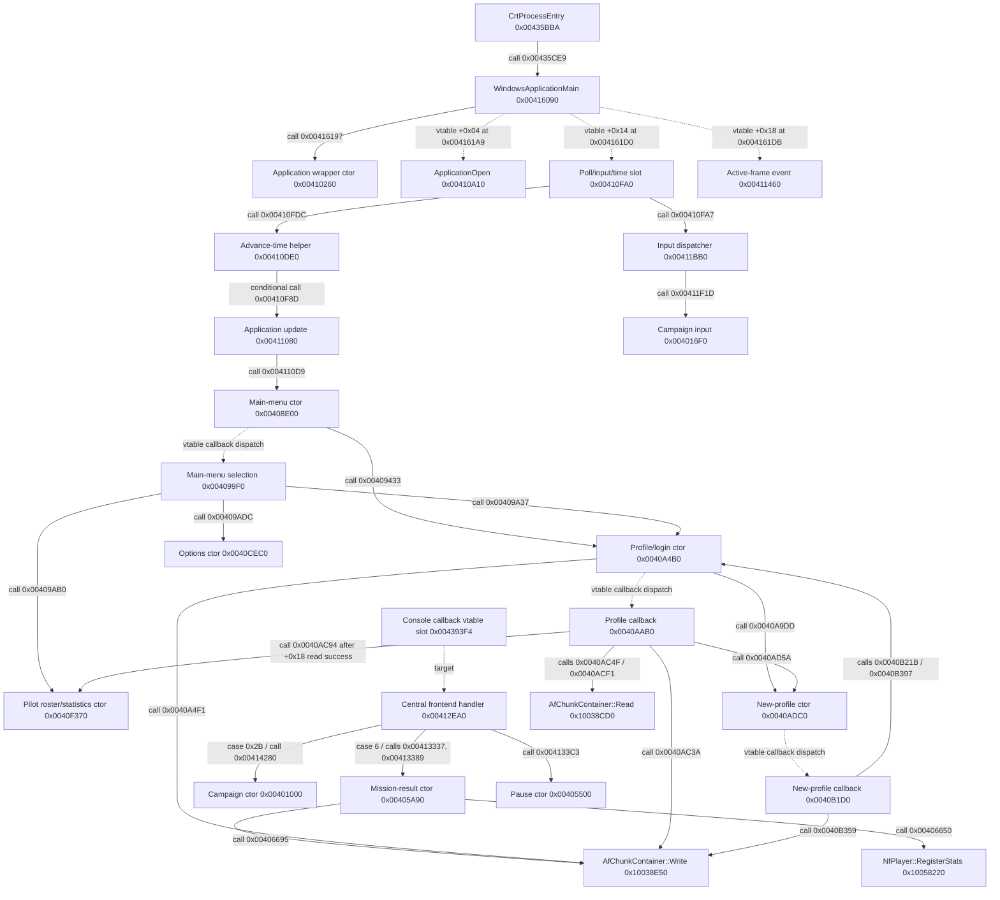
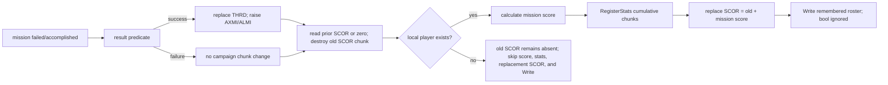

# Campaign, frontend, and roster flow

**Owner modules:** `Dogfighter.exe`, `AfEngine.dll`, selected
`Singleplayer.mode` boundary

**Status:** statically recovered; no runtime implementation in this change

**Confidence:** 2/3 (two-tool static agreement, no execution)

**Evidence IDs:** `EV-20260803-002` and the reused evidence listed below

**Scenario IDs:** `SCN-BOOT-001`, `SCN-UI-001`, `SCN-MISSION-001`,
`SCN-SAVE-001`

## Scope and evidence labels

This note covers ownership and transitions from process entry through profile
selection, campaign/mission selection, mission start, pause, mission result,
progression, score/stat registration, roster persistence, and return to the
frontend. It deliberately stops at the logic-to-presentation boundary: window
construction and input/command routing are included, but texture, widget, font,
layout, animation, and draw implementation are not.

Claims use these labels:

- **Confirmed fact:** directly supported by Ghidra 12.1.2 and, for the central
  boundaries, independently matched by Rizin 0.9.1/rz-ghidra.
- **Conditional inference:** follows from confirmed instructions only when its
  stated precondition holds; it has not been observed in a running game.
- **Hypothesis:** plausible but not suitable for implementation or parity.
- **Unknown:** evidence is insufficient. No unknown below is silently promoted
  to a default.

All addresses are image virtual addresses (VA). Ranges are byte-accurate,
end-exclusive `[start, end)`. `Dogfighter.exe` uses image base `0x00400000` and
`AfEngine.dll` uses `0x10000000`, so the RVA is the VA minus that base.

## Earlier evidence reused

The new analysis began by reviewing, rather than repeating, the existing
evidence:

| Existing evidence | Reused result | New boundary |
|---|---|---|
| `EV-20260730-002` / [EXP-20260730-066](../../experiments/EXP-20260730-066-bootstrap-module-loading.md) | process entry, application owner, frame loop, module discovery, lazy mission factory | joined to first main-menu and profile construction |
| `EV-20260730-005` / [EXP-20260730-070](../../experiments/EXP-20260730-070-mission-outcome-state.md) | independent failed/accomplished bytes and first-terminal `pause` then `menu` | joined to frontend command case 6 and result construction |
| `EV-20260730-006` / [EXP-20260730-075](../../experiments/EXP-20260730-075-mission-outcome-consumer.md) | result predicate, failure precedence, `THRD`/`AXMI`/`ALMI`, `mission_number + 1` | extended through score, stats, profile write, and subsequent actions |
| `EV-20260731-001` / [EXP-20260731-079](../../experiments/EXP-20260731-079-afs-function-order.md) | initial AFS action/event scheduling boundary | used only as the producer-side ordering boundary |
| `EV-20260731-002` / [EXP-20260731-080](../../experiments/EXP-20260731-080-afs-mission-outcome-bytecode.md) | exact five-word outcome call site | not recompiled or rescanned here |
| `EV-20260721-022` / [AFCHUNK](../../formats/AFCHUNK.md) | little-endian root/child framing, order, duplicate IDs | specialized to roster schema and unsafe legacy lifecycle |
| `EV-20260724-005`, `EV-20260724-006`, `EV-20260724-007` / [PLAYER-SPAWN](PLAYER-SPAWN.md) | mission selection, loading, room and player ownership | used as the downstream mission-load boundary |

The Windows/iOS render-settings, settings-panel, controller-profile,
calibration/remap, safe-FOV, and UI-scale experiments `EXP-20260729-055`,
`057`, `058`, `059`, `EXP-20260730-064`, `065`, `071`-`074`, `076`, and
`EXP-20260731-081`, `082` were also reviewed. They specify or implement the
modern portable/native products; they are not evidence for the original menu
state machine or roster writer. In particular, [ADR-0018](../../adr/0018-shared-durable-document-pair.md)
proves a modern durable-document transaction for AFRS/AFIP only. It does not
make the legacy roster write atomic and does not define campaign storage.

## Confirmed state flow

```mermaid
stateDiagram-v2
    [*] --> ProcessEntry
    ProcessEntry --> ApplicationOpen
    ApplicationOpen --> Loading
    Loading --> UserLoad: loading object completes
    UserLoad --> DefaultProfile: NfMain::LoadUser returns false
    DefaultProfile --> MainMenu
    UserLoad --> MainMenu: NfMain::LoadUser returns true
    MainMenu --> ProfileSelect: constructed on first menu load
    ProfileSelect --> MainMenu: sender +0x1C Read succeeds; update name; destroy login
    ProfileSelect --> PilotRoster: sender +0x18 Write attempted; Read succeeds; ctor 0x0040F370
    ProfileSelect --> NewProfile: create request
    NewProfile --> ProfileSelect: NAME/PICT/MEDA roster attempted
    MainMenu --> Settings: options action
    MainMenu --> PilotRoster: roster/statistics action ID 3
    MainMenu --> CampaignSelect: briefing / dispatch case 0x2B
    CampaignSelect --> MainMenu: Escape; set playerairforce none; deactivate
    CampaignSelect --> CampaignBriefing: confirm unlocked row
    CampaignBriefing --> CampaignSelect: back
    CampaignBriefing --> MissionLoading: start command sequence
    MissionLoading --> Mission: lazy selected mode/mission creation
    Mission --> Pause: pause/menu request without terminal flags
    Pause --> Mission: unpause
    Pause --> MissionLoading: missionrestart
    Pause --> Settings: options action
    Pause --> MainMenu: shutdown + menu true
    Mission --> Result: first terminal AFS call -> pause -> menu
    Result --> MissionLoading: failure retry -> missionrestart
    Result --> CampaignSelect: success Continue + threadend == 0; shutdown -> briefing; new Campaign +0xD8 = 0
    Result --> MainMenu: Exit + threadend == 0; shutdown -> menu true
    Result --> Credits: action 1 or 3 + threadend != 0; shutdown -> creds
```

**Confirmed fact:** the diagram contains only recovered transitions. It does
not imply that every original frontend screen or console command has been
enumerated. The main-menu options action constructs the same options window
entry at `0x0040CEC0` that the pause menu opens; the settings screen's internal
controls and renderer are outside this study.

**Unknown:** the complete numeric frontend state/command enum is not recovered.
The exact producer and semantics of the result window's `threadend` argument
are also unknown, so the credits edge is confirmed as a consumer branch but
not as a fully reconstructed campaign-completion rule. The exported bodies do
not establish the exits from Settings, Credits, or PilotRoster, so no return
edge is asserted for those screens.

### Transition details

| From | Trigger / exact identifier | Confirmed effect |
|---|---|---|
| loading | `NfMain::LoadUser` in application update | on false call default-profile initializer `0x004125D0`; either result proceeds to main-menu construction |
| loading | app update call site `0x004110D9` | allocate main-menu owner; main-menu construction calls profile/login constructor at `0x00409433` |
| main menu | options handler case `4` | allocate options window via `0x0040CEC0` and make it active |
| main menu | command `briefing`, central dispatch case `0x2B` | close/hide the current menu surface as required, allocate `0x5E8`-byte campaign owner, link its render subobject |
| campaign selection | campaign input handler `[0x004016F0,0x00401DFC)` | choose side, move only within the clamped maximum; Escape executes `set playerairforce none` and deactivates; Enter executes `set playerairforce <side>` and enters briefing |
| campaign briefing | Escape | return to selection substate |
| campaign briefing | Enter/start | execute `set briefing`, `set mission_thread`, `set mission_number`, `set mission`, then `set force_mission true`; set campaign terminal field `+0xDC`, deactivate, let app update destroy it, then execute `server` and `mode Singleplayer` |
| mission | `pause` / central frontend command handling | create `0x9C`-byte pause window if the mission is not terminal; terminal single-player flags select result instead |
| mission | AFS call ID `0x47` / `MissionFail` | set failed; only the first terminal call executes `pause`, then `menu` |
| mission | AFS call ID `0x48` / `MissionSuccess` | set accomplished; only the first terminal call executes `pause`, then `menu` |
| menu command | central dispatch case `6` | for single player, test failed/accomplished and allocate result (`0x190` bytes) or pause (`0x9C` bytes) |
| result | action 1 | `shutdown`, then `creds` if `threadend != 0`, otherwise `briefing` |
| result | action 2 | `missionrestart` |
| result | action 3 | `shutdown`, then `creds` if `threadend != 0`, otherwise `menu true` |

For result action 1 with `threadend == 0`, the callback branches at
`0x00406D3C` and executes `briefing` from `0x00406D57-0x00406D63`. Dispatch
case `0x2B` constructs Campaign at call site `0x00414280` only when its owner
slot is empty. The constructor zeroes substate `+0xD8` at `0x004015B0` and
calls rebuild at `0x004015B6`; rebuild's zero branch from `0x0040222D` builds
selection. Thus the normal Continue route returns to campaign selection with
the latest unlocked row preselected, not directly to briefing. If a Campaign
owner already exists, case `0x2B` neither creates another nor changes its
substate.

The campaign launcher stores the selected row as zero-based
`mission_number`. It forms mission and briefing identifiers with `row + 1`:

```text
set briefing "Game\Missions\Briefing\<thread><row+1>.brf"
set mission_thread <thread>
set mission_number <row>
set mission <thread>Mission<row+1>
set force_mission true
```

`<thread>` is exactly `Axis` or `Allied` in this path. The literals are logical
game identifiers, not host filesystem paths.

### Main-menu and central-dispatch identifiers

The main-menu selection callback `[0x004099F0,0x00409B67)` has these exact
zero-based entries:

| ID | Logical action |
|---:|---|
| `0` | open profile/logon selector |
| `1` | execute `briefing`, which reaches central dispatch `0x2B` and campaign selection |
| `2` | open multiplayer frontend |
| `3` | open pilot roster/statistics frontend |
| `4` | open options |
| `5` | execute paint-room route |
| `6` | execute house-editor route |
| `7` | execute credits route |

The central callback `[0x00412EA0,0x004143C1)` maps confirmed command IDs as
follows. IDs not listed remain outside this evidence.

| ID | Confirmed role |
|---:|---|
| `1` | quit |
| `2` | restart application wrapper |
| `3`-`5` | three boolean diagnostic/control switches; semantic names not assigned here |
| `6` | `menu`: select pause or terminal result for the current mission |
| `7` | mission information |
| `8` | multiplayer message |
| `9` | screenshot |
| `0x2B` | `briefing`: create campaign/briefing owner |

Window callbacks accept a gadget activation when `event+0x08 == 2`. The
campaign input switch separately handles input-event type `1` and mouse-event
types `5`/`6`; their complete device/gesture enum is not inferred.

## Call graph and lifecycle dispatch

Solid arrows below are direct calls with an identified call site. Dashed arrows
are registered callback, vtable, or application-lifecycle relationships and
must not be read as direct calls from the source node.



### Address and xref ledger

| Module | Working name | VA range `[start,end)` | RVA range | Selected xrefs / calls |
|---|---|---:|---:|---|
| DOGFIGHTER | Windows application main | `0x00416090-0x00416226` | `0x00016090-0x00016226` | entry call at `0x00435CE9`; application-constructor call at `0x00416197`; resolved vtable calls at `0x004161A9`, `0x004161D0`, `0x004161DB` |
| DOGFIGHTER | application open | `0x00410A10-0x00410ACF` | `0x00010A10-0x00010ACF` | vtable slot `+0x04` called at `0x004161A9`; opens `NfMain`; `0x00410ACF-0x00410AD0` is alignment not instruction extent |
| DOGFIGHTER | advance main clock | `0x00410DE0-0x00410F99` | `0x00010DE0-0x00010F99` | called at `0x00410FDC`; conditionally calls application update at `0x00410F8D` |
| DOGFIGHTER | poll input and advance time | `0x00410FA0-0x00410FE3` | `0x00010FA0-0x00010FE3` | vtable slot `+0x14` called at `0x004161D0`; direct input-dispatch call at `0x00410FA7` |
| DOGFIGHTER | campaign constructor | `0x00401000-0x004015C7` | `0x00001000-0x000015C7` | called at `0x00414280`; vtable/data refs at `0x0040011C`, `0x004001F4` |
| DOGFIGHTER | campaign input handler | `0x004016F0-0x00401DFC` | `0x000016F0-0x00001DFC` | called at `0x00411F1D`; calls campaign substate helpers and console execution |
| DOGFIGHTER | campaign render boundary | `0x00401EF0-0x00401F71` | `0x00001EF0-0x00001F71` | chooses selection/briefing drawing by logic substate; drawing bodies excluded |
| DOGFIGHTER | campaign side change | `0x00402130-0x00402204` | `0x00002130-0x00002204` | swaps current raw/clamped side state |
| DOGFIGHTER | campaign state rebuild | `0x00402210-0x00402796` | `0x00002210-0x00002796` | rebuilds logic-facing selection/briefing state |
| DOGFIGHTER | special campaign callback | `0x00404C10-0x00404D83` | `0x00004C10-0x00004D83` | parameter zero exposes special all-row values; not normal unlock evidence |
| DOGFIGHTER | pause constructor | `0x00405500-0x004056EE` | `0x00005500-0x000056EE` | called by central handler at `0x004133C3` |
| DOGFIGHTER | pause input | `0x00405760-0x00405A41` | `0x00005760-0x00005A41` | `unpause`, `missionrestart`, options, or `shutdown` then `menu true` |
| DOGFIGHTER | mission-result constructor | `0x00405A90-0x0040690A` | `0x00005A90-0x0000690A` | called at `0x00413337`, `0x00413389`; calls stats and roster write |
| DOGFIGHTER | mission-result action | `0x00406CE0-0x00406E14` | `0x00006CE0-0x00006E14` | Rizin created the missing function at the vtable target; Ghidra instruction extent agrees |
| DOGFIGHTER | mission information constructor | `0x00406E20-0x004070AA` | `0x00006E20-0x000070AA` | central frontend command case 7 |
| DOGFIGHTER | main-menu constructor | `0x00408E00-0x00409444` | `0x00008E00-0x00009444` | called at `0x004110D9`; calls profile/login at `0x00409433` |
| DOGFIGHTER | main-menu render boundary | `0x00409760-0x0040994A` | `0x00009760-0x0000994A` | presentation path excluded from logic reconstruction |
| DOGFIGHTER | main-menu update | `0x00409950-0x004099F0` | `0x00009950-0x000099F0` | updates active logical selection timing/state |
| DOGFIGHTER | main-menu selection | `0x004099F0-0x00409B67` | `0x000099F0-0x00009B67` | exact cases 0 through 7 listed above |
| DOGFIGHTER | profile delete callback | `0x0040A0D0-0x0040A1B1` | `0x0000A0D0-0x0000A1B1` | removes selected roster, refreshes list, then calls `Read(nullptr)` |
| DOGFIGHTER | profile/login constructor | `0x0040A4B0-0x0040AA31` | `0x0000A4B0-0x0000AA31` | called by main menu and menu action; writes current remembered roster before cataloguing |
| DOGFIGHTER | profile selection callback | `0x0040AAB0-0x0040ADB6` | `0x0000AAB0-0x0000ADB6` | sender `+0x18`: write current, read selected, then construct pilot roster/statistics at `0x0040F370`; sender `+0x1C`: read selected directly, update player name, destroy login; both require successful read |
| DOGFIGHTER | new-profile constructor | `0x0040ADC0-0x0040B15E` | `0x0000ADC0-0x0000B15E` | owns new-profile input window; rendering excluded |
| DOGFIGHTER | new-profile callback | `0x0040B1D0-0x0040B3B3` | `0x0000B1D0-0x0000B3B3` | creates root/NAME/PICT/MEDA and ignores writer result |
| DOGFIGHTER | options constructor | `0x0040CEC0-0x0040D08D` | `0x0000CEC0-0x0000D08D` | called from main menu and pause menu; controls/rendering excluded |
| DOGFIGHTER | medal presentation | `0x004100D0-0x00410247` | `0x000100D0-0x00010247` | consumes new-medal presentation state; does not define award thresholds |
| DOGFIGHTER | application update | `0x00411080-0x00411453` | `0x00011080-0x00011453` | creates main menu after loading owner finishes |
| DOGFIGHTER | active-frame event | `0x00411460-0x004114BA` | `0x00011460-0x000114BA` | separate vtable slot `+0x18` called at `0x004161DB`; does not call application update |
| DOGFIGHTER | application render callback | `0x004114C0-0x00411BA2` | `0x000114C0-0x00011BA2` | explicit outer presentation boundary; drawing not studied |
| DOGFIGHTER | input dispatcher | `0x00411BB0-0x0041221A` | `0x00011BB0-0x0001221A` | routes to main menu/overlays/campaign; campaign call site `0x00411F1D` |
| DOGFIGHTER | central frontend handler | `0x00412EA0-0x004143C1` | `0x00012EA0-0x000143C1` | Ghidra vtable callback target; Rizin created the missing function and matched calls/data refs |
| AFENGINE | roster read | `0x10038CD0-0x10038E4B` | `0x00038CD0-0x00038E4B` | full final `C2 04 00` at `0x10038E48` included |
| AFENGINE | roster write | `0x10038E50-0x10038EC9` | `0x00038E50-0x00038EC9` | full final `C2 04 00` at `0x10038EC6` included |
| AFENGINE | register mission stats | `0x10058220-0x100584A2` | `0x00058220-0x000584A2` | called by result at `0x00406650` |

The two tools initially exposed a range-convention trap for roster I/O:
`0x10038E49` and `0x10038EC7` are not byte-accurate exclusive ends because
they omit the two-byte immediate of the final `ret 4`. Direct instruction
inspection closes the ranges at `0x10038E4B` and `0x10038EC9`.

## Ownership and structures

### Application/frontend owner

**Confirmed fact:** `WindowsApplicationMain` allocates a `0xF8`-byte wrapper,
stores its global pointer at `0x00445958`, and constructs the application
owner. Relevant wrapper fields are:

| Offset | Proven role | Ownership/lifetime |
|---:|---|---|
| `+0x18` | console-callback subobject | vtable target routes commands to `0x00412EA0` |
| `+0x45` | byte | startup loading-complete state |
| `+0x48` | `NfMain*` | wrapper-owned `0x6E8`-byte runtime owner |
| `+0x4C` | main-menu/render owner | created after loading; routed by input dispatcher |
| `+0x50` | startup/loading owner | polled until complete, then destroyed/replaced |
| `+0x54` | active overlay/window slot | routed before lower-priority frontend owners; exact class varies |
| `+0x58` | additional frontend/window slot | routed by dispatcher; complete enum unknown |
| `+0x5C` | campaign owner | `0x5E8`-byte allocation, render subobject linked to `NfRenderHeap` |
| `+0x60` | transition-screen owner | exact class/role unknown |
| `+0x64`, `+0x68`, `+0x6C` | aliases into `NfMain` substructures | non-owning aliases established by application construction |

The campaign object embeds its `NfRenderObject` subobject at `+0x04` and holds
`NfMain*` at `+0xC8`. Its destructor removes cheats and deletes owned font,
texture-group, helper, and string allocations before destroying the render
subobject. This is an ownership result, not a UI drawing specification.

### Campaign object fields

| Offset | Representation | Confirmed meaning |
|---:|---|---|
| `+0xD4` | byte | input-active gate; zero consumes no campaign transition |
| `+0xD8` | signed `int32` | substate `0` selection, `1` briefing in recovered input paths |
| `+0xDC` | signed `int32` | terminal/start-transition flag consumed by application update |
| `+0x4B0` | NUL string buffer | current thread text (`Axis` or `Allied`) used to form identifiers |
| `+0x4C8` | signed `int32` | current side's clamped maximum selectable zero-based row |
| `+0x4CC` | signed `int32` | current side's raw stored maximum |
| `+0x4E4` | signed `int32` | clamped Axis maximum |
| `+0x4E8` | signed `int32` | clamped Allied maximum |
| `+0x4EC` | signed `int32` | raw Axis maximum |
| `+0x4F0` | signed `int32` | raw Allied maximum |
| `+0x500` | signed `int32` | side selector: exactly `0` Axis, exactly `1` Allied in normal construction |
| `+0x504` | signed `int32` | selected zero-based mission row; valid-side construction and side changes initialize it to that side's clamped maximum |

The constructor defaults `+0x500` to `1` (Allied), then accepts any signed
`THRD` value without validation at `0x0040146C`. For ordinary producer values,
zero selects Axis and one selects Allied. For any other value, the text path
chooses Axis because it tests `== 1`, while the maximum-selection path applies
neither side because it separately tests `== 0` and `== 1` at `0x004014FE` and
`0x00401569`. This unsupported-value behavior is confirmed but must not be
silently normalized to Allied; neither branch changes the initially zero
selection. Missing side maxima default to zero; each stored maximum is copied
to a raw field and independently clamped to `[0,9]`. For valid `THRD`, the
constructor selects the corresponding clamped maximum at Axis sites
`0x00401506`, `0x0040150C`, `0x00401512` or Allied sites `0x00401572`,
`0x00401578`, `0x0040157E`. Side changes repeat that policy at Axis sites
`0x00402145`, `0x0040214B`, `0x00402151` and Allied sites `0x00402180`,
`0x00402186`, `0x0040218C`: the screen opens or switches to the highest
currently unlocked row, not unconditionally to row zero.

### Roster ownership

`NfMain` embeds one `AfChunkContainer` at `+0x5F8`; this is the authoritative
in-memory profile/campaign object used by the frontend and result screen.
`NfPlayer+0xCC` points back to `NfMain`. The container is constructed during
`NfMain` construction, written with its remembered name during shutdown, and
destroyed with `NfMain`. Detailed container/chunk fields and disk framing are
in [ROSTER.md](../../formats/ROSTER.md).

## Campaign catalogue and unlock rule

**Confirmed fact:** the selection owner constructs ten row resources and clamps
both side maxima to zero through nine. The bounded catalogue therefore contains
ten selectable missions per side:

```text
AxisMission1 ... AxisMission10
AlliedMission1 ... AlliedMission10
```

The durable chunks are signed little-endian `int32` values:

| ID | Numeric FourCC | Meaning |
|---|---:|---|
| `THRD` | `0x44524854` | current/last successful side: Axis `0`, Allied `1` |
| `AXMI` | `0x494D5841` | maximum selectable zero-based Axis row, before UI clamp |
| `ALMI` | `0x494D4C41` | maximum selectable zero-based Allied row, before UI clamp |

Missing `AXMI`/`ALMI` means zero, so mission 1 (row zero) is initially
selectable. Navigation to the right is accepted only while
`selected < clampedMaximum`; navigation left is accepted while `selected > 0`.
For valid side state, construction and every side change initialize `selected`
to `clampedMaximum`; users may then navigate back toward zero.

On a successful result only:

```text
candidate = signed_int32(mission_number + 1)
side = case_insensitive(mission_thread, "allied") ? 1 : 0
THRD = side                         // always replace
if sideMaximum is absent: add candidate
else if old < candidate: replace with candidate
else: retain old
```

The executable uses x86 `INC` at `0x00405BA4`; `INT32_MAX` wraps to
`INT32_MIN`. That overflow is a confirmed legacy instruction effect, not a
recommended portable rule. Failure changes none of `THRD`, `AXMI`, or `ALMI`.

**Conditional inference:** for ordinary launcher-produced values `0..9`, a
success on row `n` unlocks row `n+1`; success on row nine writes candidate ten,
while the selector later clamps the display maximum back to nine. The raw ten
is retained. Its complete relationship to `threadend` is unknown.

**Unknown:** no third side or campaign thread was found in the bounded
constructor/handler/result paths. That is not proof that no other original
mode exposes a variant. No persistent difficulty chunk or complete difficulty
selector was identified here; difficulty semantics and default remain unknown.

The special campaign callback `[0x00404C10,0x00404D83)`, parameter zero, sets
all clamped maxima to nine, raw maxima to ten, and selects row nine. This is a
special/cheat route, not evidence for an ordinary unlock condition. It must not
be used as the normal campaign rule.

## Result to progress to write

The result constructor uses exactly:

```text
success = missionExists && accomplished && !failed
```

Failure therefore wins when both terminal bytes are set. The pre-gate `SCOR`
sites are `GetChunkByID` at `0x00405E96`, `ReadInt` at
`0x00405EA4` when present, and the old-chunk deleting virtual call at
`0x00405EB4`. Only later does the constructor compare the local-player pointer
at `0x004060D5` and take the null branch at `0x004060D7`. The ordered effects
are:



On both success and failure, the constructor reads prior `SCOR` (or zero) and
destroys the old chunk before it tests the local-player pointer. If no local
player exists, success progression may already have changed the in-memory
chunks and the old `SCOR` remains absent; the branch then skips mission-score
calculation, `RegisterStats`, replacement `SCOR`, and `Write`. Reachability of
that state in an ordinary single-player game is unknown.

### Exact mission-score expression

For a non-null local player, the result constructor computes a signed `int32`
mission score with unchecked legacy arithmetic:

| Source field | Conversion | Points |
|---:|---|---:|
| player `+0x3C` | signed count | `+150` each |
| player `+0x40` | signed count | `+50` each |
| player `+0x44` | signed count | `+200` each |
| player `+0x4C` | signed count | `-200` each |
| health of object returned by virtual slot `+0x94` | only when `GetPrimaryActor` and that slot result are both non-null: `int(health * 100.0 / maxHealth)` | `+5` each percent |
| fuel of object returned by virtual slot `+0x94` | only under the same two non-null gates: `int(fuel * 100.0 / fuelMax)` | `+5` each percent |
| player `+0x5C` | `int(value * 10.0)` | `+25` each converted unit |
| player `+0x58` | `int(value * 10.0)` | `+25` each converted unit |
| player `+0x60` plus `+0x64` | signed counts | `+250` each |
| player `+0x68` | signed count | `+500` each |
| player `+0x6C` | signed count | `+500` each |
| player `+0x54` | signed count | `-1000` each |

The exact constants are float32 `10.0` at `0x00438A4C` and `100.0` at
`0x00438A50`. Float-to-int conversion goes through the executable's x87
`_ftol` path; this static study does not assign a stronger portable rounding
contract. The first gate calls `NfPlayer::GetPrimaryActor` at `0x004060EB` and
tests it at `0x004060ED`. On success the getter is called again at
`0x004060F3`, then an otherwise unnamed virtual slot `+0x94` is invoked at
`0x004060F9` and its result is tested at `0x00406101`. Either null skips both
health and fuel terms; the semantic role of slot `+0x94` is unknown.
Zero-denominator and exceptional numeric behavior remain inside the scoring
NO-GO boundary. The unconditional pre-gate step has already read prior `SCOR` or
defaulted it to zero and destroyed the old chunk. With a non-null local player,
the result calculates `missionScore`, calls `RegisterStats` at `0x00406650`,
then computes `newTotal = old + missionScore` at `0x00406666`, adds a four-byte
replacement `SCOR` at `0x00406683`, and calls `Write(nullptr)` at
`0x00406695`. The write result is ignored.

### Cumulative stat chunks

`NfPlayer::RegisterStats` first requires player field `+0x04` to be nonzero; the
semantic name of that gate is unknown. For each nonzero mission field it reads
the prior signed `int32` chunk or zero, destroys the old chunk, performs an
unchecked signed addition, and adds a new four-byte chunk:

| Mission field | Chunk | Numeric FourCC |
|---:|---|---:|
| `+0x3C` | `ACKI` | `0x494B4341` |
| `+0x40` | `GUKI` | `0x494B5547` |
| `+0x44` | `WUKI` | `0x494B5557` |
| `+0x48` | `FOOK` | `0x4B4F4F46` |
| gate `+0x4C`, value added `+0x48` | `FRIK` | `0x4B495246` |
| `+0x54` | `DEAT` | `0x54414544` |

The `FRIK` mismatch is present in exact Ghidra and Rizin instructions: the
branch tests `+0x4C` but the addition reads `+0x48`. It is recorded as legacy
behavior, not corrected or semantically renamed. `RegisterStats` itself does
not write the roster; the result constructor writes afterward.

## Medals, equipment, and other unlocks

**Confirmed fact:** `MEDA` is repeatable. A new profile adds
`medal_rookie\0` followed by little-endian `int32 1`. The `AfEngine.dll`
instruction slice VA `[0x1004991E,0x10049A18)`, RVA
`[0x0004991E,0x00049A18)`, rejects names of length 64 or greater, performs a
case-insensitive duplicate scan, and adds the same string-plus-int shape while
setting a `newmedal` flag; this slice is not asserted as a function boundary. A
selected `Singleplayer.mode` callback can construct
`give_medal medal_%da` and `give_medal medal_%db` commands for indices 1..10,
but that callback is a cheat path.

The result presentation consumes `newmedal`, `newweapon`, and `newaircraft`
flags on success. It does not prove how normal play produces those flags.
`PKIL` and `PDEA` have profile UI readers, but their producers and exact roles
were not recovered.

**Unknown:** score thresholds, ordinary medal award conditions, weapon or
aircraft unlock rules, the trailing `MEDA` integer's meaning, and whether any
reward is tied to `SCOR`, `AXMI`, or `ALMI`. No such relationship may be
implemented from this evidence.

## Roster lifecycle and failure behavior

Profiles are catalogued from the logical game role `user\rosters\*.roster`.
The original file stores profile identity, campaign, cumulative score/stats,
and repeated medal records in the same `AfChunkContainer`; there is no separate
campaign file in the recovered path.

| Lifecycle point | Confirmed behavior |
|---|---|
| open profile/login screen | call `Write(nullptr)` for the currently remembered roster; ignore result; enumerate roster files and read `NAME` labels |
| preview selection | use a temporary container; failed read, missing `PICT`, or failed image lookup selects an unknown-image fallback |
| callback sender `+0x18` | call `Write(nullptr)` for the current roster, then `Read(selected)`; only a successful read constructs the pilot roster/statistics screen at `0x0040F370` |
| callback sender `+0x1C` | call `Read(selected)` directly, with no callback-local pre-write; only success updates player name and destroys the login screen |
| create profile | trim leading spaces only; reject empty/existing name; require a photo; create root 0 plus `NAME`, `PICT`, `MEDA`; ignore write result and continue UI flow |
| delete profile | remove selected logical roster without checking the result, refresh the list, call `Read(nullptr)` |
| mission result | on either outcome, read/default and destroy old `SCOR`; with a non-null local player add score/stats/replacement `SCOR` and call `Write(nullptr)`; ignore write result; with a null player old `SCOR` remains absent in memory |
| `NfMain` shutdown | call `Write(nullptr)` and ignore result |

`Read(nullptr)` frees only the remembered filename, sets it to null, and
returns false. It does not clear existing chunks or the serialization buffer;
it must not be modeled as a profile reset.

For a non-null name, `Read` remembers a duplicate of that name before open and
clears the previous buffer/chunks before validation finishes. Missing files,
seek/tell failure, incomplete reads, or a root-size mismatch return false but
do not restore the old state. The reader verifies
`root.payloadBytes == fileSize - 8` after an exact whole-file read, but it does
not prove `fileSize >= 8` before header access and does not bound every child
header/payload or NUL string against remaining bytes. Exact behavior for each
malformed file is therefore unknown and may include out-of-bounds access,
integer underflow, or invalid free; this was not executed.

`Write` opens the target directly with mode `wb`, truncates in place, performs
one `fwrite`, and closes. It has no temporary file, rename/replace, backup,
flush-to-disk, directory synchronization, rollback, or recovery transaction.
It writes `payloadBytes + 8` but reports success when the returned byte count
is at least `payloadBytes`, so a short write missing up to the final eight
bytes can be reported as successful; when the payload length is zero, a
zero-byte result also passes. `fclose` is ignored. The original write is not
atomic or reliably durable.

## Frontend/render boundary

The portable gameplay boundary should own:

- profile identity and selected profile result;
- screen/state values and allowed transitions;
- campaign side, raw/clamped maxima, selected row, briefing and launch
  directives;
- mission outcome, result action, progression, stats and score directives;
- validated persistence data and explicit save success/failure.

Windows/iOS presentation adapters should own only native widgets/canvases,
safe-area/layout, text/images, focus, keyboard/mouse/controller/touch routing,
and rendering. They may translate input into typed frontend actions and render
immutable state, but must not calculate unlocks, score, or persistence order.
This study intentionally contains no reconstruction of how the original
screens are drawn.

## Requirements for playable Windows and iOS products

The evidence makes the following work necessary before either product can be
called campaign-playable:

1. One portable C++20 frontend state model must cover profile select/create,
   main menu, settings, side/mission selection, briefing, mission loading,
   pause, result, retry/continue/exit, credits, and save-error handling.
2. One portable campaign model must preserve two side maxima, current side,
   zero-based selection, signed legacy import, the success-only maximum rule,
   and explicit safe policies for unsupported `THRD` values, mission-ten
   completion, and integer overflow.
3. Mission result integration must preserve failure precedence and, for a valid
   local player, the ordered `progress decision -> read/destroy old SCOR ->
   mission score -> stats -> replacement SCOR -> persist` transaction.
4. The score implementation must specify and test x87 conversion/overflow
   compatibility before claiming parity; reward rules must remain disabled or
   newly designed until evidence exists.
5. A bounded legacy roster importer must validate every extent, string, count,
   and arithmetic operation. It must fail closed without reproducing legacy
   memory-unsafe behavior and must define missing/corrupt-file recovery.
6. A new versioned campaign/profile document must use the shared durable
   current/backup/partial transaction on both platforms (ADR-0018 is reusable
   infrastructure, not the schema). Save failures must be surfaced; in-memory
   progress must not be silently reported as durable.
7. Profile creation/deletion and logical-name normalization must be confined to
   each platform's private app-data capability. Original logical filenames may
   be imported, but host paths must not enter diagnostics or public evidence.
8. Windows keyboard/mouse/controller and iOS touch/controller adapters must
   exercise the same typed transitions. Controller-only campaign acceptance,
   lifecycle interruption, and physical-device save recovery remain required.
9. Golden valid-roster fixtures and malformed synthetic fixtures are required
   for importer acceptance. A larger authenticated roster corpus is required
   before any bit-identical legacy exporter claim.

## GO/NO-GO

| Area | Decision | Exact boundary |
|---|---|---|
| frontend state machine | **NO-GO for complete parity; bounded GO for the documented skeleton** | boot/profile/campaign/briefing/start/pause/result/return edges are usable; complete command enum, settings internals, thread-end producer, and all modal precedence are open |
| campaign model | **GO for ordinary producer values; NO-GO for malformed-value behavioral parity** | two sides, ten rows each, defaults, raw/clamped maxima, highest-unlocked initial/side-switch selection, success-only update, and mission identifiers are closed; unsupported signed `THRD` is accepted inconsistently and needs an explicit importer/product policy |
| mission unlocks | **GO for sequential mission rows; NO-GO for rewards** | absent maximum adds `mission_number + 1`; a present maximum is replaced only for signed `old < candidate`; medals/equipment and end-of-thread semantics are not closed |
| scoring | **NO-GO for numeric or bitwise parity; bounded GO only for symbolic formula transcription and SCOR ordering** | fields, constants, x87 conversion sites, stat registration, and write order are recovered, but portable `_ftol` rounding/overflow behavior and controlled numeric traces are absent; reward thresholds/rules are also unknown |
| roster parser | **GO for a new bounded valid-file importer; NO-GO for corrupt-file behavioral parity** | framing and known records are closed; legacy malformed behavior is unsafe and incompletely defined |
| bit-identical legacy write | **NO-GO** | only one authenticated roster sample, no golden round trip/corpus, uncertain duplicate/update ordering, and a flawed non-atomic short-write result prevent a compatibility claim |

## Known unknowns and hypotheses

- **Unknown:** complete frontend command/state enumeration and modal priority.
- **Unknown:** complete values produced by default-profile initializer
  `0x004125D0` after `NfMain::LoadUser` returns false.
- **Unknown:** persistent difficulty representation and difficulty-dependent
  score or campaign behavior.
- **Unknown:** ordinary medal, weapon, and aircraft award producers and rules.
- **Unknown:** `threadend` producer and exact campaign-completion/credits rule.
- **Unknown:** normal single-player reachability of a null local player at the
  result constructor.
- **Unknown:** exact behavior for every malformed roster and for I/O failures
  after `fwrite` but before durable storage.
- **Unknown:** bitwise ordering expectations across duplicate/replaced chunks
  in a representative roster corpus.
- **Hypothesis, not an implementation input:** raw side maximum ten may
  participate in thread completion because the selector clamps it to nine and
  result actions consume a separate `threadend` flag. No producer join proves
  that relationship.
