# Player spawn and visual identity

**Status:** player/type/primary-actor and mission start-room paths recovered;
bounded AFS start parsing and selected-CCF campaign normalization implemented;
world-wide room parity and dynamic actor publication are pending

**Evidence:** `EV-20260724-005`

**Reference build:** SHA-256 values in
`docs/evidence/source-manifest.sha256`

This note records the clean-room contract for creating the local player's
primary actor, selecting its starting room, and identifying the actor's
grouped visual. Raw disassembly, decompiler output, original scripts, and
private filenames remain in the ignored `artifacts/` tree.

Confidence is high (3/3) for the player/type/primary-actor links and start
selector. Confidence is medium (2/3) for the three skin blueprint roles:
their ownership and complete hierarchy construction are proven, but their
original semantic names are not.

## Spawn event flow

```mermaid
flowchart LR
    A["NfMain::CreatePlayer"] --> B["event 0x11: type"]
    B --> C["NfPlayer::Spawn / event 0x17"]
    C --> D["GetStartPosition or explicit location"]
    D --> E["event 0x18"]
    E --> F["NfType::CreatePublicInstance"]
    F --> G["player +0xD8 = actor"]
    G --> H["actor +0x84 = player"]
    H --> I["position, rotation, room events"]
    I --> J["event 0x19: primary actor UID"]
```



`NfMain::CreatePlayer` stages the selected type, player name, and other setup
through events `0x11`, `0x13`, and `0x15`. `NfPlayer::Spawn` emits event
`0x17`. A decimal selector string requests a mission start; a named location
uses selector `-1` with an explicit position, room, and yaw.

On the server path, event `0x17` resolves the selector through
`NfMission::GetStartPosition` or accepts the explicit location, then emits
event `0x18`. Event `0x18` creates the public type instance, stores the
bidirectional player/actor link, applies position (`0x6D`), rotation (`0x70`),
and room (`0x72`), and emits event `0x19` with the primary actor UID.
Event `0x19` rebinds that UID and also establishes the local first-person UID.

`NfPlayer::GetPrimaryActor` is a direct read from player offset `+0xD8`.
`GetSecondaryActor` reads `+0xDC`.

## Mission start table

`NfMission` owns a fixed table of 16 `CcOrientation` values:

| Field | Recovered contract |
|---|---|
| Count | mission offset `+0x80` |
| First entry | mission offset `+0x84` |
| Entry stride | `0x3C` bytes |
| Capacity | 16 |
| Selection | `requestedIndex % count` |
| Empty table | identity at zero in the mission root/receiving room |

The original callback does not visibly reject a seventeenth entry. The
portable parser rejects it before construction so malformed private content
cannot overwrite a fixed legacy table.

`NfMission::Call`, case 10, implements this authored form:

```text
AddStartPos("room", coord3d(x, y, z), coord3d(rx, ry, rz));
```

It performs an exact room-name lookup, converts the axis rotation to a matrix,
stores the resulting room pointer in the orientation, and increments the
count. An editor call site independently shows that generated setup source
takes the name from the actual `CcSrtNode` room.

## World lookup and campaign CCF normalization

The authored room string is passed to `CcWorld::GetRoomByName`. It is not a
World `ROOM` ID, index, reference, or inferred join. A loaded CCF contributes
rooms to that runtime world: its first physical record binds the
receiving/root room and later records find or create rooms by name. Other
room-producing loads, including an optional background CCF, may contribute to
the same world.

A private aggregate census covered 20 campaign setup scripts. It found 20
start calls, one per script, and resolved all 20 to unique physical CCF rooms
with zero missing, ambiguous, malformed, or over-capacity cases. None selected
the primary receiving room. These are aggregate observations only; no original
script, room name, asset path, or derived payload is published.

The portable resolver records that shipped-campaign normalization against one
selected `CcfMetadata::rooms` collection in physical order. It is deliberately
not presented as full `CcWorld::GetRoomByName` parity: a complete runtime join
still requires a census across every CCF loaded into the world and recovery of
the legacy `CcName` comparison policy.

## Grouped aircraft visual

The authoritative visual path is:

```text
primary actor UID
  -> actor type
  -> object definition
  -> selected skin
  -> blueprint slot 0, 1, and 2
  -> complete instantiated hierarchy for every present slot
```

`AfVehicleType::GetSkinByName` selects a skin. `AfVehicle::SetSkin` stores it
at actor offset `+0x3F0`. The skin owns up to three blueprint pointers at
`+0x24`, `+0x28`, and `+0x2C`; each present blueprint creates its complete
hierarchy in the actor's room. The resulting roots are stored at actor offsets
`+0x3D0`, `+0x3D4`, and `+0x3D8` and parented to the actor transform. A skin
change deletes the old complete hierarchies before replacing them.

The AirCraft override calls the base skin setter, then searches the first
root for sticker and vapor anchor nodes. The original semantic roles of the
three blueprint slots remain unknown, so public APIs must use neutral
`blueprint0`, `blueprint1`, and `blueprint2` terminology.

The actor-owned UID graph also contains weapons and auxiliary effects. Those
objects are not part of the grouped aircraft visual merely because the actor
owns them. Likewise, the player must never be selected by first mesh, name
similarity, `sourceNodeReference`, or the entire owned-UID heap.

## Portable implementation

`MissionSetup` provides a bounded, non-executing scanner for the exact
`AddStartPos` call shape. It:

- treats all other AFS constructs as opaque;
- ignores comments and unrelated string literals;
- rejects malformed matching calls atomically;
- limits source size, room-name size, and start count;
- accepts only finite locale-independent floats;
- normalizes exact names only within one selected physical CCF; and
- fails closed on missing or ambiguous primary/start rooms.

The implementation deliberately does not execute AFS, convert the recovered
axis rotation into a portable runtime matrix, create an actor, or publish its
skin hierarchies to Metal. It also does not emulate the world-wide legacy room
lookup. Those steps require the dynamic actor-to-instance publication contract
and runtime validation.
