# Player spawn and visual identity

**Status:** player/type/primary-actor, mission start-room, and visible
slot-0 visual construction recovered; authenticated bounded AFS loading,
ordered multi-CCF lookup, atomic portable start-pose publication, and generic
object visual assembly implemented; authenticated actor publication is
pending

**Evidence:** `EV-20260724-005`, `EV-20260724-006`, `EV-20260727-003`,
`EV-20260727-004`

**Reference build:** SHA-256 values in
`docs/evidence/source-manifest.sha256`

This note records the clean-room contract for creating the local player's
primary actor, selecting its starting room, and identifying the actor's
grouped visual. Raw disassembly, decompiler output, original scripts, and
private filenames remain in the ignored `artifacts/` tree.

Confidence is high (3/3) for the player/type/primary-actor links, start
selector, three skin blueprint roles, initial visibility, and root-local
transform.

## Spawn event flow

```mermaid
flowchart LR
    A["NfMain::CreatePlayer"] --> B["event 0x11: type"]
    B --> C["NfPlayer::Spawn / event 0x17"]
    C --> D["GetStartPosition or explicit location"]
    D --> E["event 0x18"]
    E --> F["NfType::CreatePublicInstance"]
    F --> G["player +0xD8 = actor"]
    G --> H["actor +0x84 = player"]
    H --> I["position, rotation, room events"]
    I --> J["event 0x19: primary actor UID"]
```



`NfMain::CreatePlayer` stages the selected type, player name, and other setup
through events `0x11`, `0x13`, and `0x15`. `NfPlayer::Spawn` emits event
`0x17`. A decimal selector string requests a mission start; a named location
uses selector `-1` with an explicit position, room, and yaw.

On the server path, event `0x17` resolves the selector through
`NfMission::GetStartPosition` or accepts the explicit location, then emits
event `0x18`. Event `0x18` creates the public type instance, stores the
bidirectional player/actor link, applies position (`0x6D`), rotation (`0x70`),
and room (`0x72`), and emits event `0x19` with the primary actor UID.
Event `0x19` rebinds that UID and also establishes the local first-person UID.

`NfPlayer::GetPrimaryActor` is a direct read from player offset `+0xD8`.
`GetSecondaryActor` reads `+0xDC`.

## Mission start table

`NfMission` owns a fixed table of 16 `CcOrientation` values:

| Field | Recovered contract |
|---|---|
| Count | mission offset `+0x80` |
| First entry | mission offset `+0x84` |
| Entry stride | `0x3C` bytes |
| Capacity | 16 |
| Selection | `requestedIndex % count` |
| Empty table | identity at zero in the mission root/receiving room |

The original callback does not visibly reject a seventeenth entry. The
portable parser rejects it before construction so malformed private content
cannot overwrite a fixed legacy table.

`NfMission::Call`, case 10, implements this authored form:

```text
AddStartPos("room", coord3d(x, y, z), coord3d(rx, ry, rz));
```

It performs an exact room-name lookup, converts the axis rotation to a matrix,
stores the resulting room pointer in the orientation, and increments the
count. An editor call site independently shows that generated setup source
takes the name from the actual `CcSrtNode` room.

### Axis rotation and world-pose semantics

The three rotation fields are radians in x/y/z order. `CcAxisRot` remains in
mode zero, and `CcMatrixRot` starts at identity before applying Z (`rz`), X
(`rx`), then Y (`ry`). The primitive functions pass each value directly to
`FSIN`/`FCOS`; the inverse path stores `FPATAN` results without degree
conversion. The portable implementation therefore uses the recovered
equations explicitly instead of a library Euler convention.

The complete selected `CcOrientation` is copied unchanged. Spawn then applies
position, matrix rotation, and room membership as separate events. The vehicle
copies the position and converts the matrix directly to its quaternion; no
room transform participates. The start is an absolute source-world pose with
separate room membership, not a room-local transform.

The legacy row-vector matrix is transposed and conjugated through the same
source-to-runtime basis used by room geometry:

```text
Rruntime = B * transpose(Rlegacy) * inverse(B)
truntime = B * tlegacy * runtimeUnitsPerSourceUnit
```

No physical length unit is claimed. The default remains one runtime unit per
source unit.

## World lookup and ordered CCF publication

The authored room string is passed to `CcWorld::GetRoomByName`. It is not a
World `ROOM` ID, index, reference, or inferred join. A loaded CCF contributes
rooms to that runtime world: a leading direct room in each room section binds
the shared receiving/root room, while later room records find or create rooms.
The mission root begins with a void `CcName`. None of the shipped mission-root
loads uses flag `0x4000`, so it remains void.

`CcWorld::GetRoomByName` rejects a void query, then compares the root's full
name and prefix case-insensitively. It scans ordinary rooms newest-created-first
and compares only their names case-insensitively; the prefix is not part of an
ordinary-room lookup key. `CcRoom::LoadSceneCcf` therefore merges a later
physical room into an existing ordinary room when its name differs only by
ASCII case. Otherwise `CreateRoom` prepends a new room.

The synchronous mission load order is:

1. the main World `CCFF`, with flags `0`;
2. the optional first `BCKD`, with flags `0`;
3. every object-definition CCF selected by the level's `OBJE` loop, in physical
   placement order, with flags `0x2000`; and
4. world initialization, followed only then by successful `AddStartPos`.

Flag `0x2000` does not suppress the room section; only bit `0x20` does. It
suppresses the placed-node section relevant to object instancing. Scene wrapper
destruction and mission reset do not destroy the published world rooms; their
lifetime ends with the mission world.

`AddStartPos` constructs a query with a name but a null prefix. Consequently
the full root comparison always fails, even if a future root is named.
The empty-table fallback selects root directly and is a separate path.

A private aggregate census covered all 20 campaign setups and their complete
mission load sequences. The main CCFs contain 101 physical room records:
20 primary/root records and 81 ordinary rooms. Seven optional backgrounds
contribute only seven empty primary records. The 2,101 object CCF load calls
likewise encounter only one empty primary record per selected CCF, so they
bind that record to root but publish no ordinary room names. `MODL` records do
not issue this mission-root scene load. All 20 start calls
resolve uniquely to ordinary rooms from the main CCF; there are no missing,
ambiguous, empty, non-ASCII, background-only, object-only, or root matches.
There are no non-empty exact or ASCII-fold collisions. These are aggregate
observations only; no original script, room name, asset path, or derived
payload is published.

## Grouped aircraft visual

The authoritative visual path is separate from the mission's placed `0x4000`
scene:

```text
primary actor UID
  -> actor type
  -> selected skin
  -> model CCF
  -> blueprint slot 0, 1, and 2
  -> complete instantiated hierarchy for every present slot
```

`AfVehicleType::GetSkinByName` selects a skin. `AfVehicle::SetSkin` stores it
at actor offset `+0x3F0`. The skin owns blueprint pointers named
`thirdperson`, `damaged`, and `destroyed` at `+0x24`, `+0x28`, and `+0x2C`.
Slot 0 is mandatory; each present blueprint creates its complete hierarchy in
the actor's room. The resulting roots are stored at actor offsets `+0x3D0`,
`+0x3D4`, and `+0x3D8` and parented to the actor transform. A skin change
deletes the old complete hierarchies before replacing them.

The AirCraft override calls the base skin setter, then searches the first
root for sticker and vapor anchor nodes. `SetSkin` first hides every present
hierarchy recursively. It then creates a dynamic BSP for slot 0, unhides only
that slot, and recursively assigns the actor UID only to its mesh objects.
Slots 1 and 2 remain dormant until a separately recovered visibility
transition selects them.

Every cloned root receives local translation zero and a legacy Y-axis rotation
of pi. Descendants retain transforms derived relative to the selected authored
root. In the portable column-vector convention:

```text
relative_i   = inverse(authored_selected_root) * authored_i
actorLocal_i = recovered_root_Y_pi * relative_i
world_i      = player_spawn_world * actorLocal_i
```

All terms use the same runtime basis. A selected root is not assumed to have an
identity authored transform.

The actor-owned UID graph also contains weapons and auxiliary effects. Those
objects are not part of the grouped aircraft visual merely because the actor
owns them. Likewise, the player must never be selected by first mesh, name
similarity, `sourceNodeReference`, or the entire owned-UID heap.

## Portable implementation

`MissionSetup` provides a bounded, non-executing scanner for the exact
`AddStartPos` call shape. `MissionWorldRooms` reconstructs ordered room
publication and world-wide start lookup. Together they:

- treat all other AFS constructs as opaque;
- ignore comments and unrelated string literals;
- reject malformed matching calls atomically;
- limit source size, room-name size, and start count;
- accept only finite locale-independent floats;
- retain root separately from ordinary runtime rooms;
- preserve every source/physical-room contributor without copying geometry;
- model room-section suppression and optional primary-name copying;
- merge ordinary names using locale-independent ASCII case folding;
- reject embedded NUL and non-ASCII names whose legacy CRT behavior is not
  portable; and
- fail closed on structural, limit, missing, ambiguous, or forged state.

The production provenance chain begins with a required, explicit
`setupLogicalPath`; the Level path is supplied separately. `MissionLoadManifest`
resolves that setup identity exactly through the same guarded
`VerifiedContentSession` used for the Level, World, and object-definition
metadata. It never derives a setup name from the Level and never searches a
sibling or fallback path. The manifest retains the canonical setup
logical-path/file-index identity, checked compressed-source footprint, and
owned ordered starts. Raw AFS bytes are released after parsing.

`MissionWorldRoomLoader` accepts no caller-owned start table. It copies the
manifest-owned starts before callbacks, resolves them against the complete
ordered main/backdrop/object CCF room namespace, and carries the canonical
setup identity and footprint into the loaded result. A successfully
authenticated setup with zero `AddStartPos` records deliberately takes the
anonymous root-room fallback.

`PlayerSpawnPose` is a separate trivially copyable state, so the established
input-intention `PlayerAircraftState` and canonical hash remain unchanged. It
retains the exact authenticated source position/radians plus converted runtime
world position and column-vector matrix. The publication boundary recomputes
the pose from the selected start and retained room basis and rejects any
mismatch.

The Objective-C++ snapshot keeps an independent immutable pose copy after the
large room payload moves to Metal preparation. On the main thread, the exact
ticket is consumed, the validated Metal room is committed, and only then are
the pose and fresh deterministic input state assigned before content becomes
ready. A new request, stale callback, preparation failure, or validation
failure leaves the previously committed player state intact.

The implementation deliberately does not execute AFS or infer a setup path. It
does not yet publish the recovered primary actor to Metal. The reusable
`ObjectVisualDrawAssembly` now resolves one complete selected blueprint
subtree, shares physical meshes by first use, retains mesh/instance provenance,
and publishes only an atomic bounded result. It deliberately stops at
converted authored-world transforms. The slot-0 actor adapter derives the
root-relative transforms described above; the remaining boundary is to source
that visual through the authenticated manifest, append it with tagged
provenance, and compose the selected spawn pose exactly once.
