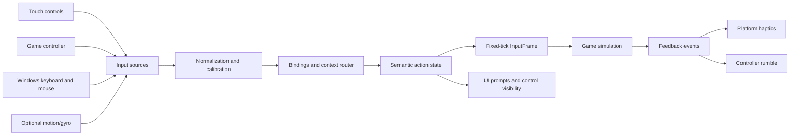

# Input, controls, and haptics system

**Status:** portable core and native V1 gameplay-action transport implemented;
profiles, remapping, haptics, menu UI, and device acceptance pending

**Priority:** P0 for the Windows x64 and iOS vertical slices

**Related scenarios:** `SCN-INPUT-001` through `SCN-INPUT-012`,
`SCN-WIN-INPUT-001`, `SCN-WIN-INPUT-002`, `SCN-IOS-INPUT-001`

## Goals

- Make the entire single-player game usable with keyboard/mouse on Windows and
  touch alone on iOS.
- Support controllers through separate Windows and iOS platform adapters,
  including hot connection and disconnection.
- Keep the simulation independent from physical device names and platform APIs.
- Preserve original input semantics while allowing mobile-friendly layouts,
  sensitivity, remapping, and accessibility options.
- Produce deterministic per-tick input frames for replay and parity testing.
- Prevent stuck buttons, accidental actions, and unsafe resume after lifecycle or
  device changes.

## Non-goals for the first slice

- Requiring a physical controller.
- Binding gameplay directly to Apple, SDL, keyboard, or controller scan codes.
- Simulating a Windows keyboard by drawing keyboard keys on the screen.
- Motion/gyro as the only flight method.
- Local multiplayer with multiple controllers.

## High-level design



Platform backends emit normalized physical inputs. The binding layer maps them
to semantic actions. Only an immutable `InputFrame` crosses into a simulation
tick. Haptics travel in the opposite direction and cannot affect gameplay.

### Implemented portable core

The C++20 `airfix::input` library now fixes action/axis numeric IDs, uses signed
Q15 values, and turns a bounded sequence-ordered physical event queue into one
deterministic frame per simulation tick. Platform timestamps are diagnostic
only. Buttons from multiple sources use logical OR; meaningful analog input
claims an axis without allowing idle drift to steal it. Device cancellation,
context changes, and lifecycle reset synthesize releases, and reset requires two
consecutive neutral ticks before gameplay input is admitted again.

Default semantic bindings cover touch, an extended controller, and the baseline
Windows keyboard/mouse profile. The Windows x64 application now uses SDL3 for
keyboard/mouse focus and standardized-controller discovery/hot-plug, converts
those native values into stable USB HID/control IDs and Q15 values, and emits
the same normalized events as iOS. Persistent profiles, configurable
calibration, glyphs, and rumble policy remain pending.

The native iOS layer feeds the complete current gameplay-action surface from a
safe-area-aware UIKit overlay and Apple's Game Controller framework; none of
those platform types enter `InputFrame`. Profile persistence/remapping,
controller glyphs, finished menu UI, physical device acceptance, and haptic
adapters remain follow-up layers.

The portable simulation consumer is also implemented.
`airfix::simulation::PlayerAircraftState` accepts one eligible `InputFrame` at
a time and preserves flight, throttle, and camera axes as uninterpreted Q15
intentions. It also records primary/secondary fire and rear-view held state,
exact press/release counts, weapon/camera/mission/pause action counts, direct
weapon selection, and a completed-step count separate from the input tick. Tick
gaps are accepted; duplicates, backward ticks, invalid Q15 or weapon values,
incompatible schemas, and counter exhaustion fail without partial mutation. A
canonical field-by-field hash supports cross-compiler replay diagnostics. No
flight motion, throttle integration, camera behavior, or weapon spawn semantics
are claimed yet.

Reference event recovery now confirms that positive pitch corresponds to the
original `pitchup` command, positive bank to `bankright`, and positive thrust
apply to increase. Aircraft use `EVENT_THRUST_SET/APPLY`; the similarly named
`EVENT_THROTTLE_SET/APPLY` values do not modify AirCraft control fields.
Keyboard thrust applies signed `+255/-255` persistent deltas, while analog
pitch/bank use recovered dead zones and nonlinear `SET` curves. These facts are
documented in `docs/re/systems/AIRCRAFT-FLIGHT.md`; they are not yet applied by
`PlayerAircraftState` because scheduler time units, the complete force law, and
the actor binding remain incomplete.

`InputRouter` is deliberately single-thread-affine. UIKit and Game Controller
callbacks must be serialized onto the same input/simulation thread as `tick()`;
adapters must also submit their complete current state when a device connects.
After a controller loss, the replacement source is quarantined until two
consecutive neutral ticks, even if the platform assigns it a new runtime ID.

### Implemented native iOS slice

`AirfixTouchControlsView` supplies a landscape flight stick, latching throttle,
held thrust adjustment, primary and secondary fire, next/direct weapon
selection, camera look/cycle/recenter, rear view, mission status, and
pause/resume. It captures each finger independently, permits simultaneous
flight/combat/camera combinations, passes touches outside active regions
through to underlying UIKit content, respects safe areas and 44-point minimum
targets, and provides explicit VoiceOver actions. Partial touch cancellation
releases only the affected control. Full cancellation releases every held
control while preserving the absolute throttle target.

`AirfixGameControllerAdapter` assigns one extended controller and maps both
sticks, both triggers, D-pad up/down, shoulders, face buttons, optional
right-stick click, and combined menu/options pause while leaving Bluetooth
pairing system-managed. Its fixed-capacity, generation- and order-tagged FIFO
preserves complete digital taps between input ticks. The portable
`ControllerInputBatchBridge` validates each batch atomically, checks Q15 values
and edge ordering, maps all controls to portable IDs, applies deterministic
stick deadzone/change thresholds, and reconciles the ordered edges with the
final sampled state. Queue overflow or malformed reconciliation resets input
and forces a recoverable pause; generation or counter exhaustion fails closed.
Disconnect resets every source and pauses, while reconnect submits a complete
state through the neutral gate.

`AirfixIOSInputCoordinator` owns both adapters and the portable `InputRouter` on
the main thread. A fixed 60 Hz pump remains active while `MTKView` is paused,
delivers exactly one immutable frame to the installed host consumer per
completed input tick, and publishes rate-limited diagnostics to UIKit. Content,
room, visibility, controller-loss, and application lifecycle boundaries reset
all sources. Its public context API transitions between gameplay, menu, modal,
and control-editor bindings only after cancellation, so held physical controls
cannot leak across a context boundary. The absolute touch throttle target is
excluded from neutral-gate blocking and is restored only after the required two
safe ticks. Foreground activation and room publication never resume gameplay;
the player must explicitly use pause/menu.

This completes action transport, not control-system acceptance. Remapping,
calibration UI, persistent layout/visibility profiles, prompt glyphs, haptics,
finished touch/controller menus, and runtime validation on both target iPhones
remain pending.

### Implemented native Windows slice

`AirfixSdlInputAdapter` owns one SDL3 standardized gamepad while preserving
keyboard and mouse as simultaneous independent sources. It maps physical SDL
scancodes directly to stable USB HID usage IDs, maps relative mouse motion and
buttons without accepting touch/pointer-synthesized mouse events, and samples
all sources through `DesktopInputBridge` at a fixed 60 Hz.

`DesktopInputBridge` is portable C++20. It accumulates one-tick relative mouse
look, preserves complete press/release taps, rejects invalid Q15 and generation
rollback, reuses `ControllerInputBatchBridge` for the same dead-zone and trigger
policy as iOS, and submits only stable physical events to `InputRouter`. A newly
assigned, remapped, or replacement gamepad must be neutral for two input ticks.
Disconnect releases its held actions and requests pause. Focus loss resets all
sources; focus regain starts a fresh lifecycle gate and full controller sample.

The fallback keyboard/mouse layout uses arrows for bank/pitch, `W`/`S` for
thrust adjustment, left/right mouse or `Space`/left `Ctrl` for weapons, relative
mouse motion for camera look, mouse wheel or `Tab` for next weapon, `R` for rear
view, `C`/`F` for camera cycle/recenter, `M` for mission status, and `Escape`
for pause. Menu bindings use arrows, `Enter`, `Escape`, and `Q`/`E` tabs.
Standard gamepad bindings match the implemented controller table below.

This is the tested physical transport baseline, not finished input acceptance.
Persistent remapping/calibration, selected-device UI, glyphs, digital menu
repeat, rumble, and physical Xbox/PlayStation/generic-controller testing remain
pending.

## Input contexts

Only the highest-priority active context receives an action unless the action is
explicitly global.

| Context | Examples | Behavior |
|---|---|---|
| System/lifecycle | suspend, controller lost | clears held state; may force pause |
| Modal dialog | confirm, cancel | blocks menu and gameplay input |
| Control editor | select, drag, resize, reset | never fires gameplay actions |
| Menu | navigate, confirm, back, tabs | digital repeat rules apply |
| Mission/status overlay | close, scroll, tabs | gameplay paused or explicitly gated |
| Flight gameplay | flight, weapons, camera | sampled into fixed simulation ticks |
| House/Paint editor | tool and object actions | later, separate action sets |
| Photo/screenshot | camera and capture | later, separate action set |

Entering a blocking context synthesizes releases for actions from the previous
context. Leaving it does not restore buttons that were physically held; the
player must return them to neutral and press again.

## Canonical action set

Names are contracts, not UI labels. Exact original behavior is filled in during
reference analysis.

### Global and menu

| Action | Type | Notes |
|---|---|---|
| `Global.Pause` | edge | available during active gameplay |
| `Global.Back` | edge | dismiss/current menu back |
| `UI.NavigateX` | axis | normalized `[-1, 1]` with repeat generation |
| `UI.NavigateY` | axis | normalized `[-1, 1]` with repeat generation |
| `UI.Confirm` | edge | primary UI action |
| `UI.Cancel` | edge | secondary UI action |
| `UI.TabPrevious` | edge/repeat | where tabs exist |
| `UI.TabNext` | edge/repeat | where tabs exist |

### Flight and combat

| Action | Type | Range/semantics |
|---|---|---|
| `Flight.Bank` | axis | `-1` left, `+1` right |
| `Flight.Pitch` | axis | sign confirmed against reference; invert setting applied before frame |
| `Flight.ThrottleDelta` | axis | held increase/decrease matching original commands |
| `Flight.ThrottleSet` | axis | absolute `[0, 1]` for touch slider where supported |
| `Combat.PrimaryFire` | held plus edges | machine guns; press/release retained |
| `Combat.SecondaryFire` | held plus edges | selected secondary weapon |
| `Combat.WeaponNext` | edge | cycle weapon |
| `Combat.WeaponSelect` | discrete value | direct slot/weapon wheel selection |
| `Camera.Cycle` | edge | original camera toggle |
| `Camera.RearView` | held | rear view while held unless accessibility latch is enabled |
| `Camera.LookX` | axis | optional free-look path |
| `Camera.LookY` | axis | optional free-look path |
| `Camera.Recenter` | edge | mobile/controller addition |
| `Mission.Status` | edge | mission or multiplayer status overlay |

Flight-assist actions, if later added, are a separate enhanced gameplay mode and
must not silently alter faithful-mode parity.

`ThrottleSet` is a control-layer convenience, not permission to change the
original flight model. Static reference analysis confirms that AirCraft accepts
both absolute `THRUST_SET` and signed `THRUST_APPLY` payloads. `InputFrame`
therefore transports an absolute slider target and a held delta independently.
The future flight-law bridge must translate their Q15 values into the recovered
reference payload domain and scheduler timing; this input layer does not invent
engine or acceleration behavior.

The separate reconstructed native command callback is intentionally not wired
to `InputFrame`. It owns eight bool flags for turn left/right, pitch up/down,
bank left/right, and thrust increase/decrease, and every already-ordered
invocation emits one exact SET/APPLY event after updating its own flag.
`InputFrame` contains final Q15 flight axes rather than ordered opposing-command
edges, and it has no turn action, so it cannot recover native last-invocation
behavior from a sampled frame. The implemented pure command reducer is an
evidence tool and future pre-aggregation seam, not permission to bypass source
arbitration, lifecycle neutralization, or the fixed-tick contract. Live wiring
requires a separately specified ordered semantic-command stream or an explicit
portable policy; see
[EXP-20260730-062](../experiments/EXP-20260730-062-native-control-command-reducer.md).

## Semantic state and deterministic sampling

Each action state contains:

```text
value              normalized scalar or vector
isHeld             state after binding resolution
pressedThisFrame   physical/control edge
releasedThisFrame  physical/control edge
source             touch, controller, keyboard, mouse, motion
sourceInstance     ephemeral runtime ID, never persisted as identity
sequence           monotonic event sequence
timestamp          platform monotonic time for diagnostics
```

At every fixed simulation boundary, the router creates:

```text
InputFrame {
  schemaVersion
  simulationTick
  analogValues[]
  pressedBits[]
  releasedBits[]
  heldBits[]
  weaponSelection
}
```

`InputFrame` is serializable for replay tests. Platform timestamps, controller
names, haptic events, and UI-only navigation do not enter deterministic gameplay
state.

## Multiple source policy

- Button-like actions are logically combined, but edge events are deduplicated.
- An analog action has one active source at a time. The most recent meaningful
  input above its deadzone claims it with short hysteresis; idle drift cannot
  steal ownership.
- Touching the screen can immediately reclaim touch input from a controller.
- Connecting a controller does not disable touch. The default UI may fade touch
  controls after meaningful controller input and restore them on the next touch.
- Settings offer `always show`, `automatic`, and `hide while controller active`.
- UI glyphs follow the last meaningful input source, not mere connection state.

## Touch control design

### Default landscape layout

```text
┌──────────────────────────────────────────────────────────────┐
│ [Mission]                                      [Camera][Pause]│
│                                                              │
│ throttle                                                     │
│   ▲          free gameplay / right-side camera swipe region  │
│   │                                                          │
│   ●                                                          │
│   │                                                          │
│   ▼                                                          │
│         (dynamic flight stick)          [Secondary] [FIRE]   │
│              left thumb                 [Weapon]   [Rear]     │
└──────────────────────────────────────────────────────────────┘
```

This is an initial ergonomic hypothesis. Device testing decides exact positions,
not the diagram.

### Flight stick

- Lower-left region, dynamic origin by default; fixed-origin option available.
- Horizontal axis maps to bank and vertical axis to pitch.
- Configurable radius, sensitivity, response curve, outer saturation, pitch
  inversion, and limited smoothing.
- Visual center, direction, and magnitude feedback remain visible under the
  thumb.
- Stick keeps the same finger ID until release/cancel and cannot jump to a second
  finger.

### Throttle

- Vertical latching slider with a large thumb target and numeric/graphic level.
- Alternative paired `increase/decrease` hold buttons reproduce original input
  semantics and are useful for accessibility.
- Sliding begins only after a deliberate touch inside its capture region.
- Throttle remains at its last value after release; canceling a touch preserves
  the last committed safe value.

### Weapons and camera

- Primary fire is the largest right-thumb button.
- Secondary fire is distinct in position, shape, and icon.
- Tap cycles weapon; touch-and-hold opens a radial or linear weapon selector.
- Right-side drag controls free-look when that camera mode is supported. Camera
  gestures never begin inside a button capture region.
- Rear view is hold by default, with an optional accessibility latch.
- Controls appear/disappear by context, but essential actions never move during
  active flight unless the player explicitly edits the layout.

### Multi-touch requirements

The system must correctly support at least these simultaneous operations:

- flight stick plus primary fire;
- flight stick plus secondary fire;
- flight stick plus throttle adjustment;
- flight stick plus camera/rear view;
- throttle adjustment plus weapon selection;
- two buttons pressed in sequence while the flight finger remains held.

Each touch is captured by one control or gesture arena. `cancel`, app
deactivation, overlay presentation, orientation/layout invalidation, and control
destruction all synthesize releases.

### Layout editor and profiles

- Move, resize, change opacity, mirror handedness, and reset every control group.
- Preview safe areas, reserved gesture edges, and comfortable thumb regions.
- Separate profiles for phone and tablet; optional named player profiles.
- Persist normalized anchors plus size in points, not absolute pixels.
- Migrate versioned layouts; keep a known-safe default if migration fails.
- Offer left-handed preset, larger-controls preset, and low-opacity preset.
- Never allow required pause/back recovery controls to become unreachable.

### Touch usability requirements

- Essential gameplay targets are at least 44 x 44 points.
- Layout respects the Home indicator, rounded corners, camera cutout/Dynamic
  Island, and device safe areas.
- Controls provide visible pressed states plus optional sound/haptic feedback.
- Icons describe actions rather than controller-specific names such as `A` or
  `R1`.
- Opacity increases while a control is active and can fade while idle.
- Gameplay remains possible with haptics and sound disabled.

## Physical controller support

### Platform behavior

- Support standardized extended gamepads exposed by iOS, including MFi and
  supported console controllers such as Xbox and PlayStation families.
- Monitor connection, disconnection, remapping, battery/capabilities where
  available, and controller profile changes.
- Bluetooth pairing remains system-managed; the game shows instructions and
  connection state but does not implement its own pairing stack.
- Use a narrow Apple Game Controller adapter including connection state,
  normalized controls, and bounded edge capture. Capability-specific glyph
  metadata remains pending. A later SDL3 desktop/common adapter must emit the
  same portable physical-event contract rather than changing simulation input.
- Poll stable analog/button state at the game update boundary; use connection
  events and explicit edges to manage device lifecycle.

### Implemented baseline mapping

| Game action | Extended controller input |
|---|---|
| Bank/pitch | left stick X/Y |
| Camera look | right stick X/Y |
| Recenter camera | right-stick click where available |
| Increase/decrease thrust | D-pad up/down |
| Primary fire | right trigger |
| Secondary fire | left trigger |
| Next weapon | right shoulder |
| Direct weapon selection | touch selector; no dedicated controller binding in the baseline |
| Rear view | left shoulder, hold |
| Camera cycle | face-left |
| Mission status | face-top tap when wheel is not invoked |
| Confirm/cancel | platform-appropriate face buttons |
| Pause | menu/options button |

The transport mapping is implemented, but remains provisional until reference
scenarios establish action timing and on-device usability tests approve its
conflicts. User remapping, action glyphs, and conflict detection are specified
but not yet implemented.

### Connection and loss

- A newly connected controller is announced non-modally and becomes active on
  meaningful input.
- If the active controller disconnects during single-player gameplay, synthesize
  releases and pause. Show touch controls immediately and offer continue.
- Disconnect in a menu preserves the menu and switches prompts to touch.
- Reconnecting never restores held actions; all inputs must pass through neutral.
- More than one connected controller is listed, but only one owns player one in
  the initial release. The first meaningful input can claim ownership from the
  selection screen.
- Low battery is informational and rate-limited; it never blocks play.

### Calibration and mapping

- Inner deadzone, outer saturation, response curve, Y inversion, sensitivity,
  and trigger threshold are configurable.
- Default calibration is per device class, not stored against personal hardware
  serial data.
- Detect stick drift and recommend deadzone adjustment without silently changing
  settings during play.
- Restore defaults per action or for the whole profile.
- Provide a live input visualizer in settings.

## Optional motion controls

Gyroscope/accelerometer control is an enhancement, disabled by default. It can
provide bank/pitch input or camera assistance with recenter, sensitivity,
deadzone, orientation calibration, and a touch/controller fallback. Motion is
never required for menus or complete gameplay and is evaluated only after the
touch and controller paths pass acceptance.

## Haptics and feedback

Gameplay emits semantic feedback events:

```text
UISelection
WeaponPrimaryPulse
WeaponSecondaryLaunch
DamageLight / DamageHeavy
CollisionLight / CollisionHeavy
ExplosionNear
MissionSuccess / MissionFailure
```

The feedback router maps them independently to iPhone Core Haptics/system
feedback and controller rumble based on runtime capability.

Rules:

- Global off switch plus separate phone/controller intensity.
- Rate limiting and priority mixing prevent constant firing from masking damage.
- Stop all continuous haptics on pause, background, interruption, controller
  loss, or engine shutdown.
- Missing haptic capability is normal, silent fallback behavior.
- Haptics never control simulation timing or event acceptance.

## Persistence model

```text
InputProfile
  schemaVersion
  gameplayBindings[]
  menuBindings[]
  analogCalibration[]
  touchLayoutPhone
  touchLayoutTablet
  touchVisibilityPolicy
  handedness
  hapticPreferences
  optionalMotionPreferences
```

Profiles use logical actions and standardized controller elements. Runtime device
IDs, Bluetooth addresses, and hardware serial-like identifiers are not stored.
Invalid or future fields are ignored safely; required missing fields receive
defaults.

## Lifecycle and error handling

| Event | Required behavior |
|---|---|
| App resigns active | synthesize releases, pause simulation, stop haptics |
| App enters background | save/checkpoint where safe, stop audio/render loop/work |
| App returns foreground | rebuild transient devices, remain paused until explicit resume |
| Touch is canceled | release captured control; never leave fire/rear held |
| System overlay appears | treat as loss of active interaction |
| Controller disconnects | release its actions; pause if it was active in gameplay |
| Controller reconnects | require neutral; update prompts after meaningful input |
| Audio interruption | pause/mute according to lifecycle policy; no input replay |
| Profile corrupt/migration fails | retain backup, load safe defaults, show recoverable notice |
| Unsupported controller feature | hide related option and use normal fallback |

## Performance and latency budgets

- No unbounded allocation in the per-event or fixed-tick input path.
- Process input quickly enough that a meaningful event is visible to the next
  eligible simulation tick; record event-to-tick latency in diagnostic builds.
- Target input processing is below 1 ms at the 95th percentile on the oldest
  supported device, excluding OS delivery and display latency.
- Visual pressed state appears in the same rendered frame when practical.
- Touch controls do not issue GPU overdraw-heavy full-screen translucent layers.

Budgets are provisional until target devices are selected.

## Test plan

### Unit and deterministic tests

- Deadzone, inversion, saturation, curves, trigger thresholds, and clamping.
- Press/hold/release edge generation across different frame/tick rates.
- Source arbitration, drift rejection, and deduplication.
- Context transitions synthesize releases.
- Profile load, migration, unknown fields, corruption, and defaults.
- Recorded `InputFrame` replay produces identical simulation hashes.

### Touch tests

- All required multi-touch combinations listed above.
- Finger crosses controls, leaves screen, receives cancel, and changes context.
- Phone/tablet layouts across supported aspect ratios and safe areas.
- Left-handed, large-control, minimum/maximum opacity, and inverted controls.
- Control editor cannot hide or strand recovery actions.
- Accidental-touch test near Home indicator and screen edges.

### Controller matrix

- At least one current Xbox-family controller.
- At least one current PlayStation-family controller.
- At least one generic/MFi extended controller where available.
- Bluetooth connection, USB connection on a compatible iPad, reconnect, low
  battery, remap, and unsupported optional capabilities.

### Lifecycle torture scenarios

- Background/foreground while flying, firing, moving throttle, paused, loading,
  saving, and in a modal dialog.
- Controller disconnect while firing or holding rear view.
- Touch-to-controller and controller-to-touch handoff without reopening settings.
- Incoming system interruption and screen lock during active gameplay.

## Acceptance criteria

- Every P0/P1 single-player action is reachable with touch alone.
- Every P0/P1 single-player action is reachable with an extended controller.
- No tested cancel, disconnect, pause, or background sequence leaves an action
  held.
- The player can edit/reset touch layout and remap/reset controller bindings
  without corrupting a profile.
- Prompt glyphs and touch visibility follow actual active input.
- A recorded control scenario reproduces the same per-tick `InputFrame` and
  simulation result.
- Essential touch targets and safe-area constraints pass on every supported
  device class.

## Open decisions

- Whether the first release uses a custom touch overlay from the start or uses
  `GCVirtualController` for the earliest device spike before replacement.
- Final default mapping after reference input timings and device playtests.
- Whether gyro support belongs in version 1.0 or a later enhancement.
- Exact policy for pausing on controller loss in future multiplayer.

## Authoritative platform references

- Apple Human Interface Guidelines: Game controls
  <https://developer.apple.com/design/human-interface-guidelines/game-controls>
- Apple Game Controller framework
  <https://developer.apple.com/documentation/gamecontroller>
- Apple: Discovering game controllers
  <https://developer.apple.com/documentation/gamecontroller/discovering-game-controllers>
- Apple Human Interface Guidelines: Playing haptics
  <https://developer.apple.com/design/human-interface-guidelines/playing-haptics>
- SDL3 gamepad category
  <https://wiki.libsdl.org/SDL3/CategoryGamepad>
- SDL3 touch category
  <https://wiki.libsdl.org/SDL3/CategoryTouch>
